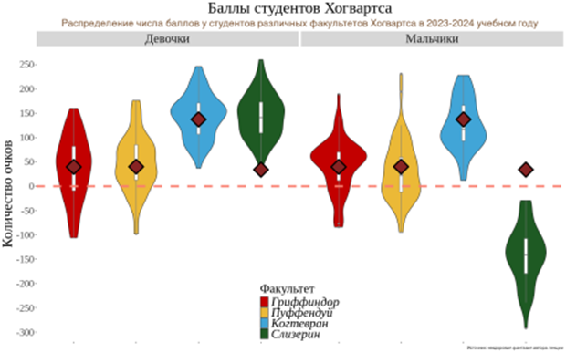

```{r setup, include=FALSE}
knitr::opts_chunk$set(echo = TRUE)
library(tidyverse)
library(ggpubr)

theme_custom <- theme_bw()+ theme(
    plot.title = element_text(size = 30, hjust = 0.5),
    plot.subtitle = element_text(size = 25, hjust = 0.5),
    strip.text = element_text(size = 20),
    axis.text = element_text(size = 20),
    axis.title = element_text(size = 25),
    legend.title = element_text(size = 25),
    legend.text = element_text(size = 20)
  )

```

## Загрузка данных

```{r data, message=FALSE, warning=FALSE}

data <- read_csv("data/raw/hogwarts_2024.csv") %>% 
  mutate(across(c(where(is.character), "course"), function(x) as.factor(x)))

```


## Диаграммы рассеяния

### Задание 1:

-   Постройте скаттерплот, визуализирующий связь между суммарным баллом
    студента за год и оценкой за экзамен по травологии.
-   Добавьте на график линию тренда. Удалите доверительную область и
    сделайте линию прямой.
-   Подумайте, как избежать того, чтобы записать одни и те же координаты
    x и y дважды.
-   Проинтерпретируйте график.

```{r point1, fig.width=12, message=FALSE}

ggplot(data, aes(x = result, y = `Herbology exam`)) +
  geom_point()+ 
  geom_smooth(method = "lm", se = FALSE, colour = "darkblue")+
  stat_cor(method = "pearson", label.x = -300, label.y = 75, size = 10, colour = "darkblue")+
  labs( title = "Взаимосвязь итоговых баллов и оценки по травологии",
        x = "Cуммарный балл за год", y = "Оценка по травологии")+
  theme_custom
```

График показывает сильную положительную корреляцию **(R = 0.76)** между
итоговым баллом и оценкой по травологии: чем выше общий результат, тем
лучше оценка по предмету.

### Задание 2:

-   Отобразите на одном графике скаттерплоты, аналогичные тому, что вы
    делали на первом задании, для экзаменов по травологии, магловедению,
    прорицаниям и зельеварению.
-   На графике так же должна присутствовать линия тренда с
    характеристиками, аналогичными тем, что были в пункте 1.
-   Раскрасьте точки на графике в разные цвета, в соответствии с
    факультетами. Используйте стандартные цвета факультетов.
-   Проинтерпретируйте полученный результат.

```{r point2, fig.height=12, fig.width=15, message=FALSE}

data_long <- data %>% 
  pivot_longer(cols = c(`Herbology exam`, `Muggle studies exam`, `Divinations exam`, `Potions exam`),
               names_to = "exam", values_to = "score") %>% 
  rename("Факультет" = house, "Пол" = sex) %>% 
  mutate("Экзамен" = fct_recode(as.factor(exam),
                              "Травология" = "Herbology exam", 
                              "Магловедение" = "Muggle studies exam",
                              "Прорицания" = "Divinations exam",
                              "Зельеварение" = "Potions exam"))

ggplot(data_long, aes(x = result, y = score, colour = Факультет)) +
  geom_point(size = 2)+ 
  geom_smooth(method = "lm", se = FALSE, colour = "darkblue")+
  stat_cor(method = "pearson", label.x = -300, label.y = 45, size = 7, colour = "darkblue")+
  labs( title = "Взаимосвязь итоговых баллов и оценок за экзамены",
        x = "Cуммарный балл за год", y = " ")+
  scale_colour_manual(values = c("Gryffindor" = "#C50000", "Hufflepuff" = "#ECB939", 
                             "Ravenclaw" = "#41A6D9", "Slytherin" = "#1F5D25"), 
                      labels = c("Gryffindor" = "Гриффиндор", "Hufflepuff" = "Пуффендуй", 
                             "Ravenclaw" = "Когтевран",  "Slytherin" = "Слизерин"))+
  scale_y_continuous(position = "right")+
  facet_grid(Экзамен ~ ., switch = "y")+
  theme_custom

```

График демонстрирует наличие сильной положительной корреляции **(R =
0.76 - 0.80)** между итоговым баллом и оценками по травологии,
магловедению и прорицаниям: чем выше общий результат, тем лучше оценка
по данным предметам. Однако для экзамена по зельеварению данной
корреляции не наблюдается, при этом студенты из Слизерина показывают
лучшие результаты!

### Задание 3:

-   Видоизмените предыдущий график: сгруппируйте и покрасьте линии
    тренда в соответствии с одной из категориальных переменных (с такой,
    которая подсвечивает одно из наблюдений на предыдущем этапе,
    относящееся ко всем 4-м экзаменам).
-   Постарайтесь избежать коллизий в легенде, при этом сохранив и
    цветовую палитру для раскраски точек по факультетам.

```{r point3, fig.height=12, fig.width=15, message=FALSE}


ggplot(data_long, aes(x = result, y = score)) +
  geom_point(aes(fill = Факультет), shape = 21, size = 2)+ 
  geom_smooth(aes(colour = Пол), 
              method = "lm", se = FALSE, linewidth = 1.5) +
  stat_cor(aes(colour = Пол), method = "pearson", 
           label.x = c(-300, -300), label.y = c(45, 60), size = 7, show.legend = FALSE)+
  labs( title = "Взаимосвязь итоговых баллов и оценок за экзамены",
        x = "Cуммарный балл за год", y = " ") +
  
  scale_colour_manual(values = c("male" = "black", "female" = "pink2"),
                      labels = c("male" = "Парни", "female" = "Девушки")
                      )+
  scale_fill_manual(values = c("Gryffindor" = "#C50000", "Hufflepuff" = "#ECB939",
                                 "Ravenclaw" = "#41A6D9", "Slytherin" = "#1F5D25"),
                      labels = c("Gryffindor" = "Гриффиндор", "Hufflepuff" = "Пуффендуй",
                                 "Ravenclaw" = "Когтевран",  "Slytherin" = "Слизерин")
                      )+
  
  scale_y_continuous(position = "right")+
  facet_grid(Экзамен ~ ., switch = "y")+
  theme_custom

```

График показывает, что положительная корреляция между итоговым баллом и
оценками по травологии, магловедению и прорицаниям выражена сильнее у
студентов мужского пола **(R = 0.80 - 0.84)**, чем у женского **(R =
0.66 - 0.72)**. А для экзамена по зельеварению у парней наблюдается
отрицательная корреляция **(R = -0.61)**, тогда как у девушек — слабая
положительная **(R = 0.26)**.


## Столбчатая диаграмма

### Задание 1:

-   Постройте барплот (столбиковую диаграмму) распредления набранных
    баллов за первый семестр (с 1-й по 17-ю неделю включительно) у
    студентов разного происхождения.
-   Выдвиньте гипотезу (или гипотезы), почему распределение получилось
    именно таким.

```{r col1, fig.height=9, fig.width=15}

data %>% 
  rowwise() %>% 
  mutate(first_term = sum(c_across(week_1:week_17))) %>% 
  ungroup() %>% 
  group_by(bloodStatus) %>% 
  summarise(n = n(), first_term = sum(first_term)) %>% 
  ungroup() %>% 
  ggplot(aes(x = fct_recode(bloodStatus, "Полукровки" = "half-blood", "Грязнокровки" = "muggle-born", 
                              "Чистокровки" = "pure-blood" ), y = first_term, fill = bloodStatus))+
  geom_col(colour = "black", linewidth = 1)+
  scale_fill_manual(values = c("half-blood" = "lightsalmon2", "muggle-born" = "slategrey", 
                               "pure-blood" = "gold2"), 
                    labels = c("half-blood" = "Полукровки", "muggle-born" = "Грязнокровки", 
                               "pure-blood" = "Чистокровки"))+
  labs(y = "Баллы за первый семестр", x = "", fill = "Происхождение",
       title = "Баллы за первый семестр у студентов разного происхождения")+
  theme_custom

```

Наблюдаемое распределение суммарных баллов за первый семестр у студентов
разного происхождения может быть связано с численностью студентов.
Вероятнее всего, полукровок больше всего среди студентов, поэтому их
общий балл за семестр также является наибольшим.

### Задание 2:

-   Модифицируйте предыдущий график – отсортируйте столбцы в порядке
    убывания суммы баллов.
-   Добавьте на график текстовые метки, отражающие число студентов
    каждого происхождения. Попробуйте использовать для этой задачи не
    geom_text, а geom_label.
-   Настройте внешний вид geom_label по своему усмотрению. Поправьте
    название оси.
-   Проинтерпретируйте график. Соотносится ли интерпретация с вашей
    гипотезой из пункта 1?

```{r col2, fig.height=9, fig.width=15}

data %>% 
  rowwise() %>% 
  mutate(first_term = sum(c_across(week_1:week_17))) %>% 
  ungroup() %>% 
  group_by(bloodStatus) %>% 
  summarise(n = n(), first_term = sum(first_term)) %>% 
  ungroup() %>% 
  ggplot(aes(x = fct_reorder( fct_recode(bloodStatus, "Полукровки" = "half-blood", "Грязнокровки" = "muggle-born", 
                              "Чистокровки" = "pure-blood" ), first_term, .desc = TRUE), y = first_term, 
             fill = bloodStatus))+
  geom_col(colour = "black", linewidth = 1)+
  geom_label(aes(label = paste0("Количество студентов:", "\n", n)), 
             colour = "black", fill = "white", fontface = "bold", label.size = 1, size = 5, vjust = 1.5)+
  scale_fill_manual(values = c("half-blood" = "lightsalmon2", "muggle-born" = "slategrey", 
                               "pure-blood" = "gold2"), 
                    labels = c("half-blood" = "Полукровки", "muggle-born" = "Грязнокровки", 
                               "pure-blood" = "Чистокровки"))+
  labs(y = "Баллы за первый семестр", x = "", fill = "Происхождение",
       title = "Баллы за первый семестр у студентов разного происхождения")+
  theme_custom

```

График действительно показывает, что суммарные баллы за первый семестр у
студентов разного происхождения коррелируют с численностью студентов.
Полукровок больше всего среди студентов, поэтому их общий балл за
семестр также является наибольшим. Чистокровки и Грязнокровки набрали
меньше баллов, что также связано с их меньшей численностью.

### Задание 3:

-   И снова измените график – добавьте на него разбивку не только по
    происхождению, но и по полу. Раскрасьте столбцы по происхождению.
-   Сделайте подписи к столбцам читаемыми.
-   Дайте графику название, измените, если требуется, название осей.
-   Сделайте шаг для оси, на которой отображены очки, через каждую
    тысячу баллов.
-   Разместите текстовые метки по правому краю графика.
-   Настройте график таким образом, чтобы метки были видны целиком и не
    обрезались.
-   Сохраните график на устройство.

```{r col3, fig.height=9, fig.width=15, message=FALSE, warning=FALSE}

sex_blood_first_term <-
data %>% 
  rowwise() %>% 
  mutate(first_term = sum(c_across(week_1:week_17))) %>% 
  ungroup() %>% 
  group_by(bloodStatus, sex) %>% 
  summarise(n = n(), first_term = sum(first_term)) %>% 
  ungroup() %>% 
  mutate(sex_blood = paste0(sex, "_", bloodStatus)) %>% 
  ggplot(aes(x = fct_reorder( fct_recode(
    sex_blood, "Девушки-Полукровки" = "female_half-blood", "Парни-Полукровки" = "male_half-blood",
    "Девушки-Грязнокровки" = "female_muggle-born", "Парни-Грязнокровки" = "male_muggle-born", 
    "Девушки-Чистокровки" = "female_pure-blood", "Парни-Чистокровки" = "male_pure-blood"), 
    first_term, .desc = FALSE), y = first_term, fill = bloodStatus))+
  geom_col(colour = "black", linewidth = 1)+
  geom_label(aes(y = max(first_term), label = paste0("Количество студентов: ", n)), 
             colour = "black", fill = "white", fontface = "bold", label.size = 1, size = 5, hjust = 1)+
  scale_fill_manual(values = c("half-blood" = "lightsalmon2", "muggle-born" = "slategrey", 
                               "pure-blood" = "gold2"), 
                    labels = c("half-blood" = "Полукровки", "muggle-born" = "Грязнокровки", 
                               "pure-blood" = "Чистокровки"))+
  scale_y_continuous(breaks = seq(-1000,10000,1000))+
  labs(y = "Баллы за первый семестр", x = "", fill = "Происхождение",
       title = "Баллы за первый семестр у студентов разного происхождения и пола")+
  coord_flip()+
  theme_custom

sex_blood_first_term

```

Сохраним график в папку **DataVis_task_2/data/pics/**

```{r pic}

ggsave("data/pics/sex_blood_first_term.png", sex_blood_first_term, width = 15, height = 10, dpi = 300, units = "in")

```

### Задание 4:

-   Изучите функцию coord_flip(). Как вы думаете, когда она может быть
    полезна? Как вы думаете, в чем ее плюсы и минусы?

Данная функция позволяет поменять местами оси X и Y.

Функция может быть полезна, когда на графике много категорий, и
горизонтальное представление может улучшить читабельность. Кроме того,
coord_flip() позволяет избежать наложения текста, если названия
категорий длинные.

Однако функция coord_flip() считается устаревшей, так как для упрощения
кода можно просто поменять местами x и y в функции aes(). Кроме того,
горизонтальные графики могут быть менее привычны для пользователей, что
может затруднить интерпретацию данных.


## Разное

### Задание 1:

-   Сравните распределение баллов за экзамен по зельеварению и за
    экзамен по древним рунам. Сделайте это тремя разными способами. Под
    разными способами понимаются идеологически разные геомы или способы
    группировки. Не считаются разными способами изменения константных
    визуальных параметров (цвет заливки, размер фигур) на сходных в
    остальном графиках.
-   Объедините графики, таким образом, чтобы результирующий график имел
    два столбца и 2 строки. Два графика должны находиться в верхней
    строке и занимать равную площадь. Третий график должен занимать
    нижнюю строку целиком.

```{r ggarrange, fig.height=12, fig.width=12}

exam_histogram <- ggplot(data)+
  geom_histogram(aes(`Potions exam`, fill = "Зельеварение"), alpha = 0.3, 
                 bins = ceiling(log2(nrow(data))+1), colour = "black")+
  geom_histogram(aes(`Study of ancient runes exam`, fill = "Древние руны"), alpha = 0.3,
                  bins = ceiling(log2(nrow(data))+1), colour = "black")+
  scale_x_continuous(position = "top")+
  labs(x = "Оценка", y = "Количество студентов", fill = "Экзамен")+
  theme_custom 

exam_density <- ggplot(data)+
  geom_density(aes(`Potions exam`, fill = "Зельеварение"), 
               alpha = 0.3, colour = "black")+
  geom_density(aes(`Study of ancient runes exam`, fill = "Древние руны"), 
               alpha = 0.3, colour = "black")+
  scale_x_continuous(position = "top")+
  scale_y_continuous(position = "right")+
  labs(x = "Оценка", y = "Доля студентов", fill = "Экзамен")+
  theme_custom 

 exam_boxplot <- data %>% 
  pivot_longer(cols = c(`Potions exam`, `Study of ancient runes exam`),
               names_to = "exam", values_to = "score") %>% 
  mutate("Экзамен" = fct_recode(as.factor(exam),
                              "Зельеварение" = "Potions exam", 
                              "Древние руны" = "Study of ancient runes exam"
                              ), 
         "Экзамен" = fct_relevel(Экзамен, "Древние руны", "Зельеварение")) %>% 
  ggplot(aes(x = Экзамен, y = score, fill = Экзамен))+
  geom_boxplot(alpha = 0.3, colour = "black")+
  labs(x = "", y = "Оценка",  fill = "Экзамен")+
  theme_custom +
  theme(
    legend.position = "inside", 
    legend.justification = c(0.45, 0.95)
    )

ggarrange(
  ggarrange(exam_histogram, exam_density, ncol = 2, legend = "none"),
  exam_boxplot, 
  ncol = 1, 
  heights = c(1, 1)
)
  


```

### Задание 2:

-   Визуализируйте средний балл по зельеварению студентов с различным
    происхождением. Вы вольны добавить дополнительные детали и
    информацию на график.
-   Измените порядок ваших фигур на первом графике слева направо
    следующим образом: маглорожденные, чистокровные, полукровки.
    Скорректируйте название оси.
-   Проинтерпретируйте результат. Как вы думаете, почему он именно
    такой? Если у вас есть гипотеза, проиллюстрируйте ее еще одним
    графиком (или графиками).
-   Объедините их при помощи ggarrange.

```{r Potions1, fig.height=9, fig.width=15}

Potions1 <- data %>% 
  group_by(bloodStatus) %>% 
  summarise(meanPotionsExam = signif(mean(`Potions exam`), 3),
            lower_Bound = quantile(`Potions exam`, 0.025), 
            upper_Bound = quantile(`Potions exam`, 0.975)) %>% 
   mutate(bloodStatus = fct_recode(bloodStatus,
                                         "Полукровки" = "half-blood", 
                                         "Грязнокровки" = "muggle-born", 
                                         "Чистокровки" = "pure-blood" ), 
          bloodStatus = fct_relevel(bloodStatus, 
                                    c("Грязнокровки",  "Чистокровки", "Полукровки")
                                    )
          ) %>% 
  ggplot(aes(x = bloodStatus, y = meanPotionsExam, 
             ymin = lower_Bound, ymax = upper_Bound, 
             colour = bloodStatus))+
  geom_pointrange(size = 2)+
  geom_errorbar(linewidth = 2, show.legend = FALSE)+
  geom_text(aes(label = meanPotionsExam), 
            hjust = -0.5, size = 10, show.legend = FALSE) +
  geom_text(aes(label = "Cредний балл:"),
            hjust = - 0.05, vjust = - 1.5,  size = 7, show.legend = FALSE) +
  geom_text(aes(y = lower_Bound, label = "95% доверительный интервал"), 
            size = 7, vjust = -1.5, hjust = - 0.4, angle = 90, show.legend = FALSE) + 
  scale_colour_manual(values = c("Грязнокровки" = "slategrey", 
                               "Чистокровки" = "gold2", 
                               "Полукровки" = "lightsalmon2")
                      )+
  scale_y_continuous(breaks = seq(0,100,10))+
  labs(x = "", y = "Оценка по зельеварению", colour = "Происхождение", 
       title = "Оценка по зельеварению для студентов разного происхождения")+
  theme_custom

Potions1

```

Средний балл по зельеварению заметно ниже у грязнокровок. Может, дело в
самом экзамене? Возможно, в одних предметах лучше результаты у
чистокровок, а в других — у грязнокровок?

```{r Potions2, fig.height=15, fig.width=18, message=FALSE, warning=FALSE}


 Potions2 <- data %>% 
  pivot_longer(cols = contains("exam"), names_to = "exam", values_to = "score") %>% 
  mutate(bloodStatus = fct_recode(bloodStatus,
                                         "Полукровки" = "half-blood", 
                                         "Грязнокровки" = "muggle-born", 
                                         "Чистокровки" = "pure-blood" ), 
         bloodStatus = fct_relevel(bloodStatus, 
                                    c("Грязнокровки",  "Чистокровки", "Полукровки")
                                    ), 
         exam = fct_recode(exam,
                           "Защита от тёмных искусств" = "Defence against the dark arts exam", 
                           "Полеты" = "Flying exam", 
                           "Астрономия" = "Astronomy exam", 
                           "Гербология" = "Herbology exam", 
                           "Прорицания" = "Divinations exam", 
                           "Заклинания" = "Charms exam", 
                           "История магии" = "History of magic exam", 
                           "Нумерология" = "Arithmancy exam", 
                           "Уход за магическими существами" = "Care of magical creatures exam", 
                           "Магловедение" = "Muggle studies exam", 
                           "Изучение древних рун" = "Study of ancient runes exam",
                           "Трансфигурация" = "Transfiguration exam", 
                           "Зельеварение" = "Potions exam" )
         ) %>% 

  group_by(exam, bloodStatus) %>%
  summarise(mean_score = mean(score), min_score = min(score), max_score = max(score)) %>%
  mutate(blood_exam = paste0(bloodStatus, " и ", str_replace(exam, " exam$", ""))) %>% 
  arrange(mean_score) %>% 
  ggplot()+
  geom_pointrange(aes(x = fct_reorder(blood_exam, mean_score), y = mean_score, 
                      ymin = min_score, ymax = max_score, colour = bloodStatus), size = 2, linewidth = 2) +
  geom_hline(yintercept = c(45, 50), linetype = "dashed", colour = "black", linewidth = 2)+
  scale_y_continuous(breaks = seq(0, 100, 10))+
  scale_colour_manual(values = c("Полукровки" = "lightsalmon2", "Грязнокровки" = "slategrey", 
                               "Чистокровки" = "gold2")
                      )+
  labs(x = "", y = "Оценка за экзамен", colour = "Происхождение", 
       title = "Средние оценки студентов разного происхождения на экзаменах")+
  theme_custom+
  coord_flip()

Potions2

```

Оказывается, что нет! Средний балл на любом экзамене для студентов
любого происхождения всегда находится в диапазоне 45-50, за исключением
грязнокровок по зельеварению. Но всех ли грязнокровок недолюбливает
профессор зельеварения? Для начала посмотрим на результаты по разным
экзаменам у студентов разных полов:

```{r Potions3, fig.height=12, fig.width=18, message=FALSE, warning=FALSE}

Potions3 <- data %>% 
  pivot_longer(cols = contains("exam"), names_to = "exam", values_to = "score") %>% 
   mutate(exam = fct_recode(exam,
                            "Защита от тёмных искусств" = "Defence against the dark arts exam", 
                           "Полеты" = "Flying exam", 
                           "Астрономия" = "Astronomy exam", 
                           "Гербология" = "Herbology exam", 
                           "Прорицания" = "Divinations exam", 
                           "Заклинания" = "Charms exam", 
                           "История магии" = "History of magic exam", 
                           "Нумерология" = "Arithmancy exam", 
                           "Уход за магическими существами" = "Care of magical creatures exam", 
                           "Магловедение" = "Muggle studies exam", 
                           "Изучение древних рун" = "Study of ancient runes exam",
                           "Трансфигурация" = "Transfiguration exam", 
                           "Зельеварение" = "Potions exam" )
         ) %>% 
  ggplot()+
  geom_rect(aes(xmin = -Inf, xmax = Inf, ymin = 40, ymax = 45), 
            fill = "skyblue", alpha = 0.2)+
  geom_rect(aes(xmin = -Inf, xmax = Inf, ymin = 50, ymax = 55), 
            fill = "pink", alpha = 0.2)+
  geom_boxplot(aes(x = exam, y = score, fill = sex), 
               outliers = FALSE, linewidth = 1, colour = "black" )+
  scale_y_continuous(breaks = seq(0, 100, 10))+
  scale_x_discrete(position = "top")+
  scale_fill_manual(values = c("male" = "skyblue2", "female" = "pink2"),
                    labels = c("male" = "Парни", "female" = "Девушки")
                    )+
  labs(x = "", y = "Оценка за экзамен", fill = "Пол",
       title = "Распределение оценок студентов разных полов на экзаменах")+
  theme_custom+
  theme(legend.position = "bottom")+
  coord_flip()

Potions3

```

Если рассматривать медианные значения по каждому экзамену, то
установленный выше диапазон **(45-50 баллов)** смещается вверх для
девушек — **(50-55 баллов)** и вниз для парней - **(40-45 баллов)**. И
снова это не касается зельеварения! Может, профессор зельеварения ещё и
сексист?

```{r Potions4, fig.height=12, fig.width=18, message=FALSE, warning=FALSE}

Potions4 <-  data %>% 
  mutate(bloodStatus = fct_recode(bloodStatus,
                                         "Полукровки" = "half-blood", 
                                         "Грязнокровки" = "muggle-born", 
                                         "Чистокровки" = "pure-blood" ), 
          bloodStatus = fct_relevel(bloodStatus, 
                                    c("Грязнокровки",  "Чистокровки", "Полукровки")
                                    )
          ) %>% 
  ggplot()+
  geom_rect(aes(xmin = -Inf, xmax = Inf, ymin = 40, ymax = 45), fill = "skyblue", alpha = 0.2)+
  geom_rect(aes(xmin = -Inf, xmax = Inf, ymin = 50, ymax = 55), fill = "pink", alpha = 0.2)+
  geom_boxplot(aes(x = bloodStatus, y = `Potions exam`, fill = sex),
               outliers = FALSE, linewidth = 1, colour = "black" )+
  scale_y_continuous(breaks = seq(0, 100, 10), position = "right")+
  scale_fill_manual(values = c("male" = "skyblue2", "female" = "pink2"),
                    labels = c("male" = "Парни", "female" = "Девушки")
                    )+
  labs(x = "", y = "Оценка по зельеварению", fill = "Пол",
       title = "Распределение оценок студентов разных полов и происхождения по зельеварению")+
  theme_custom+
  theme(legend.position = "bottom")

Potions4

```

О да! Если ты студентка, да еще и грязнокровка, то на зельеварении тебя
вряд ли ждет что-то хорошее!

```{r Potions5, fig.height=30, fig.width=40, message=FALSE, warning=FALSE}

ggarrange(ggarrange(Potions2+theme(legend.position = "none"), 
                    Potions3+theme(legend.position = "none"),
                    nrow = 1, widths = c(1, 1)), 
          ggarrange(Potions1+theme(legend.position = "inside", 
                                   legend.justification = c(0.05, 0.9) ),
                    Potions4+theme(legend.position = "inside",
                                   legend.justification = c(0.05, 0.9) ),
                    nrow = 1, widths = c(1, 1)), 
          nrow = 2, widths = c(2, 1)
          )


```

Объединять графики не всегда полезно, часто они становятся нечитаемыми.


## Дополнительно:   

Воспроизведите график максимально близко к оригиналу и
проинтерпретируйте его: 

```{r repeat, fig.height=12, fig.width=16}

data_stat <- data %>%
  group_by(house) %>%
  summarise(stat = mean(result))


ggplot(data, aes(x = house, y = result, fill = house)) +
  geom_violin(colour = "grey25",  linewidth = 1) +
  geom_boxplot(fill = "white", colour = "grey35", width = 0.05, linewidth = 1) +
  geom_point(data = data_stat, aes(x = house, y = stat), 
             shape = 23, size = 12, fill = "brown4", colour = "black", stroke = 2)+
  geom_hline(yintercept = 0, linetype = "dashed", colour = "firebrick1", linewidth = 1)+
  scale_y_continuous(breaks = seq(-500, 500, 50))+
  scale_fill_manual(values = c("Gryffindor" = "#C50000", "Hufflepuff" = "#ECB939", 
                             "Ravenclaw" = "#41A6D9", "Slytherin" = "#1F5D25"), 
                      labels = c("Gryffindor" = "Гриффиндор", "Hufflepuff" = "Пуффендуй", 
                             "Ravenclaw" = "Когтевран",  "Slytherin" = "Слизерин"))+
  labs(x = "", y = "Количество очков", fill = "Факультет", 
       title = "Баллы студентов Хогвартса", 
       subtitle = "Распределение числа баллов у студентов различных факультетов Хогвартса в 2023-2024 учебном году", 
       caption = "Источник: нездоровая фантазия автора лекции")+
  facet_wrap(fct_recode(sex, "Девочки" = "female", "Мальчики" = "male") ~. )+ 
  theme_custom + 
  theme(
    axis.text.x = element_blank(), 
    text = element_text(family = "serif"),
    panel.border = element_blank(),
    panel.grid.minor = element_blank(), 
    panel.grid.major = element_blank(), 
    strip.text = element_text(size = 26),
    legend.position = "inside", 
    legend.justification = c(0.5, 0), 
    legend.text = element_text(face = "italic"),
    legend.key.spacing.y = unit(0, "cm"), 
    plot.title = element_text(size = 34), 
    plot.subtitle = element_text(size = 22, colour = "darkorange4"), 
    plot.caption = element_text(size = 12)
       )
```

График показывает распределение баллов студентов различных факультетов Хогвартса за 2023-2024 учебный год. Средние значения по факультетам сопоставимы, хотя Когтевран выделяется более высокими результатами. Внутри факультетов распределения баллов у девочек и мальчиков схожи по размаху, но различаются по форме. Форма указывает места скопления основной массы значений, а также экстремально высокие и низкие значения - вытянутые хвосты. Особенно стоит выделить Слизерин: только высокие результаты девочек, сопоставимые с Когтевраном, позволяют удерживать средний балл на уровне других факультетов, в то время как у мальчиков из Слизерина все распределение находится ниже 0.
