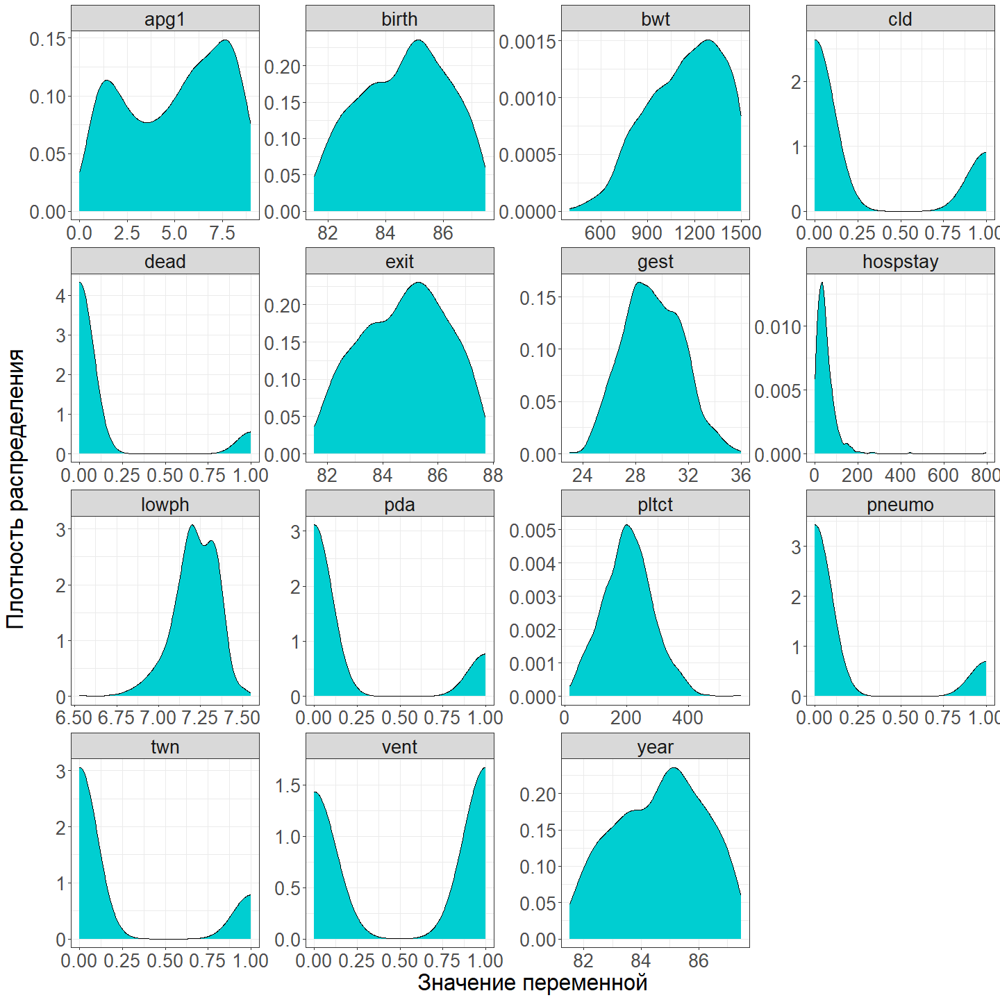
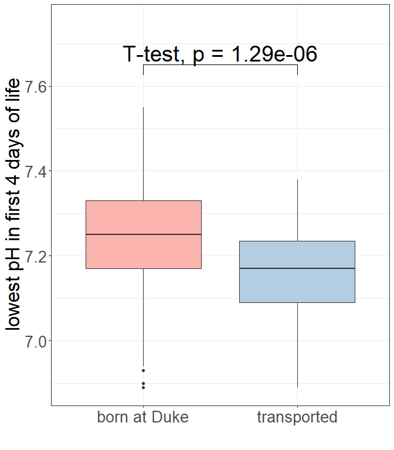
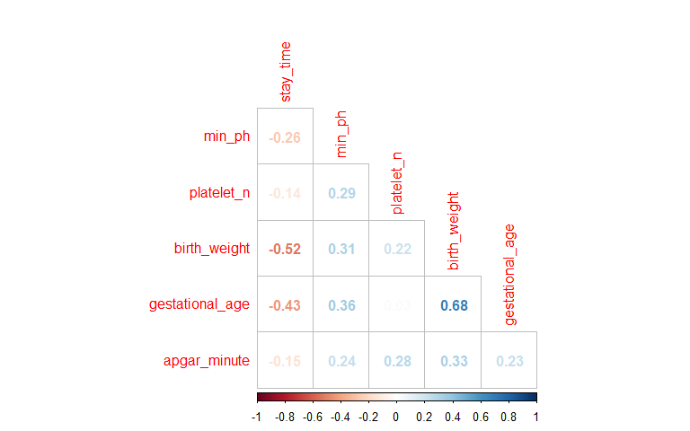
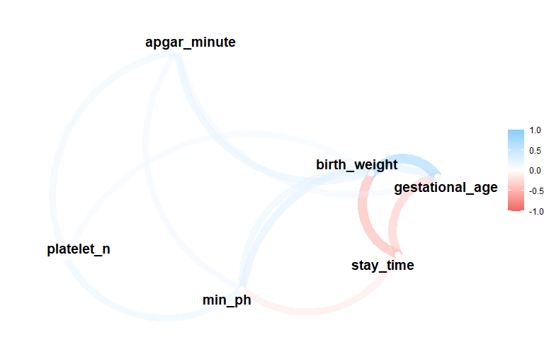
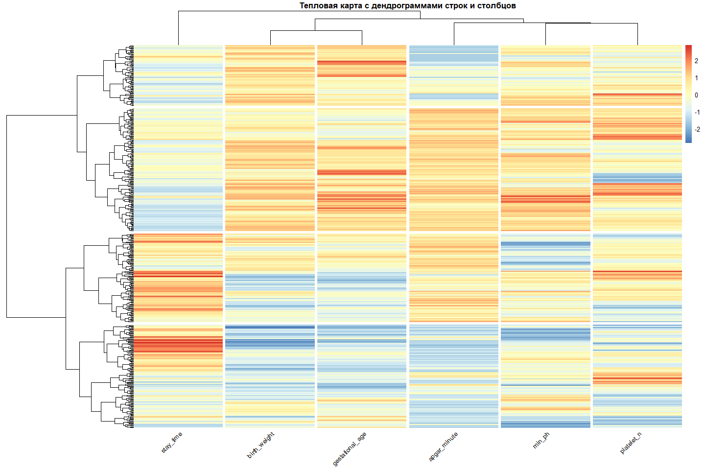

## Задание 1

-   Загрузите датасет. Это данные о 671 младенце с очень низкой массой тела (\<1600 грамм), собранные в Duke University Medical Center доктором Майклом О’Ши c 1981 по 1987 г. Описание переменных [здесь](https://hbiostat.org/data/repo/cvlbw). 
-   Переменными исхода являются колонки **dead**, а также **hospstay** - время от рождения до смерти или выписки (выводятся из 'birth' и 'exit', 7 пациентов были выписаны до рождения).
-   Сделайте копию датасета, в которой удалите колонки с количеством пропусков больше 100, а затем удалите все строки с пропусками.


``` r
data_raw <- read_rds("data/raw/very_low_birthweight.RDS")

skim(data_raw)[2:3] %>% 
  arrange(desc(n_missing))
```

```
## # A tibble: 26 × 2
##    skim_variable n_missing
##    <chr>             <int>
##  1 lol                 381
##  2 magsulf             247
##  3 pvh                 145
##  4 ivh                 144
##  5 ipe                 144
##  6 meth                106
##  7 toc                 106
##  8 pltct                70
##  9 cld                  66
## 10 lowph                62
## # ℹ 16 more rows
```

``` r
data <- data_raw %>% 
  select(where(~ sum(is.na(.)) <= 100)) %>% 
  # filter(if_any(everything(), is.na))
  drop_na() %>% 
  # Уберем ошибочные данные
  filter(hospstay >= 0)

skim(data)[2:3] %>% 
  arrange(desc(n_missing))
```

```
## # A tibble: 19 × 2
##    skim_variable n_missing
##    <chr>             <int>
##  1 race                  0
##  2 inout                 0
##  3 delivery              0
##  4 sex                   0
##  5 birth                 0
##  6 exit                  0
##  7 hospstay              0
##  8 lowph                 0
##  9 pltct                 0
## 10 bwt                   0
## 11 gest                  0
## 12 twn                   0
## 13 apg1                  0
## 14 vent                  0
## 15 pneumo                0
## 16 pda                   0
## 17 cld                   0
## 18 year                  0
## 19 dead                  0
```

## Задание 2

-   Постройте графики плотности распределения для числовых переменных. 
-   Преобразуйте категориальные переменные в факторы. 
-   Удалите выбросы, если таковые имеются. 
-   Для любых двух числовых переменных раскрасьте график по переменной **inout**.


``` r
# Графики плотности распределения для числовых переменных
data %>% 
  select(where(is.numeric)) %>% 
  mutate(id = row_number()) %>% 
  pivot_longer(-id, names_to = "Переменная", values_to = "Значение") %>% 
  ggplot()+
  geom_density(aes(Значение), fill = "darkturquoise", colour = "black")+
  labs(x = "Значение переменной", 
       y = "Плотность распределения")+
  theme_custom+
  facet_wrap(~Переменная, scales = "free")
```

<!-- -->

``` r
# Преобразование данных
cleaned_data <- data %>% 
  transmute(
    birth_date = birth, exit_date = exit, stay_time = hospstay, min_ph = lowph, platelet_n = pltct, race, 
    birth_weight = bwt, gestational_age = gest, inout, 
    multiple_gestation = factor(twn, levels = c(0, 1), labels = c("no", "yes")), delivery, 
    apgar_minute = apg1, ventilation = factor(vent, levels = c(0, 1), labels = c("no", "yes")), 
    pneumothorax = factor(pneumo, levels = c(0, 1), labels = c("no", "yes")), 
    patent_ductus = factor(pda, levels = c(0, 1), labels = c("no", "yes")),  	
    o2_30d = factor(cld, levels = c(0, 1), labels = c("no", "yes")), 
    birth_year = year, sex, dead = factor(dead, levels = c(0, 1), labels = c("no", "yes"))) %>% 
# За выбросы принимаем значения ниже Q1 - 1.5 × IQR и выше Q3 + 1.5 × IQR
  mutate(across(where(is.numeric), 
                ~ case_when(
                  . < quantile(., 0.25, na.rm = TRUE) - 1.5 * IQR(., na.rm = TRUE) | 
                  . > quantile(., 0.75, na.rm = TRUE) + 1.5 * IQR(., na.rm = TRUE) ~ NA,
                  TRUE ~ .
                ))) %>% 
  select(where(~ sum(is.na(.)) <= 100)) %>% 
  # filter(if_any(everything(), is.na))
  drop_na()

       
# Графики плотности распределения по переменной - inout.
cleaned_data %>% 
  select(where(is.numeric), inout) %>% 
  pivot_longer( -inout, names_to = "Переменная", values_to = "Значение") %>% 
  ggplot()+
  geom_density(aes(Значение, fill = inout),  colour = "black", alpha = 0.7)+
  scale_fill_brewer(palette = "Pastel1")+
  labs(x = "Значение переменной", 
       y = "Плотность распределения")+
  theme_custom+
  theme(
    legend.position = "top", 
          )+
  facet_wrap(~Переменная, scales = "free")
```

<!-- -->


## Задание 3

- Проведите тест на сравнение значений колонки **min_ph** между группами в переменной **inout**. Вид статистического теста определите самостоятельно. 
- Визуализируйте результат через библиотеку 'rstatix'.


``` r
# Критерий Шапиро — Уилка -> t-критерий Стьюдента 
shapiro.test(cleaned_data$min_ph[data$inout == "born at Duke"])
```

```
## 
## 	Shapiro-Wilk normality test
## 
## data:  cleaned_data$min_ph[data$inout == "born at Duke"]
## W = 0.98499, p-value = 0.0003113
```

``` r
shapiro.test(cleaned_data$min_ph[data$inout == "transported"])
```

```
## 
## 	Shapiro-Wilk normality test
## 
## data:  cleaned_data$min_ph[data$inout == "transported"]
## W = 0.94347, p-value = 0.002221
```

``` r
t.test(data = cleaned_data,  min_ph ~ inout) 
```

```
## 
## 	Welch Two Sample t-test
## 
## data:  min_ph by inout
## t = 5.1735, df = 94.435, p-value = 1.287e-06
## alternative hypothesis: true difference in means between group born at Duke and group transported is not equal to 0
## 95 percent confidence interval:
##  0.04972167 0.11164968
## sample estimates:
## mean in group born at Duke  mean in group transported 
##                   7.238008                   7.157322
```

``` r
# Коробчатая диаграмма + результаты стат. теста
ggplot(cleaned_data)+
  geom_boxplot(aes( x = inout, y = min_ph,  fill = inout))+
  scale_fill_brewer(palette = "Pastel1")+
  scale_y_continuous(limits = c(NA, max(cleaned_data$min_ph) + 0.2))+
  labs(y = "lowest pH in first 4 days of life", x = "")+
  theme_custom +
  theme(legend.position = "none")+
  stat_pvalue_manual(t_test(data = cleaned_data,  min_ph ~ inout),
                     label = "T-test, p = {p}", 
                     size = 10, 
                     y.position = max(cleaned_data$min_ph) + 0.1)
```

<!-- -->
- Как бы вы интерпретировали результат, если бы знали, что более низкое значение **min_ph** ассоциировано с более низкой выживаемостью?

Для сравнения минимального уровня pH в первые четыре дня жизни ребенка в зависимости от места рождения (в медицинском центре Университета Дьюка или за его пределами) был применен **t-критерий Стьюдента**. Предварительно была проведена проверка распределений на нормальность с использованием **критерия Шапиро—Уилка**. Анализ выявил статистически значимые различия между группами: дети, рожденные в центре Дьюка, в среднем имеют более высокий уровень pH, что может свидетельствовать о лучших шансах на выживание.

## Задание 4

- Сделайте новый датафрейм, в котором оставьте только континуальные или ранговые данные, кроме 'birth', 'year' и 'exit'. - Сделайте корреляционный анализ этих данных. 
- Постройте два любых типа графиков для визуализации корреляций.


``` r
# Подготовка данных
cor_data <- cleaned_data %>% 
  select(where(is.numeric), -birth_date, -birth_year, -exit_date )

# Матрица корреляций
cor(cor_data) 
```

```
##                  stay_time     min_ph  platelet_n birth_weight gestational_age
## stay_time        1.0000000 -0.2628111 -0.13751643   -0.5222201     -0.43391064
## min_ph          -0.2628111  1.0000000  0.29279438    0.3103002      0.35928694
## platelet_n      -0.1375164  0.2927944  1.00000000    0.2180920      0.02837645
## birth_weight    -0.5222201  0.3103002  0.21809200    1.0000000      0.67667411
## gestational_age -0.4339106  0.3592869  0.02837645    0.6766741      1.00000000
## apgar_minute    -0.1518070  0.2353072  0.27638428    0.3264958      0.23483478
##                 apgar_minute
## stay_time         -0.1518070
## min_ph             0.2353072
## platelet_n         0.2763843
## birth_weight       0.3264958
## gestational_age    0.2348348
## apgar_minute       1.0000000
```

``` r
# Визуализация корреляций
corrplot(cor(cor_data), method = 'number', type = 'lower', diag = FALSE)
```

<!-- -->

``` r
cor(cor_data) %>% 
  network_plot(min_cor = .2)
```

<!-- -->

## Задание 5 ----------------------------------------------------------- 

- Постройте иерархическую кластеризацию на этом датафрейме.


## Задание 6 ?????????????????????????????????????????????????????

- Сделайте одновременный график heatmap и иерархической кластеризации. 
- Интерпретируйте результат.


``` r
library(pheatmap)
scale_cor_data <- scale(cor_data)

pheatmap(scale_cor_data,
         show_rownames = FALSE, 
         clustering_distance_rows = dist(scale_cor_data),
         clustering_method = "ward.D2", 
         cutree_rows = 5,
         cutree_cols = length(colnames(scale_cor_data)),
         angle_col = 45, 
         main = "Dendrograms for clustering rows and columns with heatmap")
```

<!-- -->

