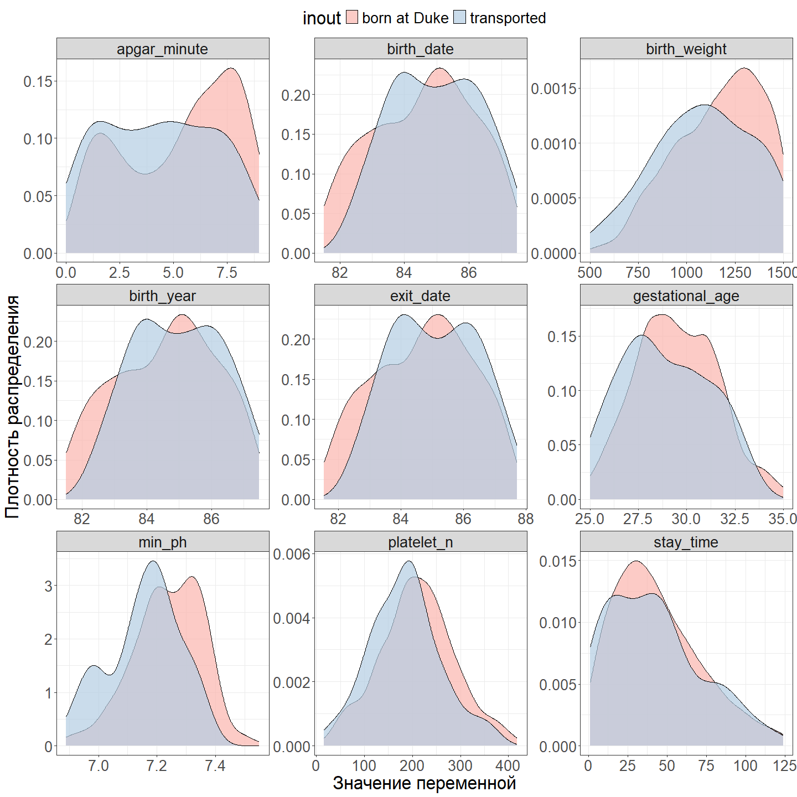
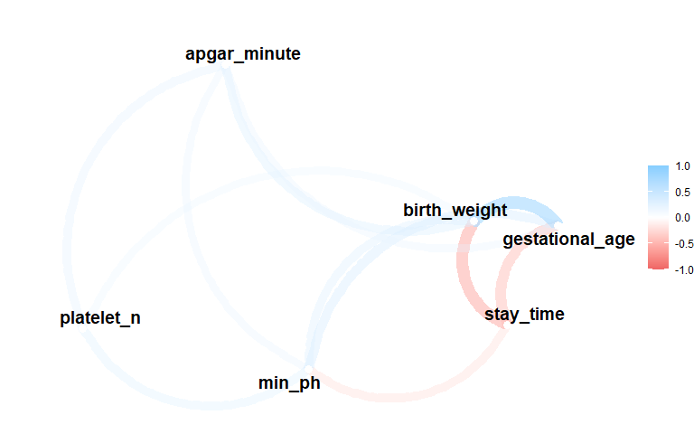

## Задание 1

-   Загрузите датасет. Это данные о 671 младенце с очень низкой массой тела (\<1600 грамм), собранные в Duke University Medical Center доктором Майклом О’Ши c 1981 по 1987 г. Описание переменных [здесь](https://hbiostat.org/data/repo/cvlbw). 
-   Переменными исхода являются колонки **dead**, а также **hospstay** - время от рождения до смерти или выписки (выводятся из 'birth' и 'exit', 7 пациентов были выписаны до рождения).
-   Сделайте копию датасета, в которой удалите колонки с количеством пропусков больше 100, а затем удалите все строки с пропусками.


## Задание 2

-   Постройте графики плотности распределения для числовых переменных. 
-   Преобразуйте категориальные переменные в факторы. 
-   Удалите выбросы, если таковые имеются. 
-   Для любых двух числовых переменных раскрасьте график по переменной **inout**.


``` r
# Графики плотности распределения для числовых переменных
data %>% 
  select(where(is.numeric)) %>% 
  mutate(id = row_number()) %>% 
  pivot_longer(-id, names_to = "Переменная", values_to = "Значение") %>% 
  ggplot()+
  geom_density(aes(Значение), fill = "darkturquoise", colour = "black")+
  labs(x = "Значение переменной", 
       y = "Плотность распределения")+
  theme_custom+
  facet_wrap(~Переменная, scales = "free")
```

<!-- -->

``` r
# Преобразование данных
cleaned_data <- data %>% 
  transmute(
    birth_date = birth, exit_date = exit, stay_time = hospstay, min_ph = lowph, platelet_n = pltct, race, 
    birth_weight = bwt, gestational_age = gest, inout, 
    multiple_gestation = factor(twn, levels = c(0, 1), labels = c("no", "yes")), delivery, 
    apgar_minute = apg1, ventilation = factor(vent, levels = c(0, 1), labels = c("no", "yes")), 
    pneumothorax = factor(pneumo, levels = c(0, 1), labels = c("no", "yes")), 
    patent_ductus = factor(pda, levels = c(0, 1), labels = c("no", "yes")),  	
    o2_30d = factor(cld, levels = c(0, 1), labels = c("no", "yes")), 
    birth_year = year, sex, dead = factor(dead, levels = c(0, 1), labels = c("no", "yes"))) %>% 
# За выбросы принимаем значения ниже Q1 - 1.5 × IQR и выше Q3 + 1.5 × IQR
  mutate(across(where(is.numeric), 
                ~ case_when(
                  . < quantile(., 0.25, na.rm = TRUE) - 1.5 * IQR(., na.rm = TRUE) | 
                  . > quantile(., 0.75, na.rm = TRUE) + 1.5 * IQR(., na.rm = TRUE) ~ NA,
                  TRUE ~ .
                ))) %>% 
  select(where(~ sum(is.na(.)) <= 100)) %>% 
  # filter(if_any(everything(), is.na))
  drop_na()

       
# Графики плотности распределения по переменной - inout.
cleaned_data %>% 
  select(where(is.numeric), inout) %>% 
  pivot_longer( -inout, names_to = "Переменная", values_to = "Значение") %>% 
  ggplot()+
  geom_density(aes(Значение, fill = inout),  colour = "black", alpha = 0.7)+
  scale_fill_brewer(palette = "Pastel1")+
  labs(x = "Значение переменной", 
       y = "Плотность распределения")+
  theme_custom+
  theme(
    legend.position = "top", 
          )+
  facet_wrap(~Переменная, scales = "free")
```

<!-- -->

## Задание 3

- Проведите тест на сравнение значений колонки **min_ph** между группами в переменной **inout**. Вид статистического теста определите самостоятельно. 
- Визуализируйте результат через библиотеку 'rstatix'.


``` r
# Критерий Шапиро — Уилка -> t-критерий Стьюдента 
shapiro.test(cleaned_data$min_ph[data$inout == "born at Duke"])
```

```
## 
## 	Shapiro-Wilk normality test
## 
## data:  cleaned_data$min_ph[data$inout == "born at Duke"]
## W = 0.98499, p-value = 0.0003113
```

``` r
shapiro.test(cleaned_data$min_ph[data$inout == "transported"])
```

```
## 
## 	Shapiro-Wilk normality test
## 
## data:  cleaned_data$min_ph[data$inout == "transported"]
## W = 0.94347, p-value = 0.002221
```

``` r
t.test(data = cleaned_data,  min_ph ~ inout) 
```

```
## 
## 	Welch Two Sample t-test
## 
## data:  min_ph by inout
## t = 5.1735, df = 94.435, p-value = 1.287e-06
## alternative hypothesis: true difference in means between group born at Duke and group transported is not equal to 0
## 95 percent confidence interval:
##  0.04972167 0.11164968
## sample estimates:
## mean in group born at Duke  mean in group transported 
##                   7.238008                   7.157322
```

``` r
# Коробчатая диаграмма + результаты стат. теста
ggplot(cleaned_data)+
  geom_boxplot(aes( x = inout, y = min_ph,  fill = inout))+
  scale_fill_brewer(palette = "Pastel1")+
  scale_y_continuous(limits = c(NA, max(cleaned_data$min_ph) + 0.2))+
  labs(y = "lowest pH in first 4 days of life", x = "")+
  theme_custom +
  theme(legend.position = "none")+
  stat_pvalue_manual(t_test(data = cleaned_data,  min_ph ~ inout),
                     label = "T-test, p = {p}", 
                     size = 10, 
                     y.position = max(cleaned_data$min_ph) + 0.1)
```

<!-- -->
- Как бы вы интерпретировали результат, если бы знали, что более низкое значение **min_ph** ассоциировано с более низкой выживаемостью?

Для сравнения минимального уровня pH в первые четыре дня жизни ребенка в зависимости от места рождения (в медицинском центре Университета Дьюка или за его пределами) был применен **t-критерий Стьюдента**. Предварительно была проведена проверка распределений на нормальность с использованием **критерия Шапиро—Уилка**. Анализ выявил статистически значимые различия между группами: дети, рожденные в центре Дьюка, в среднем имеют более высокий уровень pH, что может свидетельствовать о лучших шансах на выживание.

## Задание 4

- Сделайте новый датафрейм, в котором оставьте только континуальные или ранговые данные, кроме 'birth', 'year' и 'exit'. - Сделайте корреляционный анализ этих данных. 
- Постройте два любых типа графиков для визуализации корреляций.


``` r
# Подготовка данных
cor_data <- cleaned_data %>% 
  select(where(is.numeric), -birth_date, -birth_year, -exit_date )

# Матрица корреляций
cor(cor_data) 
```

```
##                  stay_time     min_ph  platelet_n birth_weight gestational_age
## stay_time        1.0000000 -0.2628111 -0.13751643   -0.5222201     -0.43391064
## min_ph          -0.2628111  1.0000000  0.29279438    0.3103002      0.35928694
## platelet_n      -0.1375164  0.2927944  1.00000000    0.2180920      0.02837645
## birth_weight    -0.5222201  0.3103002  0.21809200    1.0000000      0.67667411
## gestational_age -0.4339106  0.3592869  0.02837645    0.6766741      1.00000000
## apgar_minute    -0.1518070  0.2353072  0.27638428    0.3264958      0.23483478
##                 apgar_minute
## stay_time         -0.1518070
## min_ph             0.2353072
## platelet_n         0.2763843
## birth_weight       0.3264958
## gestational_age    0.2348348
## apgar_minute       1.0000000
```

``` r
# Визуализация корреляций
corrplot(cor(cor_data), method = 'number', type = 'lower', diag = FALSE)
```

<!-- -->

``` r
cor(cor_data) %>% 
  network_plot(min_cor = .2)
```

<!-- -->

## Задание 5

- Постройте иерархическую кластеризацию на этом датафрейме.


``` r
rownames(cor_data) <- paste0("id-", seq(1:nrow(cor_data)))
scaled_cor_data <- scale(cor_data)
dist_cor_data <- dist(scaled_cor_data, method = "euclidean")
hc <- hclust(d = dist_cor_data, method = "ward.D2")

Cluster_full <- fviz_dend(
  hc, k = 4, show_labels = FALSE,  main = "",
  k_colors = "lancet", rect = TRUE, horiz = TRUE, 
)
```

```
## Warning: The `<scale>` argument of `guides()` cannot be `FALSE`. Use "none" instead as
## of ggplot2 3.3.4.
## ℹ The deprecated feature was likely used in the factoextra package.
##   Please report the issue at <https://github.com/kassambara/factoextra/issues>.
## This warning is displayed once every 8 hours.
## Call `lifecycle::last_lifecycle_warnings()` to see where this warning was
## generated.
```

``` r
dend_cuts <- cut(as.dendrogram(hc), h = 17)

Cluster_1 <- fviz_dend(dend_cuts$lower[[1]], 
          main = "Кластер 1", 
          k = 1, k_colors = pal_lancet()(4)[1], 
          cex = 1, label_cols = "black",  
          ggtheme = theme_custom, 
          )
Cluster_2 <- fviz_dend(dend_cuts$lower[[2]], 
          main = "Кластер 2",
          k = 1, k_colors = pal_lancet()(4)[2], 
          cex = 1, label_cols = "black", 
          ggtheme = theme_custom,  
          )
Cluster_3 <- fviz_dend(dend_cuts$lower[[3]], 
          main = "Кластер 3",
          k = 1, k_colors = pal_lancet()(4)[3], 
          cex = 1, label_cols = "black",  
          ggtheme = theme_custom, 
          )
Cluster_4 <- fviz_dend(dend_cuts$lower[[4]], 
          main = "Кластер 4",  
          k = 1, k_colors = pal_lancet()(4)[4], 
          cex = 1, label_cols = "black", 
          ggtheme = theme_custom, 
          )

ggarrange( Cluster_full, 
           ggarrange(Cluster_4, Cluster_3, Cluster_2, Cluster_1, ncol = 1),
           nrow = 1, widths = c(1, 3) )
```

<!-- -->

## Задание 6

- Сделайте одновременный график heatmap и иерархической кластеризации. 


``` r
pheatmap(scaled_cor_data,
         show_rownames = FALSE, 
         clustering_distance_rows = dist_cor_data,
         clustering_method = "ward.D2", 
         cutree_rows = 4,
         cutree_cols = length(colnames(scaled_cor_data)),
         treeheight_row = 200, 
         angle_col = 45, 
         angle_row = 45, 
         main = "Тепловая карта с дендрограммами строк и столбцов")
```

<!-- -->
- Интерпретируйте результат

1. **Цвет** на тепловой карте представляет стандартизованные значения для каждой строки и переменной. Красный и синий цвета указывают на отклонения от среднего значения (красный — положительное отклонение, синий — отрицательное).
2. **Кластеризация по строкам** группирует объекты (пациентов) с похожими характеристиками по переменным. Результаты кластеризации строк согласуются с дендрограммой кластеров, полученной на предыдущем этапе.
3. **Кластеризация по столбцам** объединяет переменные, которые имеют схожие паттерны значений, например: *birth_weight* и *gestational_age*, что соответствует корреляционному анализу.

## Задание 7

- Проведите PCA анализ на этих данных. 


``` r
scaled_cor_data_pca <- prcomp(scaled_cor_data, scale = FALSE) 
summary(scaled_cor_data_pca)
```

```
## Importance of components:
##                           PC1    PC2    PC3    PC4     PC5     PC6
## Standard deviation     1.6034 1.0666 0.8834 0.8374 0.73129 0.52444
## Proportion of Variance 0.4285 0.1896 0.1301 0.1169 0.08913 0.04584
## Cumulative Proportion  0.4285 0.6181 0.7481 0.8650 0.95416 1.00000
```

``` r
fviz_eig(scaled_cor_data_pca, addlabels = T, 
         xlab = "", ylab = "Процент дисперсии",
         ggtheme = theme_custom,
         main = "Объясненная дисперсия компонентов PCA")
```

<!-- -->

- Проинтерпретируйте результат. Нужно ли применять шкалирование для этих данных перед проведением PCA?

Согласно **Cumulative Proportion**, первые три компоненты объясняют около 75% вариации данных, что является хорошим показателем, так как большая часть информации сохраняется в этих трех компонентах.

Шкалирование данных перед PCA необходимо, чтобы привести все переменные к одному масштабу и избежать доминирования переменных с большими диапазонами значений. Однако для бинарных переменных нормирование может исказить информацию. В нашем случае данные уже предварительно нормированы, и остались только количественные переменные, для которых нормирование полезно.

## Задание 8

- Постройте biplot график для PCA. 
- Раскрасьте его по значению колонки 'dead'.


``` r
ggbiplot(scaled_cor_data_pca, 
         scale=0,
         groups = cleaned_data$dead, 
         point.size	= 2, 
         ellipse = TRUE, ellipse.alpha = 0.2,
         varname.size = 7,
         alpha = 0.7) +
  labs(fill = "Dead", colour = "Dead") +
  scale_color_manual(values = c("yes" = "coral3", "no" = "palegreen3")) +
  scale_fill_manual(values = c("yes" = "coral1", "no" = "palegreen1")) +
  theme_custom+
  theme(legend.direction = 'horizontal', legend.position = 'top')
```

<!-- -->

## Задание 9???????????????????????????????????

- Переведите последний график в 'plotly'. При наведении на точку нужно, чтобы отображалось id пациента.


``` r
ggplotly(
ggbiplot(scaled_cor_data_pca, 
         scale=0,
         groups = cleaned_data$dead, 
         ellipse = TRUE, ellipse.alpha = 0.2,
         varname.size = 4, 
         point.size	= 1, alpha = 0.7, 
         labels = rownames(cor_data), 
         labels.size = 0
         ) +
  labs(fill = "Dead", colour = "Dead") +
  scale_color_manual(values = c("yes" = "coral3", "no" = "palegreen3")) +
  scale_fill_manual(values = c("yes" = "coral1", "no" = "palegreen1")) +
  theme_custom,
  tooltip = c("x", "labels")
)
```

```{=html}
<div class="plotly html-widget html-fill-item" id="htmlwidget-33122d6e692241518cec" style="width:1440px;height:1440px;"></div>
<script type="application/json" data-for="htmlwidget-33122d6e692241518cec">{"x":{"data":[{"x":[-2.0122037032946332,-1.7195207426674322,-1.4198979410693133,-1.1941245177472868,-0.61556775885339654,0.82185914495548718,-0.54483522086523506,2.3462288752875273,-1.5479899785276376,-0.0025129170099833669,-0.21828504105454188,0.73537999952556343,0.33412552851273813,2.4327899005787663,-0.36993381168362588,-0.47979324238859372,-0.0080808051728450958,1.5177964206717443,-1.8122529926962472,-0.49479441412958103,1.5960858499115866,-1.2300968279162212,-0.013997454743375503,-0.39510369084248642,0.49433039378359661,-1.3383979759030169,-0.56907738330067659,0.10290186486628725,-1.1505005528301948,0.69956080442748991,2.8086271634354412,1.9531988017882307,-0.075315798296484895,0.45153249532932543,-0.56990593737939621,-1.665925472233295,0.55558478684992274,0.19265947115534007,-1.4519335782340059,-1.1529157420800193,0.8081073855941423,1.4140901451411181,1.7657342506630174,-0.7181155280780751,-0.67681682176486191,0.61867791218659773,-1.3934621481843954,2.1963525255674514,-0.76184621637572858,-1.1564172850269852,0.21305147933486962,3.2050012031550583,-1.7255444339679071,1.069345733440737,0.84301965256181621,0.29417594043873035,-0.0074071807308993542,0.37523207353355431,2.217605252155217,0.15438628499261267,-1.448889647385939,-2.1332514499105941,-0.44369848641572912,-0.84999691243673003,-0.50028698884301992,0.96851807500431952,-0.69434537134374286,-1.8303949944948064,2.7535534325333471,-0.15919758820354291,0.29590050373897309,-0.60695419426568786,-1.1619583491901415,-2.1333112354039088,-1.1789320063601099,1.1777364025357453,1.3133719065898155,-0.32489821007721348,-1.3154516945533474,2.7035545241294092,1.8141052248209293,2.4777797026059378,0.8794483447079513,2.1422970003646595,-1.919223173180898,-1.2605423796280402,-0.2506697436214087,3.9986523698476835,-0.79620957565627815,1.2347433287069021,-0.80909416124769951,-0.98930771516970128,0.41069235965602813,-0.77077257484561745,-0.53593334861963338,0.80874220911445394,1.2971703158193841,0.45803360082472538,1.5725705159901113,-1.2244545791517321,-0.097630894622488681,-0.47655073900318284,-0.094652929802068617,-1.8585009347100294,1.6022664554327712,-0.52107745660197069,-1.4173603717902685,0.99726108947309877,-1.2299316626716914,1.8935312770371244,-0.055640246608250558,-0.55572463452169485,0.26212793937707135,-0.15002250628662245,-0.81021589754412082,3.3269811254360899,-1.305784917342856,0.14071771912033837,0.010725576799892273,-0.37643039693700892,0.01692965760181802,-0.54422330013772524,1.2577339312212479,-2.2849952162067018,2.6528197898817023,-0.83773383925431444,2.8985207772465125,0.76984201980990707,-0.67130322101973983,-2.1580470873529158,1.0877884172903987,-1.1620512711271356,-0.092404405399540937,-1.1880716200152845,-2.3535122390878942,-1.7770411949345797,0.63903498922906143,-0.74230161571540054,1.6814147377134909,-0.28670399426129389,1.2707407845153789,0.5132158656805621,-2.0576139602597423,-2.1012917942303311,-1.4326925646772806,-0.28677820933850667,0.78627797626735296,2.0021284568190838,1.7313150060777471,2.1465073823122611,0.32956330817742768,-0.34133686947705089,-1.9161076852225023,0.86240357461345052,4.096366883114043,-1.1275242078903558,1.2106935908060674,2.3816866756468409,-2.0087674080710247,0.075626179653423733,-1.2405415805733133,-0.24723965520564126,-2.8749926868870723,1.2198553064655477,-1.8512440636958207,-1.8819990634792225,-1.49628187041862,0.15530426048435067,-2.34327237606505,-2.1512929848156763,-2.754825796720977,0.066071988937332946,0.27204767271317049,-0.79732807540527006,1.0839671952851979,0.69112157929807549,0.44462628402392379,-2.1091088892815057,1.9390866412338446,3.2804570935185438,-1.3271727647586029,-1.8682486878965479,-0.44947069577848531,-0.81953217097308129,-1.7392831113781704,-3.1669372424730686,-1.0091652551167922,-1.7536121957658741,1.9418546583904304,-1.5318703264771363,-1.0534498549166473,1.3851469224841539,0.82948121342964798,-1.0804348161176061,-2.0962347368696874,-1.2217362297044065,-2.6831123810737649,2.2513812348059843,-1.3071033363744944,-1.110945738022403,-1.1067962975308023,-0.061635733953404312,1.3984715005885411,0.06676398661793205,-1.7171150051696469,-1.3426446503398362,-2.0845831268034964,-3.6877125556592896,-1.2400008907944047,0.85628824735343023,-2.5157925286234435,-0.13899756460532639,-0.48888828197904871,-1.1050214783834171,0.049869532703421017,2.0833503623493055,1.4467131756000815,-0.058128151372712822,-0.02297625051229427,-2.5288573107533456,-0.47334449138880125,-1.6479309401010185,2.9531024740281162,2.1379289025513324,-2.0259389711005937,-2.1495449129826931,-1.9430879446580991,-2.3130083769868355,1.4127265362308599,-0.88876645875730864,1.7405848636395636,1.0164467168306299,1.6428122957407778,1.6688968124607424,-1.8185878081367108,-1.012198315817574,1.3228680538149635,-0.52488618831197642,-2.4790153232337273,-0.9098519928754587,2.0204105185842449,3.9319842379518093,-0.61246789587884998,0.94939700553271367,0.05044804444853529,-0.0057098281593206341,1.4032107135680443,-2.4046329417789898,-0.65127856800010187,-0.25335652497018629,1.6886068586597023,0.39315384361559513,-0.88931142086688064,-0.60648836729843869,2.0296386767493733,0.17497690579710509,-1.2690200204953941,-2.5055339925743647,2.0070073404411648,-1.4586594092334626,-0.1190711550750287,-0.34368745882895313,2.1767810743935447,-1.0662608280192882,2.0459089628313216,2.3416316725928374,2.9275173912157739,-0.30863386055759395,0.47909782947111551,-0.5881682503032456,4.5622823085379203,-1.8555381004251028,-1.0999254249006034,-1.0710153027835863,1.0166087261927939,-0.8432604539504307,0.8230691499125834,-1.1772019429204952,-2.7829267917351719,1.0806059928267573,1.5589788910671729,-2.119896169458833,-1.3487704323332386,-1.7240849938974425,2.5555276950957024,1.586732140171037,-1.6908058926603045,1.4968079658557685,-2.009512212045534,1.6972165410037532,1.4778347385690249,-0.34867404788022233,0.93059543688671853,-0.76841841540158395,0.46867162581309563,-1.0073344558925346,1.952325963271385,-1.3431632016571695,1.5637805821114497,-3.0391488594448539,0.16621686463684565,-1.5034116077457813,-2.5148620904796872,-2.0529704649417364,2.680918158716854,1.3574935122663971,0.68109532829138475,-2.1506964066282608,-1.8847966521309245,-1.2567762949877033,-1.9473541713740816,-1.6032385749619762,0.042494211034658072,-0.49703809926736836,1.3210704169025269,-0.4811810969590582,-0.88828595102436092,-1.9938422911286939,-1.0854736159348568,-2.5081530668987155,-2.3004386505232364,-0.27917902291527141,-0.97941583660503184,1.6003052953918835,0.34024534735603912,1.4437545428668406,-0.30762044504253266,-1.2561264206529952,-2.2319227260617427,0.22939262653301454,-2.1588243964106422,3.4410156372603082,-0.64145845407993862,0.42241958658111151,1.4345090897487227,1.3076372028338441,1.2206974488342845,2.3412370626860231,1.2018612064780911,-1.6505316739112583,3.0881291648560958,2.4309660281784371,-1.3359020158959962,0.38682604676018933,0.61274149638929765,-1.0404564949428086,1.8064532385975078,-2.550526584272125,-2.1643553120189529,-1.4952721611793325,-0.6515616882361791,0.11413752581213964,1.3952505746453245,0.64057554439072728,-1.6955584690166037,-1.7601953602697269,1.6544109898029249,-2.8951132069017103,-2.786680990066416,1.7391122482026784,-0.28286540614683203,2.9396516916750999,-1.9543730667879586,-1.968501069413608,-1.4582775763169338,-1.7204947906081876,0.79977543276658436,-1.7970082215962173,0.67174953797065673,-0.049584533445665366,-2.1545810363213236,-1.6243962715365334,-1.4597887078447453,2.7902783592777469,-0.63844572978816372,1.1773649189956097,-1.2816235033946843,-2.1820838582819935,2.7634918402030424,4.0869221074225797,1.4881521482011462,-1.5504234010520734,-1.1136833264105348,-1.4006581223612891,-2.8614364189549302,-0.95302637675760182,0.69967045374524439,1.107922562131346,0.65186594057294112,2.2879926732042684,-0.45297451427303864,-2.1746088250063873,-2.5868651683042838,-1.4218703525204719,-0.011193545190585371,-1.4512097688970118,-2.4593369991610587,-1.7209584231983068,0.83596045328858082,3.6899563081991378,-0.92299866502063355,-1.4640655985657425,-2.1910999896995218,-1.0152959842952827,-1.3968625466317173,1.2094095727907752,-0.1402516423865767,-0.41799478447862343,-0.48957309925227716,0.087012043414553042,0.56540013742052664,0.80577964469927066,0.90134950479691134,-0.3637738852444633,4.0623274306917789,-1.513310051732377,-0.84896556768579023,0.054450948415773179,-0.21082188323153092,1.1700518409071139,-0.19183246417939542,0.054566138591966754,0.59001133458757504,-1.5927414890644038,-0.24518156816850781,0.61812926046907157,-0.79766880311276944,1.8017708352348727,-3.4978911833394091,2.1041141898464213,-0.94719106689531285,-0.57351148158948551,-0.25789466061527067,0.89525304485326873,-0.30089121279841952,-1.0086875465132947,0.77485850135636869,-1.0575906482827624,1.736649078321127,1.5602227164998625],"y":[-0.30494472730123123,-0.49293992563063499,1.2711045433797579,-1.9326559679317568,-0.68906956428343014,0.28286841723433037,2.4180038944709334,1.7128098954037634,-0.84567813752000298,-0.50399863790261745,-0.29797534971563983,-0.1704383751560431,0.98631444041618832,0.65165379588788963,0.87928799685043957,-1.4168594291658838,0.5859404746804866,-0.31392892541597933,0.82350329797165622,-0.083360179427581213,2.0667923011791425,0.40986400674799461,-0.84747420981857913,1.1595413162610846,0.27962313350355844,-1.5087289494925222,0.021444200232893538,0.4035383490716058,0.8190112563842209,0.23950084916409392,0.029936738006899739,1.773665746853252,0.33915185317592667,0.31388820098369152,0.43478753193003022,0.14274810007158231,1.6413911596449204,-0.096652936414833718,-0.91237984690574236,1.4784572431579484,0.10378877624425804,0.50753643814517369,-0.92454913957566942,-1.3668486716662922,-0.15143529338848521,1.8645460284453377,-0.34320041948672569,1.6089546126514307,-0.73860405724357947,-1.6959439245276771,-0.21340529333777244,-0.3975716940904041,0.13566736217683326,-2.9117658152350976,-0.87602745767262935,0.10581000672742967,-0.29064934222832406,-0.87585345285470595,1.3681944461797828,-0.061748040584762527,-1.3559740145350756,-0.30720317519763207,1.097271313518547,-0.16883793907825917,-1.4596794434629761,1.0527851393840328,0.70642724602849261,0.24266672186671159,-0.14092753582610471,1.6572741729744966,0.18623495541593743,0.79527165471693728,0.28929386644229871,0.57547098060322543,-0.12119866408387965,0.48212415267798991,0.047018427036361131,2.3455689644224154,1.3251965195930988,0.61422941693311139,-0.28224070326893874,0.085195923839952517,0.39218741414679714,0.1719073903849872,0.90129695057067727,0.078604106045180672,-0.36793915291965512,-0.31867621057271467,-0.85840437172014339,0.54728369635350649,-0.57844930753617085,-0.20000356455776949,0.20149073863761754,2.1409825796279454,2.6139886576226834,-0.21507851829213845,-0.21577477787800575,1.0463466405800028,0.24985514392451108,1.7130792765736638,3.3120183052399064,1.2394143628136112,0.14664478836189143,1.0303895349998917,0.95107694851506419,0.032156571689239737,-0.19217906674850205,-1.6148183610187423,1.7290095692222112,0.3743869452260542,-0.37729823799682366,1.1402072996136881,-0.74170386862121218,-1.6717534586233804,1.2622520197466394,0.79912542022971234,-1.2834302569265181,0.058077379347873326,-1.5857393138186995,-0.72048193952018647,-1.7841161258025438,0.27740271916870896,0.68114217845770053,0.036611677534346333,0.45383158804087825,0.09909235537019763,-1.206712948004498,-1.2980684782509566,2.1398787887669988,-0.22817448110475702,0.87981861204248346,-0.09029927112721331,-0.57370452591334886,1.1266372042107806,-0.012476405016907562,-1.8565540302566426,-0.85143875304008876,-0.076976871935802424,0.012722192338409192,-1.2293014615283766,-1.6731263641973206,-2.3685521506432083,0.42097462833568916,-0.63074280273590666,0.97424427035064576,-2.0491074552401733,-2.1992812859968209,-2.3127203886541614,0.80501431100621823,1.2541556408521901,1.5476993296671182,1.381654799721949,0.41424662953245878,0.004580983007181098,1.4649814728897175,0.8939983255457834,-0.49541460916372393,-0.34785548271852001,1.0089828380114327,1.7409386610711661,-0.75092924790539628,0.74543391316636076,1.5567367723170134,-1.2933943032885291,-0.29700220650492881,-0.26888780012590446,-0.39574402222014221,0.66004843373686417,2.1589708927762734,-0.50596295037290517,1.7375788479441538,-0.0075039855303309652,0.40303932501850664,-0.61568804219740547,1.5530972197692774,-0.46674646451031554,-1.0822518753081014,-0.71527643350788361,0.35096820128805423,-0.53541311402182301,0.93172161825830124,-0.58438484199090257,-0.4831831700254377,0.55285143913183954,-0.0745327468668361,0.57747158422100231,-0.95506165857244318,-0.059694218113325731,-2.3955187688539965,0.11377010107014467,-1.0424259721677993,0.97786716326216139,0.12710733571375762,-0.027307892422295862,-0.89484954086611612,0.44063428900946128,0.18128967190464265,0.24410224405457104,-1.5227110521893552,-0.63386539024711108,1.8744797765680823,0.86378913356439824,1.1532211552332385,-0.75140439813050697,0.18543802305411128,-0.1175768782891551,-0.97680251480515878,0.23223534729354678,2.2823996903264478,-0.62442700074685409,0.10091910609604182,0.98141211771242065,1.6097714798667462,-0.12825434057807816,-0.5238151643484521,-0.29498128609995583,-0.37810712873186375,0.57707419576970675,-1.2030909227806419,-0.39215973151733502,-0.70253338178956137,-1.9742975760139845,0.10939781335180079,1.1861202589995852,1.3629326968714564,0.32551782963678932,-0.70960714309217199,-1.6729472472461859,2.0416550139310985,-1.51316104995074,0.52150804354380764,0.74511772572705892,-1.8634231332015117,0.16563178809667894,0.62257478986344628,0.96020813330627797,-1.3804202269146941,-1.003282233590906,0.61313830538952518,-1.3618329083162704,-0.78096612115421049,0.78987213440558002,-0.68713947961857613,1.794025888780701,1.225102894176491,0.32709170470319088,-0.2296931476026422,1.4881340356212849,1.2722288158671635,-0.91143129752825092,0.4506801266399213,-0.31725116372988699,0.25688701735035857,0.82743984101374579,-0.47525830816549303,1.1207908124769241,-1.8615041172762248,-0.57149943927900015,0.54622180972875578,-0.94830188316985964,-1.4836606953230564,0.24136548044476963,-0.55292808064515875,-1.3547416887534247,1.3912272313958505,-0.061200587863015236,-0.023549785977564099,-0.66851538293657042,-1.1416374430784104,-1.4131002139622784,0.54011162281907354,0.27507222318912095,0.4845350996980976,1.2063017687297195,2.0718577440961723,1.3331062260553022,-2.0453434085853215,0.065407855987635405,0.039446603428158207,0.88439016070807042,1.7414406083374983,0.064422610597968416,-0.73125195508369623,-0.30003397282274524,-0.73668357828838726,-0.71287076625774048,0.082555552142957303,2.069498880874463,0.54842631802251474,1.175286322339558,-1.333425293692464,-0.84539940077190412,0.80985452476641118,1.1262657689783553,-0.97850553901583404,-2.2124566042173597,-0.89712371722791129,-0.53205317050359646,0.94613015604640582,0.50544025680899862,-0.51408557032466962,0.92597651327936892,-0.036454971056268007,-0.94305745162382781,0.26069042947866905,-1.4445019146358447,0.45115761963225337,0.52071220209469438,1.1096934438193882,-0.52632437552696443,-0.063385644024053778,-0.77039958756109517,-0.56447949457014435,0.3924189021852012,-0.1909197450570298,-2.062051495470262,-0.42505814389359459,0.36726326982062202,-0.47016489456394478,0.61153794226292646,-0.0053395516736931348,0.77377867293833591,-1.4550061242253336,1.8190882867137823,-0.52230817680633224,0.40647410575920351,0.6335726896130317,0.85478081611619727,0.55562350987793252,-1.256490785935203,0.4530332641856552,-0.97750703166232666,0.02639015068935141,-0.63395492465506642,0.21210209346545139,-0.027673299875126536,0.46599909961080593,0.95456349474123681,0.19836247233333795,0.072572869287188368,0.43775362011313323,-2.0585234751493404,-0.23335903157996421,-1.2593976575240802,0.4817111376938118,-1.4043883919014601,-1.4850074389085199,-1.0206448841195006,-1.0761677100192839,0.50672687065186583,-0.27079757851437686,-0.12045571373290252,0.1589817593646892,1.6222140939572096,-0.61205274688942823,0.50145104494693771,2.107819486962204,0.40899259496070212,0.69910680381659929,1.6250050767867141,1.8074402570069827,-0.47956679914791506,0.62131893699507046,0.38246851851742175,0.74183855451921588,-0.29734839557778703,-0.23873826155205993,-0.053889011467294079,-0.10109368962844827,-0.019020021587499925,0.37908162118342992,0.17949034474243911,-0.046941130583019193,2.5023349929874845,-1.0974841628030003,0.75233117768397217,-1.4675000945950567,-0.96098580026804814,0.59537792240709797,0.37088302988397598,0.43243188798297899,-0.69924358008206156,-1.6490479251355952,0.62750206967282796,0.80875079892767676,-0.99603334729260207,-0.32719536408034594,-1.195207031190969,0.39893845648407472,-0.52597910641986279,0.37192182681286112,1.2016656831851447,1.2696410292815146,-0.55213798156547045,0.86149873928880805,-0.43026063152058353,-1.4845469356568075,-0.70495835955196384,1.0143112737451991,-0.75334347798434853,1.4343953971652408,-0.47274467594835323,0.88413383989766436,-2.1136390513957726,-1.0317340055161135,2.5927819411158661,0.11124110510331667,-0.30690410954467751,-0.92024227963455596,-1.2899955701451713,-0.86546888710908709,0.61000532202022162,1.6867317334513519,-0.95140211277028752,-0.97925098814373479,0.40378334653266368,0.27582459014456179,-0.37180103401336639,0.34812489268477681,-0.90021517963787423,-0.8355209092487349,-1.3894127914284797,-0.71088608280376331,0.14597961691892944,1.7013126482522802,2.6866642997740273,-2.5649783204255594,-1.4014942921969322,-0.72998807933493937,0.39032190321570781,-0.48057032721271525,-1.1288703072133697,-0.56286080409866368,2.5737072209057952,0.050221823851189153,-0.9445907040268976,0.84120468537726856,-0.37081061249486602,2.0685624173845736,0.021879750813528356],"text":["id-1","id-2","id-4","id-5","id-6","id-7","id-8","id-10","id-11","id-12","id-13","id-14","id-15","id-16","id-17","id-18","id-19","id-20","id-21","id-22","id-23","id-24","id-25","id-26","id-27","id-28","id-29","id-30","id-31","id-32","id-33","id-34","id-35","id-36","id-37","id-38","id-40","id-41","id-43","id-44","id-45","id-46","id-47","id-48","id-49","id-50","id-51","id-52","id-53","id-54","id-55","id-56","id-57","id-59","id-60","id-61","id-62","id-63","id-64","id-65","id-66","id-67","id-68","id-69","id-70","id-71","id-72","id-73","id-74","id-75","id-76","id-77","id-78","id-79","id-80","id-81","id-82","id-84","id-85","id-87","id-88","id-89","id-90","id-91","id-92","id-94","id-95","id-96","id-98","id-100","id-101","id-102","id-103","id-104","id-106","id-107","id-108","id-109","id-110","id-111","id-112","id-114","id-115","id-116","id-117","id-118","id-119","id-120","id-121","id-123","id-125","id-126","id-127","id-128","id-129","id-130","id-131","id-132","id-134","id-136","id-137","id-138","id-139","id-140","id-141","id-142","id-143","id-144","id-145","id-146","id-147","id-148","id-149","id-150","id-151","id-152","id-153","id-155","id-156","id-157","id-158","id-159","id-160","id-161","id-162","id-163","id-165","id-166","id-167","id-169","id-170","id-171","id-172","id-173","id-174","id-175","id-177","id-178","id-179","id-180","id-181","id-182","id-183","id-184","id-185","id-186","id-188","id-189","id-190","id-191","id-192","id-193","id-194","id-196","id-197","id-198","id-199","id-200","id-201","id-202","id-203","id-205","id-206","id-207","id-208","id-209","id-211","id-212","id-213","id-214","id-215","id-216","id-217","id-218","id-219","id-221","id-222","id-223","id-224","id-225","id-227","id-228","id-229","id-230","id-231","id-232","id-233","id-234","id-235","id-236","id-237","id-238","id-239","id-240","id-241","id-242","id-243","id-244","id-245","id-247","id-248","id-249","id-251","id-252","id-253","id-254","id-255","id-256","id-258","id-261","id-262","id-263","id-264","id-265","id-266","id-267","id-269","id-270","id-271","id-272","id-273","id-274","id-275","id-276","id-277","id-278","id-279","id-280","id-281","id-282","id-283","id-284","id-285","id-286","id-287","id-288","id-289","id-290","id-291","id-293","id-294","id-295","id-297","id-298","id-301","id-302","id-303","id-304","id-305","id-306","id-307","id-308","id-309","id-310","id-311","id-312","id-313","id-314","id-315","id-316","id-317","id-318","id-319","id-320","id-321","id-322","id-323","id-324","id-325","id-326","id-327","id-328","id-329","id-330","id-331","id-332","id-333","id-334","id-335","id-337","id-338","id-339","id-340","id-341","id-342","id-343","id-344","id-345","id-346","id-347","id-348","id-349","id-350","id-351","id-352","id-353","id-354","id-355","id-356","id-357","id-358","id-359","id-360","id-361","id-362","id-363","id-364","id-365","id-366","id-367","id-368","id-369","id-370","id-371","id-372","id-373","id-374","id-375","id-376","id-377","id-378","id-379","id-380","id-381","id-382","id-383","id-384","id-385","id-386","id-387","id-388","id-389","id-390","id-391","id-392","id-393","id-394","id-395","id-396","id-397","id-398","id-399","id-400","id-401","id-402","id-403","id-404","id-405","id-406","id-407","id-408","id-411","id-412","id-413","id-414","id-415","id-416","id-417","id-418","id-420","id-421","id-422","id-423","id-424","id-426","id-427","id-428","id-429","id-430","id-431","id-432","id-433","id-434","id-435","id-436","id-437","id-438","id-439","id-440","id-441","id-442","id-443","id-445","id-446","id-447","id-448","id-449","id-450","id-451","id-452","id-453","id-454","id-455","id-456","id-458","id-459","id-460","id-461","id-462","id-463","id-464","id-465","id-466","id-467","id-468","id-469","id-470","id-471","id-472","id-473","id-474","id-475","id-476","id-477","id-478","id-479","id-480","id-481","id-482","id-483"],"hovertext":["xvar: -2.012203703<br />labels: id-1","xvar: -1.719520743<br />labels: id-2","xvar: -1.419897941<br />labels: id-4","xvar: -1.194124518<br />labels: id-5","xvar: -0.615567759<br />labels: id-6","xvar:  0.821859145<br />labels: id-7","xvar: -0.544835221<br />labels: id-8","xvar:  2.346228875<br />labels: id-10","xvar: -1.547989979<br />labels: id-11","xvar: -0.002512917<br />labels: id-12","xvar: -0.218285041<br />labels: id-13","xvar:  0.735380000<br />labels: id-14","xvar:  0.334125529<br />labels: id-15","xvar:  2.432789901<br />labels: id-16","xvar: -0.369933812<br />labels: id-17","xvar: -0.479793242<br />labels: id-18","xvar: -0.008080805<br />labels: id-19","xvar:  1.517796421<br />labels: id-20","xvar: -1.812252993<br />labels: id-21","xvar: -0.494794414<br />labels: id-22","xvar:  1.596085850<br />labels: id-23","xvar: -1.230096828<br />labels: id-24","xvar: -0.013997455<br />labels: id-25","xvar: -0.395103691<br />labels: id-26","xvar:  0.494330394<br />labels: id-27","xvar: -1.338397976<br />labels: id-28","xvar: -0.569077383<br />labels: id-29","xvar:  0.102901865<br />labels: id-30","xvar: -1.150500553<br />labels: id-31","xvar:  0.699560804<br />labels: id-32","xvar:  2.808627163<br />labels: id-33","xvar:  1.953198802<br />labels: id-34","xvar: -0.075315798<br />labels: id-35","xvar:  0.451532495<br />labels: id-36","xvar: -0.569905937<br />labels: id-37","xvar: -1.665925472<br />labels: id-38","xvar:  0.555584787<br />labels: id-40","xvar:  0.192659471<br />labels: id-41","xvar: -1.451933578<br />labels: id-43","xvar: -1.152915742<br />labels: id-44","xvar:  0.808107386<br />labels: id-45","xvar:  1.414090145<br />labels: id-46","xvar:  1.765734251<br />labels: id-47","xvar: -0.718115528<br />labels: id-48","xvar: -0.676816822<br />labels: id-49","xvar:  0.618677912<br />labels: id-50","xvar: -1.393462148<br />labels: id-51","xvar:  2.196352526<br />labels: id-52","xvar: -0.761846216<br />labels: id-53","xvar: -1.156417285<br />labels: id-54","xvar:  0.213051479<br />labels: id-55","xvar:  3.205001203<br />labels: id-56","xvar: -1.725544434<br />labels: id-57","xvar:  1.069345733<br />labels: id-59","xvar:  0.843019653<br />labels: id-60","xvar:  0.294175940<br />labels: id-61","xvar: -0.007407181<br />labels: id-62","xvar:  0.375232074<br />labels: id-63","xvar:  2.217605252<br />labels: id-64","xvar:  0.154386285<br />labels: id-65","xvar: -1.448889647<br />labels: id-66","xvar: -2.133251450<br />labels: id-67","xvar: -0.443698486<br />labels: id-68","xvar: -0.849996912<br />labels: id-69","xvar: -0.500286989<br />labels: id-70","xvar:  0.968518075<br />labels: id-71","xvar: -0.694345371<br />labels: id-72","xvar: -1.830394994<br />labels: id-73","xvar:  2.753553433<br />labels: id-74","xvar: -0.159197588<br />labels: id-75","xvar:  0.295900504<br />labels: id-76","xvar: -0.606954194<br />labels: id-77","xvar: -1.161958349<br />labels: id-78","xvar: -2.133311235<br />labels: id-79","xvar: -1.178932006<br />labels: id-80","xvar:  1.177736403<br />labels: id-81","xvar:  1.313371907<br />labels: id-82","xvar: -0.324898210<br />labels: id-84","xvar: -1.315451695<br />labels: id-85","xvar:  2.703554524<br />labels: id-87","xvar:  1.814105225<br />labels: id-88","xvar:  2.477779703<br />labels: id-89","xvar:  0.879448345<br />labels: id-90","xvar:  2.142297000<br />labels: id-91","xvar: -1.919223173<br />labels: id-92","xvar: -1.260542380<br />labels: id-94","xvar: -0.250669744<br />labels: id-95","xvar:  3.998652370<br />labels: id-96","xvar: -0.796209576<br />labels: id-98","xvar:  1.234743329<br />labels: id-100","xvar: -0.809094161<br />labels: id-101","xvar: -0.989307715<br />labels: id-102","xvar:  0.410692360<br />labels: id-103","xvar: -0.770772575<br />labels: id-104","xvar: -0.535933349<br />labels: id-106","xvar:  0.808742209<br />labels: id-107","xvar:  1.297170316<br />labels: id-108","xvar:  0.458033601<br />labels: id-109","xvar:  1.572570516<br />labels: id-110","xvar: -1.224454579<br />labels: id-111","xvar: -0.097630895<br />labels: id-112","xvar: -0.476550739<br />labels: id-114","xvar: -0.094652930<br />labels: id-115","xvar: -1.858500935<br />labels: id-116","xvar:  1.602266455<br />labels: id-117","xvar: -0.521077457<br />labels: id-118","xvar: -1.417360372<br />labels: id-119","xvar:  0.997261089<br />labels: id-120","xvar: -1.229931663<br />labels: id-121","xvar:  1.893531277<br />labels: id-123","xvar: -0.055640247<br />labels: id-125","xvar: -0.555724635<br />labels: id-126","xvar:  0.262127939<br />labels: id-127","xvar: -0.150022506<br />labels: id-128","xvar: -0.810215898<br />labels: id-129","xvar:  3.326981125<br />labels: id-130","xvar: -1.305784917<br />labels: id-131","xvar:  0.140717719<br />labels: id-132","xvar:  0.010725577<br />labels: id-134","xvar: -0.376430397<br />labels: id-136","xvar:  0.016929658<br />labels: id-137","xvar: -0.544223300<br />labels: id-138","xvar:  1.257733931<br />labels: id-139","xvar: -2.284995216<br />labels: id-140","xvar:  2.652819790<br />labels: id-141","xvar: -0.837733839<br />labels: id-142","xvar:  2.898520777<br />labels: id-143","xvar:  0.769842020<br />labels: id-144","xvar: -0.671303221<br />labels: id-145","xvar: -2.158047087<br />labels: id-146","xvar:  1.087788417<br />labels: id-147","xvar: -1.162051271<br />labels: id-148","xvar: -0.092404405<br />labels: id-149","xvar: -1.188071620<br />labels: id-150","xvar: -2.353512239<br />labels: id-151","xvar: -1.777041195<br />labels: id-152","xvar:  0.639034989<br />labels: id-153","xvar: -0.742301616<br />labels: id-155","xvar:  1.681414738<br />labels: id-156","xvar: -0.286703994<br />labels: id-157","xvar:  1.270740785<br />labels: id-158","xvar:  0.513215866<br />labels: id-159","xvar: -2.057613960<br />labels: id-160","xvar: -2.101291794<br />labels: id-161","xvar: -1.432692565<br />labels: id-162","xvar: -0.286778209<br />labels: id-163","xvar:  0.786277976<br />labels: id-165","xvar:  2.002128457<br />labels: id-166","xvar:  1.731315006<br />labels: id-167","xvar:  2.146507382<br />labels: id-169","xvar:  0.329563308<br />labels: id-170","xvar: -0.341336869<br />labels: id-171","xvar: -1.916107685<br />labels: id-172","xvar:  0.862403575<br />labels: id-173","xvar:  4.096366883<br />labels: id-174","xvar: -1.127524208<br />labels: id-175","xvar:  1.210693591<br />labels: id-177","xvar:  2.381686676<br />labels: id-178","xvar: -2.008767408<br />labels: id-179","xvar:  0.075626180<br />labels: id-180","xvar: -1.240541581<br />labels: id-181","xvar: -0.247239655<br />labels: id-182","xvar: -2.874992687<br />labels: id-183","xvar:  1.219855306<br />labels: id-184","xvar: -1.851244064<br />labels: id-185","xvar: -1.881999063<br />labels: id-186","xvar: -1.496281870<br />labels: id-188","xvar:  0.155304260<br />labels: id-189","xvar: -2.343272376<br />labels: id-190","xvar: -2.151292985<br />labels: id-191","xvar: -2.754825797<br />labels: id-192","xvar:  0.066071989<br />labels: id-193","xvar:  0.272047673<br />labels: id-194","xvar: -0.797328075<br />labels: id-196","xvar:  1.083967195<br />labels: id-197","xvar:  0.691121579<br />labels: id-198","xvar:  0.444626284<br />labels: id-199","xvar: -2.109108889<br />labels: id-200","xvar:  1.939086641<br />labels: id-201","xvar:  3.280457094<br />labels: id-202","xvar: -1.327172765<br />labels: id-203","xvar: -1.868248688<br />labels: id-205","xvar: -0.449470696<br />labels: id-206","xvar: -0.819532171<br />labels: id-207","xvar: -1.739283111<br />labels: id-208","xvar: -3.166937242<br />labels: id-209","xvar: -1.009165255<br />labels: id-211","xvar: -1.753612196<br />labels: id-212","xvar:  1.941854658<br />labels: id-213","xvar: -1.531870326<br />labels: id-214","xvar: -1.053449855<br />labels: id-215","xvar:  1.385146922<br />labels: id-216","xvar:  0.829481213<br />labels: id-217","xvar: -1.080434816<br />labels: id-218","xvar: -2.096234737<br />labels: id-219","xvar: -1.221736230<br />labels: id-221","xvar: -2.683112381<br />labels: id-222","xvar:  2.251381235<br />labels: id-223","xvar: -1.307103336<br />labels: id-224","xvar: -1.110945738<br />labels: id-225","xvar: -1.106796298<br />labels: id-227","xvar: -0.061635734<br />labels: id-228","xvar:  1.398471501<br />labels: id-229","xvar:  0.066763987<br />labels: id-230","xvar: -1.717115005<br />labels: id-231","xvar: -1.342644650<br />labels: id-232","xvar: -2.084583127<br />labels: id-233","xvar: -3.687712556<br />labels: id-234","xvar: -1.240000891<br />labels: id-235","xvar:  0.856288247<br />labels: id-236","xvar: -2.515792529<br />labels: id-237","xvar: -0.138997565<br />labels: id-238","xvar: -0.488888282<br />labels: id-239","xvar: -1.105021478<br />labels: id-240","xvar:  0.049869533<br />labels: id-241","xvar:  2.083350362<br />labels: id-242","xvar:  1.446713176<br />labels: id-243","xvar: -0.058128151<br />labels: id-244","xvar: -0.022976251<br />labels: id-245","xvar: -2.528857311<br />labels: id-247","xvar: -0.473344491<br />labels: id-248","xvar: -1.647930940<br />labels: id-249","xvar:  2.953102474<br />labels: id-251","xvar:  2.137928903<br />labels: id-252","xvar: -2.025938971<br />labels: id-253","xvar: -2.149544913<br />labels: id-254","xvar: -1.943087945<br />labels: id-255","xvar: -2.313008377<br />labels: id-256","xvar:  1.412726536<br />labels: id-258","xvar: -0.888766459<br />labels: id-261","xvar:  1.740584864<br />labels: id-262","xvar:  1.016446717<br />labels: id-263","xvar:  1.642812296<br />labels: id-264","xvar:  1.668896812<br />labels: id-265","xvar: -1.818587808<br />labels: id-266","xvar: -1.012198316<br />labels: id-267","xvar:  1.322868054<br />labels: id-269","xvar: -0.524886188<br />labels: id-270","xvar: -2.479015323<br />labels: id-271","xvar: -0.909851993<br />labels: id-272","xvar:  2.020410519<br />labels: id-273","xvar:  3.931984238<br />labels: id-274","xvar: -0.612467896<br />labels: id-275","xvar:  0.949397006<br />labels: id-276","xvar:  0.050448044<br />labels: id-277","xvar: -0.005709828<br />labels: id-278","xvar:  1.403210714<br />labels: id-279","xvar: -2.404632942<br />labels: id-280","xvar: -0.651278568<br />labels: id-281","xvar: -0.253356525<br />labels: id-282","xvar:  1.688606859<br />labels: id-283","xvar:  0.393153844<br />labels: id-284","xvar: -0.889311421<br />labels: id-285","xvar: -0.606488367<br />labels: id-286","xvar:  2.029638677<br />labels: id-287","xvar:  0.174976906<br />labels: id-288","xvar: -1.269020020<br />labels: id-289","xvar: -2.505533993<br />labels: id-290","xvar:  2.007007340<br />labels: id-291","xvar: -1.458659409<br />labels: id-293","xvar: -0.119071155<br />labels: id-294","xvar: -0.343687459<br />labels: id-295","xvar:  2.176781074<br />labels: id-297","xvar: -1.066260828<br />labels: id-298","xvar:  2.045908963<br />labels: id-301","xvar:  2.341631673<br />labels: id-302","xvar:  2.927517391<br />labels: id-303","xvar: -0.308633861<br />labels: id-304","xvar:  0.479097829<br />labels: id-305","xvar: -0.588168250<br />labels: id-306","xvar:  4.562282309<br />labels: id-307","xvar: -1.855538100<br />labels: id-308","xvar: -1.099925425<br />labels: id-309","xvar: -1.071015303<br />labels: id-310","xvar:  1.016608726<br />labels: id-311","xvar: -0.843260454<br />labels: id-312","xvar:  0.823069150<br />labels: id-313","xvar: -1.177201943<br />labels: id-314","xvar: -2.782926792<br />labels: id-315","xvar:  1.080605993<br />labels: id-316","xvar:  1.558978891<br />labels: id-317","xvar: -2.119896169<br />labels: id-318","xvar: -1.348770432<br />labels: id-319","xvar: -1.724084994<br />labels: id-320","xvar:  2.555527695<br />labels: id-321","xvar:  1.586732140<br />labels: id-322","xvar: -1.690805893<br />labels: id-323","xvar:  1.496807966<br />labels: id-324","xvar: -2.009512212<br />labels: id-325","xvar:  1.697216541<br />labels: id-326","xvar:  1.477834739<br />labels: id-327","xvar: -0.348674048<br />labels: id-328","xvar:  0.930595437<br />labels: id-329","xvar: -0.768418415<br />labels: id-330","xvar:  0.468671626<br />labels: id-331","xvar: -1.007334456<br />labels: id-332","xvar:  1.952325963<br />labels: id-333","xvar: -1.343163202<br />labels: id-334","xvar:  1.563780582<br />labels: id-335","xvar: -3.039148859<br />labels: id-337","xvar:  0.166216865<br />labels: id-338","xvar: -1.503411608<br />labels: id-339","xvar: -2.514862090<br />labels: id-340","xvar: -2.052970465<br />labels: id-341","xvar:  2.680918159<br />labels: id-342","xvar:  1.357493512<br />labels: id-343","xvar:  0.681095328<br />labels: id-344","xvar: -2.150696407<br />labels: id-345","xvar: -1.884796652<br />labels: id-346","xvar: -1.256776295<br />labels: id-347","xvar: -1.947354171<br />labels: id-348","xvar: -1.603238575<br />labels: id-349","xvar:  0.042494211<br />labels: id-350","xvar: -0.497038099<br />labels: id-351","xvar:  1.321070417<br />labels: id-352","xvar: -0.481181097<br />labels: id-353","xvar: -0.888285951<br />labels: id-354","xvar: -1.993842291<br />labels: id-355","xvar: -1.085473616<br />labels: id-356","xvar: -2.508153067<br />labels: id-357","xvar: -2.300438651<br />labels: id-358","xvar: -0.279179023<br />labels: id-359","xvar: -0.979415837<br />labels: id-360","xvar:  1.600305295<br />labels: id-361","xvar:  0.340245347<br />labels: id-362","xvar:  1.443754543<br />labels: id-363","xvar: -0.307620445<br />labels: id-364","xvar: -1.256126421<br />labels: id-365","xvar: -2.231922726<br />labels: id-366","xvar:  0.229392627<br />labels: id-367","xvar: -2.158824396<br />labels: id-368","xvar:  3.441015637<br />labels: id-369","xvar: -0.641458454<br />labels: id-370","xvar:  0.422419587<br />labels: id-371","xvar:  1.434509090<br />labels: id-372","xvar:  1.307637203<br />labels: id-373","xvar:  1.220697449<br />labels: id-374","xvar:  2.341237063<br />labels: id-375","xvar:  1.201861206<br />labels: id-376","xvar: -1.650531674<br />labels: id-377","xvar:  3.088129165<br />labels: id-378","xvar:  2.430966028<br />labels: id-379","xvar: -1.335902016<br />labels: id-380","xvar:  0.386826047<br />labels: id-381","xvar:  0.612741496<br />labels: id-382","xvar: -1.040456495<br />labels: id-383","xvar:  1.806453239<br />labels: id-384","xvar: -2.550526584<br />labels: id-385","xvar: -2.164355312<br />labels: id-386","xvar: -1.495272161<br />labels: id-387","xvar: -0.651561688<br />labels: id-388","xvar:  0.114137526<br />labels: id-389","xvar:  1.395250575<br />labels: id-390","xvar:  0.640575544<br />labels: id-391","xvar: -1.695558469<br />labels: id-392","xvar: -1.760195360<br />labels: id-393","xvar:  1.654410990<br />labels: id-394","xvar: -2.895113207<br />labels: id-395","xvar: -2.786680990<br />labels: id-396","xvar:  1.739112248<br />labels: id-397","xvar: -0.282865406<br />labels: id-398","xvar:  2.939651692<br />labels: id-399","xvar: -1.954373067<br />labels: id-400","xvar: -1.968501069<br />labels: id-401","xvar: -1.458277576<br />labels: id-402","xvar: -1.720494791<br />labels: id-403","xvar:  0.799775433<br />labels: id-404","xvar: -1.797008222<br />labels: id-405","xvar:  0.671749538<br />labels: id-406","xvar: -0.049584533<br />labels: id-407","xvar: -2.154581036<br />labels: id-408","xvar: -1.624396272<br />labels: id-411","xvar: -1.459788708<br />labels: id-412","xvar:  2.790278359<br />labels: id-413","xvar: -0.638445730<br />labels: id-414","xvar:  1.177364919<br />labels: id-415","xvar: -1.281623503<br />labels: id-416","xvar: -2.182083858<br />labels: id-417","xvar:  2.763491840<br />labels: id-418","xvar:  4.086922107<br />labels: id-420","xvar:  1.488152148<br />labels: id-421","xvar: -1.550423401<br />labels: id-422","xvar: -1.113683326<br />labels: id-423","xvar: -1.400658122<br />labels: id-424","xvar: -2.861436419<br />labels: id-426","xvar: -0.953026377<br />labels: id-427","xvar:  0.699670454<br />labels: id-428","xvar:  1.107922562<br />labels: id-429","xvar:  0.651865941<br />labels: id-430","xvar:  2.287992673<br />labels: id-431","xvar: -0.452974514<br />labels: id-432","xvar: -2.174608825<br />labels: id-433","xvar: -2.586865168<br />labels: id-434","xvar: -1.421870353<br />labels: id-435","xvar: -0.011193545<br />labels: id-436","xvar: -1.451209769<br />labels: id-437","xvar: -2.459336999<br />labels: id-438","xvar: -1.720958423<br />labels: id-439","xvar:  0.835960453<br />labels: id-440","xvar:  3.689956308<br />labels: id-441","xvar: -0.922998665<br />labels: id-442","xvar: -1.464065599<br />labels: id-443","xvar: -2.191099990<br />labels: id-445","xvar: -1.015295984<br />labels: id-446","xvar: -1.396862547<br />labels: id-447","xvar:  1.209409573<br />labels: id-448","xvar: -0.140251642<br />labels: id-449","xvar: -0.417994784<br />labels: id-450","xvar: -0.489573099<br />labels: id-451","xvar:  0.087012043<br />labels: id-452","xvar:  0.565400137<br />labels: id-453","xvar:  0.805779645<br />labels: id-454","xvar:  0.901349505<br />labels: id-455","xvar: -0.363773885<br />labels: id-456","xvar:  4.062327431<br />labels: id-458","xvar: -1.513310052<br />labels: id-459","xvar: -0.848965568<br />labels: id-460","xvar:  0.054450948<br />labels: id-461","xvar: -0.210821883<br />labels: id-462","xvar:  1.170051841<br />labels: id-463","xvar: -0.191832464<br />labels: id-464","xvar:  0.054566139<br />labels: id-465","xvar:  0.590011335<br />labels: id-466","xvar: -1.592741489<br />labels: id-467","xvar: -0.245181568<br />labels: id-468","xvar:  0.618129260<br />labels: id-469","xvar: -0.797668803<br />labels: id-470","xvar:  1.801770835<br />labels: id-471","xvar: -3.497891183<br />labels: id-472","xvar:  2.104114190<br />labels: id-473","xvar: -0.947191067<br />labels: id-474","xvar: -0.573511482<br />labels: id-475","xvar: -0.257894661<br />labels: id-476","xvar:  0.895253045<br />labels: id-477","xvar: -0.300891213<br />labels: id-478","xvar: -1.008687547<br />labels: id-479","xvar:  0.774858501<br />labels: id-480","xvar: -1.057590648<br />labels: id-481","xvar:  1.736649078<br />labels: id-482","xvar:  1.560222716<br />labels: id-483"],"textfont":{"size":0,"color":"rgba(124,205,124,1)"},"type":"scatter","mode":"text","hoveron":"points","name":"(no,1)","legendgroup":"(no,1)","showlegend":true,"xaxis":"x","yaxis":"y","hoverinfo":"text","frame":null},{"x":[1.5162150030042227,0.26939336981403611,-0.12300275994700177,-0.76471891248706458,-0.46221088346530548,-0.22541246138496532,0.89581142020871707,0.89569347467929938,0.87052204686255041,2.9720349600465612,0.83825259555008613,1.0672145245383833,1.4931785114568015,1.0437508808734524,1.212600690804188,1.4696917896987081,2.8137548104330943,-0.90264190573817493,3.5417348929797856,1.6650122907232296,2.2891311486557662,1.9919215999756927,1.871278319685671,0.91677599806145882,1.4476405794205109,1.85195576713613,1.5588779982363759,0.10351368173093785,0.33179328048040152,-0.40602803336496684,1.8632787080626994,3.8728250327473019,1.5191054759846618,0.90667379655928582,2.0852530215266349,3.2805217660317441,-0.36078390134510224,-0.60038475317180351,2.5991264096156104,1.26449729224797,3.7755126761853606,3.0434287954669554,3.1472305403768543],"y":[-1.9207939328389327,0.80930140788846261,0.98794848940701741,0.46095173652229848,-0.12190950552017805,-0.41673384496365617,-2.3213685152902799,-0.55504426591631573,-1.6447584284961478,-1.0367066444557436,0.402449850489356,-0.91436193751692463,-2.4952859733779613,-1.3765304224410038,-0.15824997068798166,-1.0874605433623383,-1.6369585695380895,0.11304364787894482,-0.43255935486235281,1.3679483870749245,-0.76722341318692699,-1.6031090708331719,2.0705209980331474,0.10174377859771751,-0.88115410869158795,-0.13946460865057447,-1.7029119133820445,-2.3057995513587959,-0.64958603317219499,1.0674929969715659,1.3537967542339844,-1.1075821356197566,0.013540105791990636,-2.9390370090304918,0.05303066307879712,-0.14854132317359547,1.9987753737545517,-0.65938766725882703,-0.088806586339301663,0.069906611748052849,-0.46772261828905914,-0.70772822848254324,0.16402078253817345],"text":["id-3","id-9","id-39","id-42","id-58","id-83","id-86","id-93","id-97","id-99","id-105","id-113","id-122","id-124","id-133","id-135","id-154","id-164","id-168","id-176","id-187","id-195","id-204","id-210","id-220","id-226","id-246","id-250","id-257","id-259","id-260","id-268","id-292","id-296","id-299","id-300","id-336","id-409","id-410","id-419","id-425","id-444","id-457"],"hovertext":["xvar:  1.516215003<br />labels: id-3","xvar:  0.269393370<br />labels: id-9","xvar: -0.123002760<br />labels: id-39","xvar: -0.764718912<br />labels: id-42","xvar: -0.462210883<br />labels: id-58","xvar: -0.225412461<br />labels: id-83","xvar:  0.895811420<br />labels: id-86","xvar:  0.895693475<br />labels: id-93","xvar:  0.870522047<br />labels: id-97","xvar:  2.972034960<br />labels: id-99","xvar:  0.838252596<br />labels: id-105","xvar:  1.067214525<br />labels: id-113","xvar:  1.493178511<br />labels: id-122","xvar:  1.043750881<br />labels: id-124","xvar:  1.212600691<br />labels: id-133","xvar:  1.469691790<br />labels: id-135","xvar:  2.813754810<br />labels: id-154","xvar: -0.902641906<br />labels: id-164","xvar:  3.541734893<br />labels: id-168","xvar:  1.665012291<br />labels: id-176","xvar:  2.289131149<br />labels: id-187","xvar:  1.991921600<br />labels: id-195","xvar:  1.871278320<br />labels: id-204","xvar:  0.916775998<br />labels: id-210","xvar:  1.447640579<br />labels: id-220","xvar:  1.851955767<br />labels: id-226","xvar:  1.558877998<br />labels: id-246","xvar:  0.103513682<br />labels: id-250","xvar:  0.331793280<br />labels: id-257","xvar: -0.406028033<br />labels: id-259","xvar:  1.863278708<br />labels: id-260","xvar:  3.872825033<br />labels: id-268","xvar:  1.519105476<br />labels: id-292","xvar:  0.906673797<br />labels: id-296","xvar:  2.085253022<br />labels: id-299","xvar:  3.280521766<br />labels: id-300","xvar: -0.360783901<br />labels: id-336","xvar: -0.600384753<br />labels: id-409","xvar:  2.599126410<br />labels: id-410","xvar:  1.264497292<br />labels: id-419","xvar:  3.775512676<br />labels: id-425","xvar:  3.043428795<br />labels: id-444","xvar:  3.147230540<br />labels: id-457"],"textfont":{"size":0,"color":"rgba(205,91,69,1)"},"type":"scatter","mode":"text","hoveron":"points","name":"(yes,1)","legendgroup":"(yes,1)","showlegend":true,"xaxis":"x","yaxis":"y","hoverinfo":"text","frame":null},{"x":[0,0.83672080279859939,null,0,-0.74832738939213095,null,0,-0.48571186882362111,null,0,-1.0359659484493076,null,0,-0.95245452198031699,null,0,-0.63614821678531919],"y":[0,0.56008153245877923,null,0,0.50091544858901293,null,0,1.3897149742170611,null,0,-0.40210747643244293,null,0,-0.72867915469787792,null,0,0.83217315943207326],"text":"x: 0","type":"scatter","mode":"lines","line":{"width":5.2913385826771648,"color":"rgba(0,0,0,1)","dash":"solid"},"hoveron":"points","showlegend":false,"xaxis":"x","yaxis":"y","hoverinfo":"text","frame":null},{"x":[2.2388564546280794,2.2208803693232393,2.1672246125381283,2.0787025508519417,1.9566560884854209,1.8029353254007288,1.6198705116719121,1.4102367232691035,1.1772117947355718,0.92432814645535222,0.65541923676097658,0.37456145061276258,0.086012305758053242,-0.20585408689795603,-0.49661333035481831,-0.78185781086538086,-1.0572635128673173,-1.3186555666513926,-1.5620715351306269,-1.7838214803474517,-1.9805438991718285,-2.1492566802621704,-2.287402309833487,-2.3928866409593796,-2.4641106387047853,-2.4999946198656291,-2.4999946198656291,-2.4641106387047853,-2.3928866409593801,-2.2874023098334875,-2.1492566802621709,-1.9805438991718289,-1.7838214803474526,-1.5620715351306274,-1.3186555666513913,-1.0572635128673173,-0.78185781086538197,-0.49661333035481786,-0.20585408689795609,0.08601230575805216,0.37456145061276258,0.65541923676097602,0.92432814645535288,1.1772117947355714,1.4102367232691027,1.6198705116719125,1.8029353254007288,1.9566560884854209,2.0787025508519417,2.1672246125381283,2.2208803693232393,2.2388564546280794,2.2388564546280794],"y":[0.12919727528635516,0.3227299661190588,0.5120336844402722,0.69423877884583074,0.86658320583419246,1.0264543995704494,1.1714288757212814,1.2993089690070858,1.4081561475674387,1.4963203991280702,1.5624652435050104,1.6055879922818461,1.625034948544031,1.6205113162577658,1.5920856690773726,1.5401889108385984,1.4656077434956993,1.369472741521738,1.2532412135520159,1.1186751110706565,0.96781431902214654,0.8029457332349168,0.62656859341172011,0.44135659720331843,0.25011736967751858,0.055749902585076859,-0.13879939140017158,-0.33058134329404021,-0.51668873419757677,-0.69430036577211118,-0.86072382673030134,-1.0134363070467569,-1.1501228411864108,-1.2687114006222873,-1.3674043036758592,-1.4447054665388399,-1.4994430823786939,-1.5307873847357427,-1.5382632259368747,-1.5217572798499346,-1.4815197597923653,-1.4181606255523698,-1.3326403370202811,-1.2262552945956644,-1.1006181870787355,-0.95763354495203445,-0.79946886963968544,-0.62852177639522866,-0.447383648898381,-0.25880035651995315,-0.065630629741177254,0.12919727528635477,0.12919727528635516],"text":"","type":"scatter","mode":"lines","line":{"width":4.9133858267716546,"color":"rgba(124,205,124,0.2)","dash":"solid"},"fill":"toself","fillcolor":"rgba(154,255,154,0.2)","hoveron":"fills","name":"no","legendgroup":"no","showlegend":true,"xaxis":"x","yaxis":"y","hoverinfo":"text","frame":null},{"x":[3.3150421729815043,3.3002169024958334,3.2559658270273353,3.18295974777305,3.082305362476172,2.9555284890163724,2.8045509355660725,2.631661367937534,2.4394806157420854,2.2309219432847374,2.0091468874469385,1.7775173320101465,1.5395445449246146,1.2988359510664571,1.0590404473537349,0.82379308918865501,0.59665998672304676,0.38108424626355275,0.1803337762897308,-0.0025482507073790739,-0.16478952961817406,-0.3039306480340187,-0.4178623684323759,-0.50485760206760766,-0.56359758987586184,-0.59319189351821189,-0.59319189351821189,-0.56359758987586184,-0.50485760206760788,-0.41786236843237612,-0.30393064803401915,-0.16478952961817406,-0.00254825070737974,0.18033377628973057,0.38108424626355397,0.59665998672304676,0.82379308918865413,1.0590404473537354,1.2988359510664571,1.5395445449246135,1.7775173320101465,2.009146887446938,2.2309219432847378,2.4394806157420854,2.6316613679375336,2.8045509355660725,2.9555284890163724,3.0823053624761725,3.18295974777305,3.2559658270273353,3.3002169024958334,3.3150421729815043,3.3150421729815043],"y":[-0.73886625635895153,-0.52130636196243341,-0.30263109480917405,-0.086155349043923524,0.12483932369074174,0.32715445923229086,0.51772316635460758,0.69365661771276099,0.85228784152084702,0.99121215012570141,1.1083235926205162,1.2018468789139021,1.2703642913180391,1.3128371757036863,1.3286216864380307,1.317478546428184,1.2795766743180044,1.2154906238536403,1.1261918742344099,1.0130341034784067,0.87773266804361172,0.72233859977252757,0.54920751434015336,0.3609639025215316,0.16046134558686104,-0.049260742081780995,-0.26502318741426278,-0.48355525167546959,-0.70154421153052338,-0.91568557655373117,-1.1227331819350284,-1.3195483970295436,-1.5031477037988266,-1.6707479239030838,-1.8198084088477915,-1.9480695536250783,-2.0535870500223345,-2.13476136035279,-2.1903619648163715,-2.2195460149255455,-2.2218711102292406,-2.1973020046527241,-2.1462111407921682,-2.0693730040645408,-1.9679523822981486,-1.8434867087364804,-1.6978627561174104,-1.5332880351217588,-1.3522573307615886,-1.1575148839824594,-0.95201279176802212,-0.73886625635895187,-0.73886625635895153],"text":"","type":"scatter","mode":"lines","line":{"width":4.9133858267716546,"color":"rgba(205,91,69,0.2)","dash":"solid"},"fill":"toself","fillcolor":"rgba(255,114,86,0.2)","hoveron":"fills","name":"yes","legendgroup":"yes","showlegend":true,"xaxis":"x","yaxis":"y","hoverinfo":"text","frame":null},{"x":[0.83672080279859939,-0.74832738939213095,-0.48571186882362111,-1.0359659484493076,-0.95245452198031699,-0.63614821678531919],"y":[0.56008153245877923,0.50091544858901293,1.3897149742170611,-0.40210747643244293,-0.72867915469787792,0.83217315943207326],"text":["stay_time","min_ph","platelet_n","birth_weight","gestational_age","apgar_minute"],"hovertext":["xvar:  0.8367208","xvar: -0.7483274","xvar: -0.4857119","xvar: -1.0359659","xvar: -0.9524545","xvar: -0.6361482"],"textfont":{"size":15.118110236220474,"color":"rgba(0,0,0,1)"},"type":"scatter","mode":"text","hoveron":"points","showlegend":false,"xaxis":"x","yaxis":"y","hoverinfo":"text","frame":null}],"layout":{"margin":{"t":23.305936073059364,"r":7.3059360730593621,"b":70.73474470734746,"l":70.73474470734746},"plot_bgcolor":"rgba(255,255,255,1)","paper_bgcolor":"rgba(255,255,255,1)","font":{"color":"rgba(0,0,0,1)","family":"","size":14.611872146118724},"xaxis":{"domain":[0,1],"automargin":true,"type":"linear","autorange":false,"range":[-4.1002122988691498,4.9747820517477805],"tickmode":"array","ticktext":["-2.5","0.0","2.5"],"tickvals":[-2.5,0,2.5],"categoryorder":"array","categoryarray":["-2.5","0.0","2.5"],"nticks":null,"ticks":"outside","tickcolor":"rgba(51,51,51,1)","ticklen":3.6529680365296811,"tickwidth":0.66417600664176002,"showticklabels":true,"tickfont":{"color":"rgba(77,77,77,1)","family":"","size":26.567040265670411},"tickangle":-0,"showline":false,"linecolor":null,"linewidth":0,"showgrid":true,"gridcolor":"rgba(235,235,235,1)","gridwidth":0.66417600664176002,"zeroline":false,"anchor":"y","title":{"text":"PC1 (42.8%)","font":{"color":"rgba(0,0,0,1)","family":"","size":33.208800332088011}},"scaleanchor":"y","scaleratio":1,"hoverformat":".2f"},"yaxis":{"domain":[0,1],"automargin":true,"type":"linear","autorange":false,"range":[-3.2515897747440117,3.6245710709534262],"tickmode":"array","ticktext":["-2","0","2"],"tickvals":[-2,0,2.0000000000000004],"categoryorder":"array","categoryarray":["-2","0","2"],"nticks":null,"ticks":"outside","tickcolor":"rgba(51,51,51,1)","ticklen":3.6529680365296811,"tickwidth":0.66417600664176002,"showticklabels":true,"tickfont":{"color":"rgba(77,77,77,1)","family":"","size":26.567040265670411},"tickangle":-0,"showline":false,"linecolor":null,"linewidth":0,"showgrid":true,"gridcolor":"rgba(235,235,235,1)","gridwidth":0.66417600664176002,"zeroline":false,"anchor":"x","title":{"text":"PC2 (19.0%)","font":{"color":"rgba(0,0,0,1)","family":"","size":33.208800332088011}},"scaleanchor":"x","scaleratio":1,"hoverformat":".2f"},"shapes":[{"type":"rect","fillcolor":"transparent","line":{"color":"rgba(51,51,51,1)","width":0.66417600664176002,"linetype":"solid"},"yref":"paper","xref":"paper","x0":0,"x1":1,"y0":0,"y1":1}],"showlegend":true,"legend":{"bgcolor":"rgba(255,255,255,1)","bordercolor":"transparent","borderwidth":1.8897637795275593,"font":{"color":"rgba(0,0,0,1)","family":"","size":26.567040265670411},"title":{"text":"Dead","font":{"color":"rgba(0,0,0,1)","family":"","size":33.208800332088011}}},"hovermode":"closest","barmode":"relative"},"config":{"doubleClick":"reset","modeBarButtonsToAdd":["hoverclosest","hovercompare"],"showSendToCloud":false},"source":"A","attrs":{"2c5016bb290b":{"x":{},"y":{},"label":{},"colour":{},"type":"scatter"},"2c503ed17712":{"x":{},"y":{},"xend":{},"yend":{}},"2c5028320c0":{"x":{},"y":{},"colour":{},"fill":{}},"2c502ccb1b15":{"x":{},"y":{},"label":{},"angle":{},"hjust":{}}},"cur_data":"2c5016bb290b","visdat":{"2c5016bb290b":["function (y) ","x"],"2c503ed17712":["function (y) ","x"],"2c5028320c0":["function (y) ","x"],"2c502ccb1b15":["function (y) ","x"]},"highlight":{"on":"plotly_click","persistent":false,"dynamic":false,"selectize":false,"opacityDim":0.20000000000000001,"selected":{"opacity":1},"debounce":0},"shinyEvents":["plotly_hover","plotly_click","plotly_selected","plotly_relayout","plotly_brushed","plotly_brushing","plotly_clickannotation","plotly_doubleclick","plotly_deselect","plotly_afterplot","plotly_sunburstclick"],"base_url":"https://plot.ly"},"evals":[],"jsHooks":[]}</script>
```

``` r
# rownames(cor_data)
```
