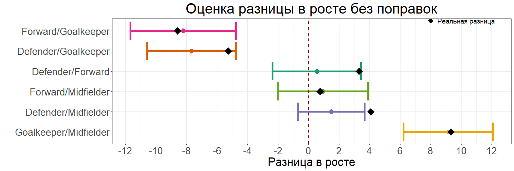
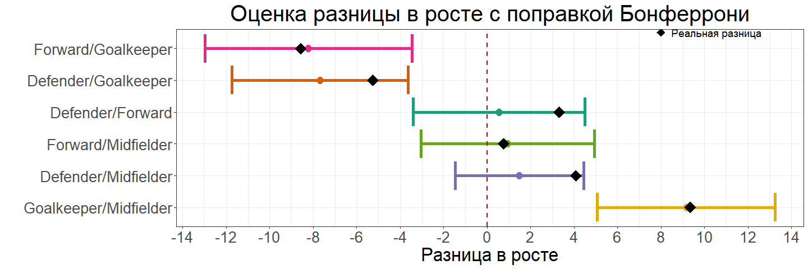
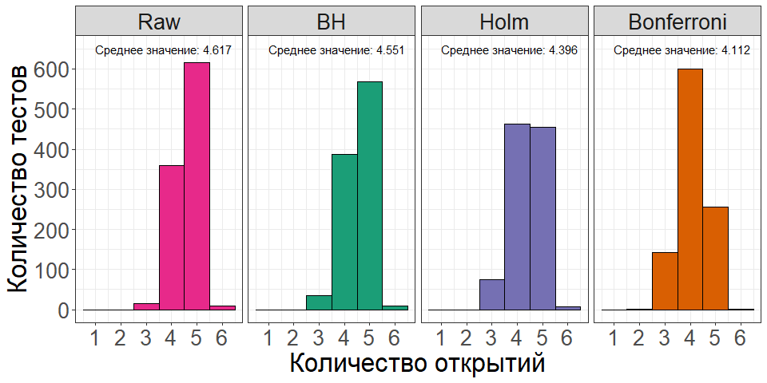

## Загрузка файла


``` r
set.seed(2210)

#Подобие генеральное совокупности
soccer_general <- read_delim("data/raw/soccer.csv", show_col_types = FALSE, delim = ";") %>% 
  transmute(Name, Position = as.factor(Position), Nationality = as.factor(Nationality), Height ) %>% 
  filter(Nationality %in% c("Spanish", "Italian", "German", "English", "Argentinian"))

#Выборка из 150 футболистов
soccer_sample <- soccer_general %>%
  slice_sample(n = 150)

head(soccer_sample)
```

```
## # A tibble: 6 × 4
##   Name              Position   Nationality Height
##   <chr>             <fct>      <fct>        <dbl>
## 1 Xavier Annunziata Midfielder Spanish        179
## 2 Adrian Ricchiuti  Midfielder Argentinian    168
## 3 Michael Thurk     Forward    German         178
## 4 Alessandro Nesta  Defender   Italian        187
## 5 Gonzalo Rodriguez Defender   Argentinian    182
## 6 Steve Sidwell     Midfielder English        178
```

## Задание 1

-   Постройте доверительные интервалы для попарных разниц между средними (без поправок и с поправкой Бонферрони).
-   Покрывают ли интервалы реальную разницу между средним ростом? Иллюстрации приветствуются.


``` r
# Реальная разница в среднем росте для игроков разных позиций
E_difference <- pairwise_t_test(soccer_general, Height ~ Position, pool.sd = FALSE, detailed = TRUE) %>% 
  transmute(difference = as.factor(paste0(group1, "/", group2)), estimate)

# Оценка разницы в среднем росте для игроков разных позиций без поправки на множественное сравнение
pairwise_none_adj <- pairwise_t_test(data = soccer_sample,  Height ~ Position, 
                                   conf.level = (1 - 0.05), p.adjust.method = "none", 
                                   pool.sd = FALSE, detailed = TRUE) %>% 
  transmute(difference = as.factor(paste0(group1, "/", group2)), estimate, conf.low, conf.high, p.adj)

# Оценка разницы в среднем росте для игроков разных позиций с поправкой Бонферрони
pairwise_bonferroni_adj <- pairwise_t_test(data = soccer_sample,  Height ~ Position,
                                   conf.level = (1 - 0.05/nrow(pairwise_none_adj)),
                                   p.adjust.method = "bonferroni",
                                   pool.sd = FALSE, detailed = TRUE) %>%
  transmute(difference = as.factor(paste0(group1, "/", group2)), estimate, conf.low, conf.high, p.adj)

# Доверительные интервалы для попарных разниц между средними без поправок 
ggplot(pairwise_none_adj)+
  geom_pointrange(aes(x = fct_reorder(difference, estimate, .desc = TRUE), y = estimate, 
                      ymin = conf.low, ymax = conf.high, colour = difference), 
                  size = 1, show.legend = FALSE)+
  geom_errorbar(aes(x = fct_reorder(difference, estimate, .desc = TRUE), y = estimate, 
                    ymin = conf.low, ymax = conf.high, colour = difference), 
                linewidth = 2, show.legend = FALSE)+
  geom_point(data = E_difference, aes(x = difference, y = estimate), 
             size = 7, shape = 18) +
  geom_hline(yintercept = 0, color = "firebrick4", linetype = "dashed", linewidth = 1)+
  scale_colour_brewer(palette = "Dark2")+
  scale_y_continuous(breaks = seq(-20, 20, 2))+
  labs(x = "", y = "Разница в росте",
       title = "Оценка разницы в росте без поправок")+
  coord_flip()+
  theme_custom +
  annotate("point", x = 6.5, y = 8, 
           size = 5, shape = 18) +
  annotate("text", x = 6.5, y = 8.2, hjust = 0,
            size = 5, label = "  Реальная разница")
```

<!-- -->

``` r
# Доверительные интервалы для попарных разниц между средними с поправкой Бонферрони 
ggplot(pairwise_bonferroni_adj)+
  geom_pointrange(aes(x = fct_reorder(difference, estimate, .desc = TRUE), y = estimate, 
                      ymin = conf.low, ymax = conf.high, colour = difference), 
                  size = 1, show.legend = FALSE)+
  geom_errorbar(aes(x = fct_reorder(difference, estimate, .desc = TRUE), y = estimate, 
                    ymin = conf.low, ymax = conf.high, colour = difference), 
                linewidth = 2, show.legend = FALSE)+
  geom_point(data = E_difference, aes(x = difference, y = estimate), 
             size = 7, shape = 18) +
  geom_hline(yintercept = 0, color = "firebrick4", linetype = "dashed", linewidth = 1)+
  scale_colour_brewer(palette = "Dark2")+
  scale_y_continuous(breaks = seq(-20, 20, 2))+
  labs(x = "", y = "Разница в росте", 
       title = "Оценка разницы в росте с поправкой Бонферрони")+
  coord_flip()+
  theme_custom+
  annotate("point", x = 6.5, y = 8, 
           size = 5, shape = 18) +
  annotate("text", x = 6.5, y = 8.2, hjust = 0,
            size = 5, label = "  Реальная разница")
```

<!-- -->

Если доверительные интервалы для попарных разниц между средними строятся без поправки на множественные сравнения, реальная разница в росте между защитниками и полузащитниками оказывается за пределами этих интервалов. При использовании поправки Бонферрони доверительные интервалы увеличиваются и включают все реальные разницы.

## Задание 2

-   Проведите попарные тесты для разниц между средними (без поправок, с поправкой Холма и поправкой Бенджамини-Хохберга).
-   Сколько открытий получилось в каждом случае? Сколько из них ложные?


``` r
raw <- c()        
bonferroni <- c()     
holm <- c()     
BH <- c()     
pb <- progress_bar$new(
  format = "  Processing [:bar] :percent in :elapsedfull",
  total = 1000, clear = FALSE, width= 100)

for (i in (1:1000)) {
  
  pb$tick()
  Sys.sleep(1 / 100)
  
  set.seed(i)
  soccer_simulation <- soccer_general %>%
  slice_sample(n = 150)
  
  pairwise_t_test(soccer_simulation, Height ~ Position,
                  p.adjust.method = "none", pool.sd = FALSE) %>% 
  filter(p.adj < 0.05) %>% nrow() -> raw[i]
  
  pairwise_t_test(soccer_simulation, Height ~ Position,
                  p.adjust.method = "bonferroni", pool.sd = FALSE) %>% 
  filter(p.adj < 0.05) %>% nrow() -> bonferroni[i]
  
  pairwise_t_test(soccer_simulation, Height ~ Position,
                  p.adjust.method = "holm", pool.sd = FALSE) %>% 
  filter(p.adj < 0.05) %>% nrow() -> holm[i]

  pairwise_t_test(soccer_simulation, Height ~ Position,
                  p.adjust.method = "BH", pool.sd = FALSE) %>% 
  filter(p.adj < 0.05) %>% nrow() -> BH[i]
  
} 

simulations <- tibble(
  discoveries = c(raw, bonferroni, holm, BH),
  method = as.factor(rep(c("Raw", "Bonferroni", "Holm", "BH"), each = 1000))) 

  ggplot() +
  geom_histogram(data = simulations, aes(x = discoveries, fill = method),
                 binwidth = 1, color = "black", show.legend = FALSE) +
  geom_text(data = simulations %>% group_by(method) %>% summarise(mean = mean(discoveries)), 
            aes(x = 1, y = 650, label = paste0("Среднее значение: ", mean)),
            hjust = 0)+
  scale_fill_brewer(palette = "Dark2")+
  scale_y_continuous(breaks = seq(0,1000,100))+
  scale_x_continuous(breaks = 1:6)+
  labs(x = "Количество открытий", y = "Количество тестов")+
  theme_custom +
  facet_grid( ~ fct_relevel(method, c("Raw", "BH", "Holm", "Bonferroni") ))
```

<!-- -->

Реальные различия в среднем росте игроков по позициям составляют: **3.3183291, -5.2565139, 4.0832884, -8.5748429, 0.7649594, 9.3398023**.
При проведении 1000 симуляций на различных выборках среднее количество значимых открытий в попарных тестах без поправок составляет **4.617**, что сопровождается высоким риском ошибки I рода. 

После применения поправок на множественные сравнения среднее количество значимых открытий ожидаемо уменьшается:

-   с поправкой Бенджамини-Хохберга — до **4.551**,  
-   с поправкой Холма — до **4.396**,  
-   с поправкой Бонферрони — до **4.112**.  

Поправка Бенджамини-Хохберга позволяет сохранить больше значимых открытий по сравнению с более строгими вариантами. Поправка Бонферрони минимизирует вероятность ошибки I рода, но существенно увеличивает риск ошибки II рода, особенно при большом количестве тестов. Поправка Холма — это компромиссный вариант, который обеспечивает сбалансированный контроль ошибок I и II рода.
