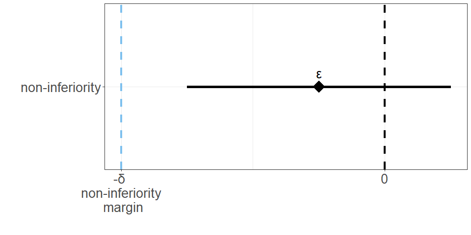
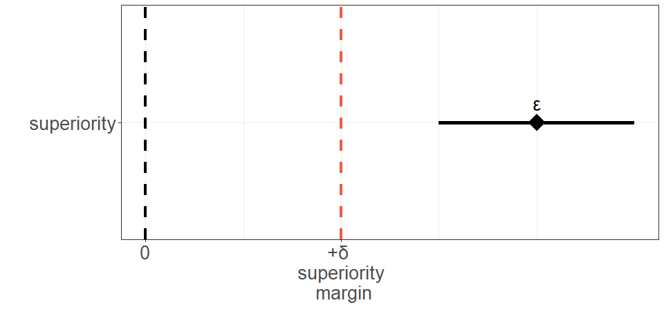
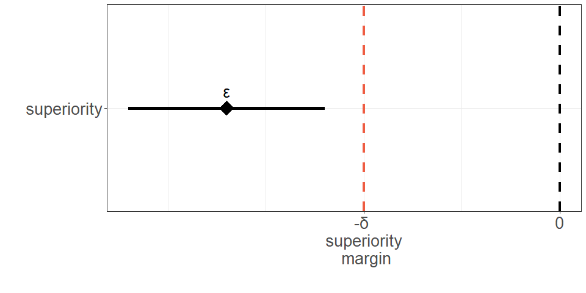

## 1. Исследование не меньшей эффективности препарата T в сравнении с препаратом R в лечении ХОБЛ. 

Статистическая гипотеза **не меньшей эффективности** в исследовании была сформулирована следующим образом:

$$
H_0: T - R \leq δ \\
H_A: T - R > δ
$$

- T – абсолютный прирост индекса Тиффно за 3 месяца для препарата T;
- R – абсолютный прирост индекса Тиффно за 3 месяца для препарата R; 
- δ – граница не меньшей эффективности, -2%.

<!-- -->

При расчёте необходимого размера выборки были сделаны следующие допущения:

1. Из литературных данных известно, что для референтного препарата R абсолютный прирост индекса Тиффно за 3 месяца в среднем (M±SD) составляет 7.2 ± 3.1%. Для исследуемого препарата T абсолютный прирост индекса Тиффно ожидается на том же уровне.
2. Граница не меньшей эффективности: – 2%.
3. Мощность исследования должна составлять 80%, соответственно, предельная величина ошибки II рода (β) = 0.2;
4. Распределение в группы будет равномерным в соотношении 1:1;
5. Односторонняя величина ошибки I рода (α) составляет 0.025;

Расчёт размера выборки был проведён в **RStudio** (версия 2024.12.0 Build 467) c использованием **языка R** (версия 4.4.0) с помощью функции **epi.ssninfc из пакета epiR** (версия 2.0.74).

Результаты расчёта представлены далее.


``` r
epi.ssninfc(
    treat = 7.2,
    control = 7.2,
    sigma = 3.1,
    delta = 2,
    n = NA,
    power = 0.8, 
    r = 1,
    alpha = 0.025
)
```

```
## $n.total
## [1] 76
## 
## $n.treat
## [1] 38
## 
## $n.control
## [1] 38
## 
## $delta
## [1] 2
## 
## $power
## [1] 0.8
```

Таким образом, в каждую из групп необходимо включить не менее 38 пациентов, в сумме - не менее 76 пациентов.      
С поправкой на частоту выбывания пациентов в ходе исследования - 20%, в каждую из групп необходимо включить не менее 46 пациентов, в сумме - не менее 92 пациентов.     
С поправкой на частоту выбывания пациентов в ходе скрининга - 10%, в каждую из групп необходимо включить не менее 51 пациента, в сумме - не менее 102 пациентов.     

## 2. Исследование превосходства препарата T над референтным лечением R в лечении рассеянного склероза.

Статистическая гипотеза **превосходства** в исследовании была сформулирована следующим образом:

$$
H_0: T - R \leq δ \\
H_A: T - R > δ
$$

- T – доля пациентов без новых очагов по МРТ к визиту #3 для препарата T;
- R – доля пациентов без новых очагов по МРТ к визиту #3 для препарата R; 
- δ – граница превосходства, 1%.

<!-- -->

При расчёте необходимого размера выборки были сделаны следующие допущения:

1. Согласно литературным данным, на фоне применения препарата R доля пациентов без новых очагов составляет 66%. Ожидается, что препарат T будет эффективнее препарата R примерно на 15%.
2. Граница превосходства: 1%.
3. Мощность исследования должна составлять 80%, соответственно, предельная величина ошибки II рода (β) = 0.2;
4. В группу T должно быть рандомизировано в 2 раза больше пациентов, чем в группу R.
5. Односторонняя величина ошибки I рода (α) составляет 0.025;

Расчёт размера выборки был проведён в **RStudio** (версия 2024.12.0 Build 467) c использованием **языка R** (версия 4.4.0) с помощью функции **epi.sssupb из пакета epiR** (версия 2.0.74).
 
Результаты расчёта представлены далее.


``` r
epi.sssupb(
    treat = 0.81,
    control = 0.66,
    delta = 1,
    n = NA,
    power = 0.8,
    r = 2,
    alpha = 0.025
)
```

```
## $n.total
## [1] 12
## 
## $n.treat
## [1] 8
## 
## $n.control
## [1] 4
## 
## $delta
## [1] 1
## 
## $power
## [1] 0.8
```
Таким образом, в группу лечения необходимо включить не менее 8 пациентов, а в контрольную группу - не менее 4 пациентов.  
С поправкой на частоту выбывания пациентов в ходе исследования - 20%, в группу лечения необходимо включить не менее 10 пациентов, а в контрольную группу - не менее 5 пациентов.   
С поправкой на частоту выбывания пациентов в ходе скрининга - 10%, в группу лечения необходимо включить не менее 11 пациентов, а в контрольную группу - не менее 6 пациентов.  

## 3. Исследование превосходства нового препарата А над препаратом Б в профилактике интраоперационных кровотечений. 

Статистическая гипотеза **превосходства** в исследовании была сформулирована следующим
образом:

$$
H_0: T - R \geq δ \\
H_A: T - R < δ
$$

- T – объём кровопотери при применении препарата A;
- R – объём кровопотери при применении препарата Б;  
- δ – граница превосходства, - 50 мл.

<!-- -->

При расчёте необходимого размера выборки были сделаны следующие допущения:

1. Из данных литературы известно, что средний объём кровопотери при применении препарата Б составляет 306 ± 52 мл. Ожидается, что препарат А в среднем будет снижать объём кровопотери на 20% в сравнении с препаратом Б - 244.8 ± 52 мл.
2. Граница превосходства: -50 мл.
3. Мощность исследования должна составлять 80%, соответственно, предельная величина ошибки II рода (β) = 0.2;
4. Распределение в группы должно быть таким, чтобы препарат А получили 75% пациентов, включённых в исследование.
5. Односторонняя величина ошибки I рода (α) составляет 0.025;

Расчёт размера выборки был проведён в **RStudio** (версия 2024.12.0 Build 467) c использованием **языка R** (версия 4.4.0) с помощью функции **TwoSampleMean.NIS из пакета TrialSize** (версия 1.4).

Результаты расчёта представлены далее.


``` r
TwoSampleMean.NIS(
    alpha = 0.025,
    beta = 0.2,
    sigma = 52,
    k = 3,
    delta = -50,
    margin = -61.2
)
```

```
## [1] 676.7657
```

Таким образом, в группу лечения необходимо включить не менее 677 пациентов, а в контрольную группу - не менее 226 пациентов.  
С поправкой на частоту выбывания пациентов в ходе исследования - 20%, в группу лечения необходимо включить не менее 813 пациентов, а в контрольную группу - не менее 272 пациентов.   
С поправкой на частоту выбывания пациентов в ходе скрининга - 10%, в группу лечения необходимо включить не менее 895 пациентов, а в контрольную группу - не менее 300 пациентов.  
 
## 4. Исследование превосходства нового препарата Y над препаратом X в снижении частоты рецидивов псориатического артрита.

Статистическая гипотеза **превосходства** в исследовании была сформулирована следующим
образом:

$$
H_0: T - R \geq δ \\
H_A: T - R < δ
$$

- T – частота рецидивов псориатического артрита за 6 месяцев на фоне лечения препаратом Y;
- R – частота рецидивов псориатического артрита за 6 месяцев на фоне лечения препаратом X;
- δ – граница превосходства, - 5%.

<!-- -->

При расчёте необходимого размера выборки были сделаны следующие допущения:

1. Из данных литературы известно, что на фоне лечения препаратом Х рецидив псориатического артрита за 6 месяцев наблюдается в 32% случаев. Ожидается, новый препарат Y снизит частоту рецидивов на 15%, до 17% случаев.
2. Граница превосходства: -5%.
3. Мощность исследования должна составлять 80%, соответственно, предельная величина ошибки II рода (β) = 0.2;
4. Распределение в группы должно быть таким, чтобы препарат Х получили не более 250 пациентов включённых в исследование. Без учета поправки на частоту выбывания пациентов в ходе исследования (20%), в группу лечения необходимо включить не более 208 пацентов.
5. Односторонняя величина ошибки I рода (α) составляет 0.025;

Расчёт размера выборки был проведён в **RStudio** (версия 2024.12.0 Build 467) c использованием **языка R** (версия 4.4.0) с помощью функции **TwoSampleProportion.NIS из пакета TrialSize** (версия 1.4).
 
Результаты расчёта представлены далее.


``` r
TwoSampleProportion.NIS(
    alpha = 0.025,
    beta = 0.2,
    p1 = 0.17,
    p2 = 0.32,
    k = 0.56,
    delta = -0.15,
    margin = -0.05
)
```

```
## [1] 206.391
```
Таким образом, в группу лечения необходимо включить не менее 207 пациентов, а в контрольную группу - не менее 370 пациентов.   
С поправкой на частоту выбывания пациентов в ходе исследования - 20%, в группу лечения необходимо включить не менее 249 пациентов, а в контрольную группу - не менее 444 пациентов.   
С поправкой на частоту выбывания пациентов в ходе скрининга - 10%, в группу лечения необходимо включить не менее 274 пациентов, а в контрольную группу - не менее 489 пациентов.  
