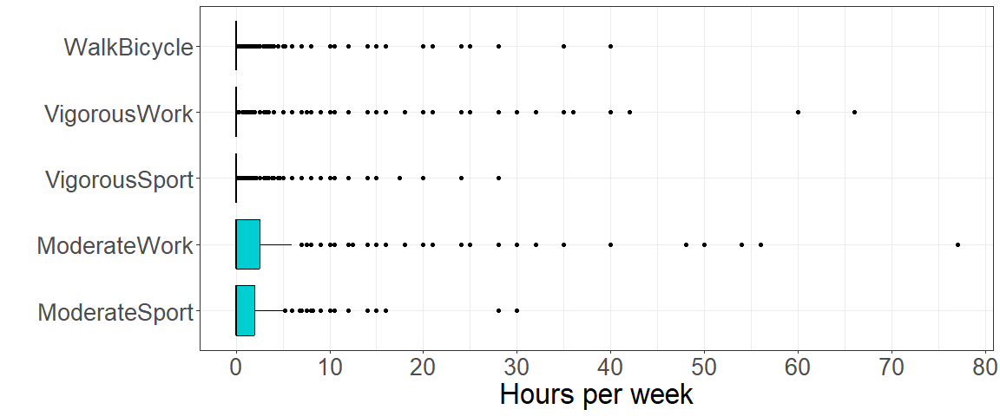
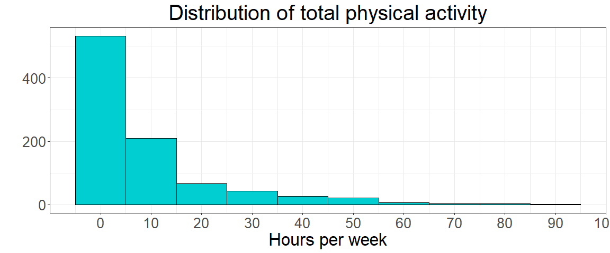
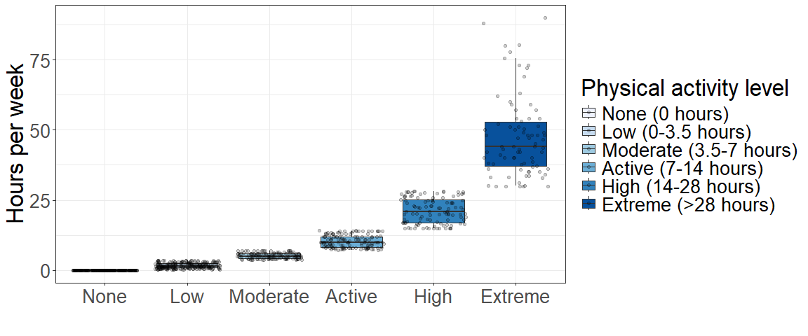
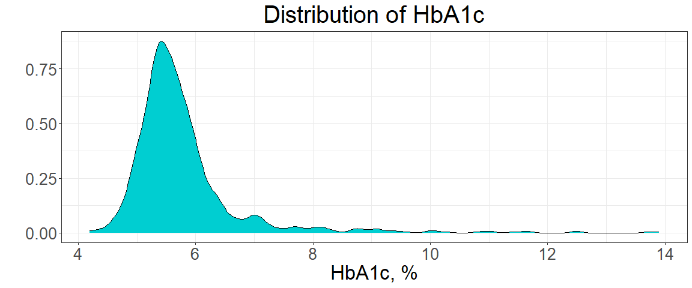
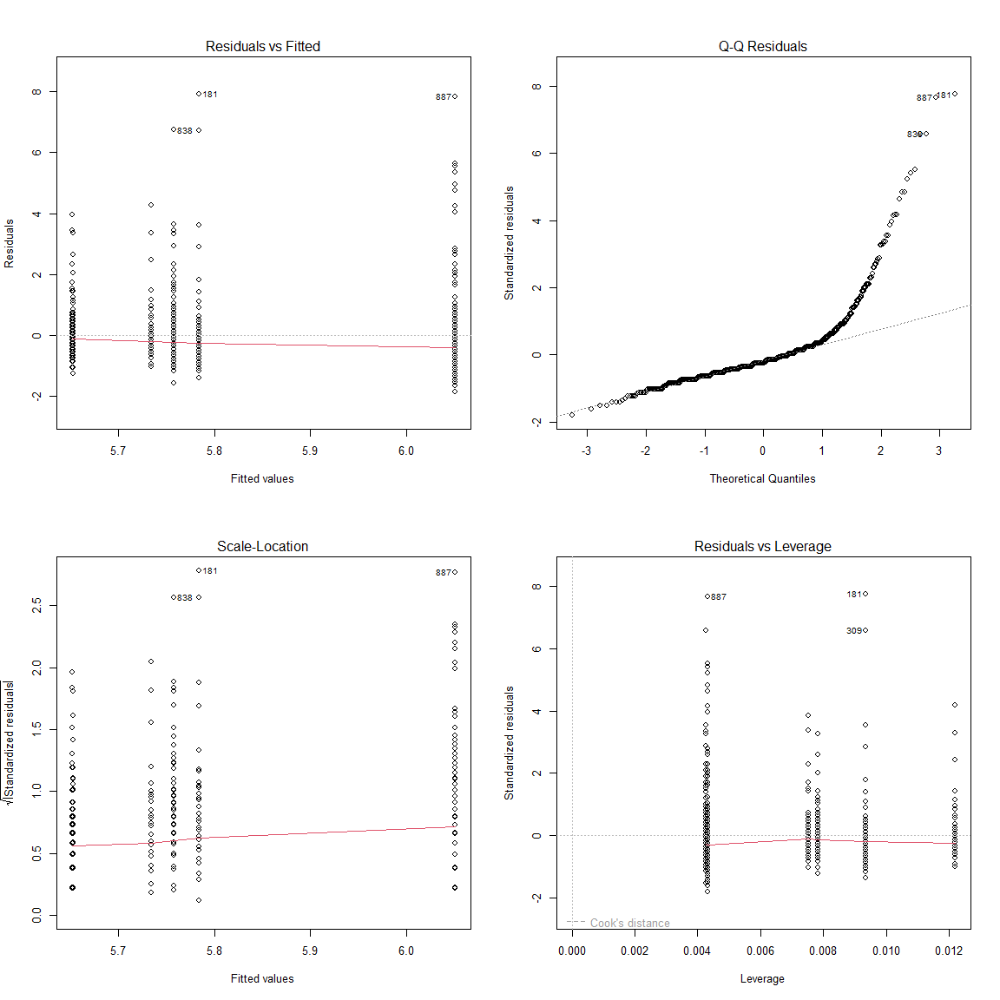
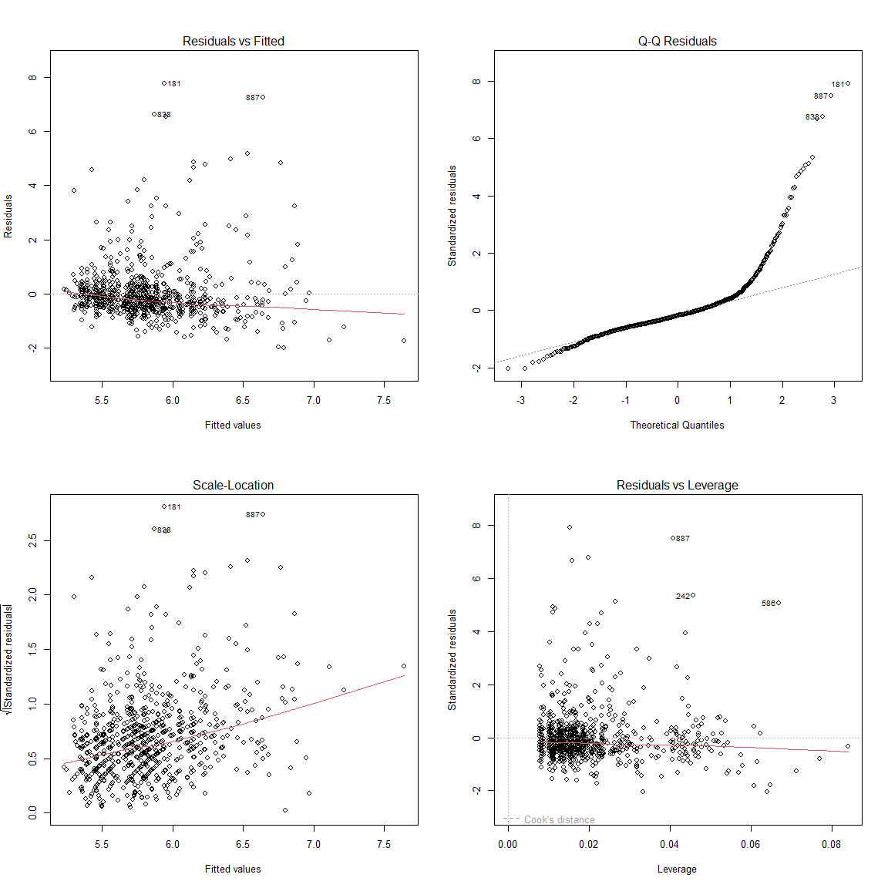

## Оценка физической активности 

Для оценки физической активности респондентов использовались следующие показатели:

-   Часы работы с высокой интенсивностью в неделю (**Vigorous Work**);
-   Часы работы с умеренной интенсивностью в неделю (**Moderate Work**);
-   Часы ходьбы или езды на велосипеде в неделю (**Walk/Bicycle**);
-   Часы занятия спорта с высокой интенсивностью в неделю (**Vigorous Sport**);
-   Часы занятия спорта с умеренной интенсивностью в неделю (**Moderate Sport**);


Изначально предполагалось, что любые виды физической активности связаны с более низким уровнем гликированного гемоглобина.

## Ковариаты модели 

Согласно представленному DAG, имеющиеся ковариаты имеют следующую роль:

- Конфаундеры — переменные, которые влияют как на зависимую переменную, так и на независимую переменную:
Пол, Раса, Сопутствующие заболевания.
- Коллайдеры — переменные, на которые оказывают влияние как зависимая, так и независимая переменные: 
Кровяное давление.
- Медиаторы — переменные, через которые независимая переменная оказывает воздействие на зависимую: 
Индекс массы тела.
- Нейтральные переменные — переменные, которые влияют либо на зависимую переменную, либо на независимую: Регулярность курения, Образование, Доход семьи, Возраст, Семейный статус, Прием лекарств от диабета.

Для учета эффекта физической активности на уровень гликированного гемоглобина в модель были включены следующие ковариаты, характеризующие респондента:

-   Пол (**Sex**);
-   Раса (**Race**): *Latino, White, Black, Other*;
-   Регулярность курения (**Smoking**): *Every day, Some days, Not at all*;
-   Наличие cопутствующих заболеваний: *Yes/No*
    -   Бронхиальная астма (**Asthma**)
    -   Болезни сердца (**Heart Disease**)
    -   Инсульт (**Stroke**)
    -   Болезни щитовидной железы (**Thyroid Disease**)
    -   Хронические обструктивные заболевания легких (**COPD**)
    -   Злокачественные опухоли (**Cancer**)


## Разведочный анализ данных 

Для выбранных показателей физической активности медиана и межквартильный размах (IQR) находятся на уровне нуля. Это свидетельствует о скошенном распределении данных и необходимости их преобразования.

<!-- -->

Все пять показателей физической активности были объединены в общий показатель — **Physical Activity**, рассчитанный как сумма их значений. Такой подход позволяет лучше отразить общий уровень нагрузки респондентов. Хотя распределение стало более равномерным, перекос в сторону нулевых значений сохраняется.

<!-- -->

Для анализа была введена категориальная переменная **Activity Level**, что упрощает интерпретацию и учёт различий между уровнями активности.

<!-- -->

Уровень физической активности и ковариаты модели представлены в виде категориальных переменных, каждая из которых имеет достаточное количество наблюдений (**более 3%**). Распределение гликированного гемоглобина (**HbA1c**) скошено вправо, но с учётом объема выборки  это не является критическим фактором при построении модели.


```{=html}
<div id="kbsoflwyko" style="padding-left:0px;padding-right:0px;padding-top:10px;padding-bottom:10px;overflow-x:auto;overflow-y:auto;width:auto;height:auto;">
<style>#kbsoflwyko table {
  font-family: system-ui, 'Segoe UI', Roboto, Helvetica, Arial, sans-serif, 'Apple Color Emoji', 'Segoe UI Emoji', 'Segoe UI Symbol', 'Noto Color Emoji';
  -webkit-font-smoothing: antialiased;
  -moz-osx-font-smoothing: grayscale;
}

#kbsoflwyko thead, #kbsoflwyko tbody, #kbsoflwyko tfoot, #kbsoflwyko tr, #kbsoflwyko td, #kbsoflwyko th {
  border-style: none;
}

#kbsoflwyko p {
  margin: 0;
  padding: 0;
}

#kbsoflwyko .gt_table {
  display: table;
  border-collapse: collapse;
  line-height: normal;
  margin-left: auto;
  margin-right: auto;
  color: #333333;
  font-size: 16px;
  font-weight: normal;
  font-style: normal;
  background-color: #FFFFFF;
  width: auto;
  border-top-style: solid;
  border-top-width: 2px;
  border-top-color: #A8A8A8;
  border-right-style: none;
  border-right-width: 2px;
  border-right-color: #D3D3D3;
  border-bottom-style: solid;
  border-bottom-width: 2px;
  border-bottom-color: #A8A8A8;
  border-left-style: none;
  border-left-width: 2px;
  border-left-color: #D3D3D3;
}

#kbsoflwyko .gt_caption {
  padding-top: 4px;
  padding-bottom: 4px;
}

#kbsoflwyko .gt_title {
  color: #333333;
  font-size: 125%;
  font-weight: initial;
  padding-top: 4px;
  padding-bottom: 4px;
  padding-left: 5px;
  padding-right: 5px;
  border-bottom-color: #FFFFFF;
  border-bottom-width: 0;
}

#kbsoflwyko .gt_subtitle {
  color: #333333;
  font-size: 85%;
  font-weight: initial;
  padding-top: 3px;
  padding-bottom: 5px;
  padding-left: 5px;
  padding-right: 5px;
  border-top-color: #FFFFFF;
  border-top-width: 0;
}

#kbsoflwyko .gt_heading {
  background-color: #FFFFFF;
  text-align: center;
  border-bottom-color: #FFFFFF;
  border-left-style: none;
  border-left-width: 1px;
  border-left-color: #D3D3D3;
  border-right-style: none;
  border-right-width: 1px;
  border-right-color: #D3D3D3;
}

#kbsoflwyko .gt_bottom_border {
  border-bottom-style: solid;
  border-bottom-width: 2px;
  border-bottom-color: #D3D3D3;
}

#kbsoflwyko .gt_col_headings {
  border-top-style: solid;
  border-top-width: 2px;
  border-top-color: #D3D3D3;
  border-bottom-style: solid;
  border-bottom-width: 2px;
  border-bottom-color: #D3D3D3;
  border-left-style: none;
  border-left-width: 1px;
  border-left-color: #D3D3D3;
  border-right-style: none;
  border-right-width: 1px;
  border-right-color: #D3D3D3;
}

#kbsoflwyko .gt_col_heading {
  color: #333333;
  background-color: #FFFFFF;
  font-size: 100%;
  font-weight: normal;
  text-transform: inherit;
  border-left-style: none;
  border-left-width: 1px;
  border-left-color: #D3D3D3;
  border-right-style: none;
  border-right-width: 1px;
  border-right-color: #D3D3D3;
  vertical-align: bottom;
  padding-top: 5px;
  padding-bottom: 6px;
  padding-left: 5px;
  padding-right: 5px;
  overflow-x: hidden;
}

#kbsoflwyko .gt_column_spanner_outer {
  color: #333333;
  background-color: #FFFFFF;
  font-size: 100%;
  font-weight: normal;
  text-transform: inherit;
  padding-top: 0;
  padding-bottom: 0;
  padding-left: 4px;
  padding-right: 4px;
}

#kbsoflwyko .gt_column_spanner_outer:first-child {
  padding-left: 0;
}

#kbsoflwyko .gt_column_spanner_outer:last-child {
  padding-right: 0;
}

#kbsoflwyko .gt_column_spanner {
  border-bottom-style: solid;
  border-bottom-width: 2px;
  border-bottom-color: #D3D3D3;
  vertical-align: bottom;
  padding-top: 5px;
  padding-bottom: 5px;
  overflow-x: hidden;
  display: inline-block;
  width: 100%;
}

#kbsoflwyko .gt_spanner_row {
  border-bottom-style: hidden;
}

#kbsoflwyko .gt_group_heading {
  padding-top: 8px;
  padding-bottom: 8px;
  padding-left: 5px;
  padding-right: 5px;
  color: #333333;
  background-color: #FFFFFF;
  font-size: 100%;
  font-weight: initial;
  text-transform: inherit;
  border-top-style: solid;
  border-top-width: 2px;
  border-top-color: #D3D3D3;
  border-bottom-style: solid;
  border-bottom-width: 2px;
  border-bottom-color: #D3D3D3;
  border-left-style: none;
  border-left-width: 1px;
  border-left-color: #D3D3D3;
  border-right-style: none;
  border-right-width: 1px;
  border-right-color: #D3D3D3;
  vertical-align: middle;
  text-align: left;
}

#kbsoflwyko .gt_empty_group_heading {
  padding: 0.5px;
  color: #333333;
  background-color: #FFFFFF;
  font-size: 100%;
  font-weight: initial;
  border-top-style: solid;
  border-top-width: 2px;
  border-top-color: #D3D3D3;
  border-bottom-style: solid;
  border-bottom-width: 2px;
  border-bottom-color: #D3D3D3;
  vertical-align: middle;
}

#kbsoflwyko .gt_from_md > :first-child {
  margin-top: 0;
}

#kbsoflwyko .gt_from_md > :last-child {
  margin-bottom: 0;
}

#kbsoflwyko .gt_row {
  padding-top: 8px;
  padding-bottom: 8px;
  padding-left: 5px;
  padding-right: 5px;
  margin: 10px;
  border-top-style: solid;
  border-top-width: 1px;
  border-top-color: #D3D3D3;
  border-left-style: none;
  border-left-width: 1px;
  border-left-color: #D3D3D3;
  border-right-style: none;
  border-right-width: 1px;
  border-right-color: #D3D3D3;
  vertical-align: middle;
  overflow-x: hidden;
}

#kbsoflwyko .gt_stub {
  color: #333333;
  background-color: #FFFFFF;
  font-size: 100%;
  font-weight: initial;
  text-transform: inherit;
  border-right-style: solid;
  border-right-width: 2px;
  border-right-color: #D3D3D3;
  padding-left: 5px;
  padding-right: 5px;
}

#kbsoflwyko .gt_stub_row_group {
  color: #333333;
  background-color: #FFFFFF;
  font-size: 100%;
  font-weight: initial;
  text-transform: inherit;
  border-right-style: solid;
  border-right-width: 2px;
  border-right-color: #D3D3D3;
  padding-left: 5px;
  padding-right: 5px;
  vertical-align: top;
}

#kbsoflwyko .gt_row_group_first td {
  border-top-width: 2px;
}

#kbsoflwyko .gt_row_group_first th {
  border-top-width: 2px;
}

#kbsoflwyko .gt_summary_row {
  color: #333333;
  background-color: #FFFFFF;
  text-transform: inherit;
  padding-top: 8px;
  padding-bottom: 8px;
  padding-left: 5px;
  padding-right: 5px;
}

#kbsoflwyko .gt_first_summary_row {
  border-top-style: solid;
  border-top-color: #D3D3D3;
}

#kbsoflwyko .gt_first_summary_row.thick {
  border-top-width: 2px;
}

#kbsoflwyko .gt_last_summary_row {
  padding-top: 8px;
  padding-bottom: 8px;
  padding-left: 5px;
  padding-right: 5px;
  border-bottom-style: solid;
  border-bottom-width: 2px;
  border-bottom-color: #D3D3D3;
}

#kbsoflwyko .gt_grand_summary_row {
  color: #333333;
  background-color: #FFFFFF;
  text-transform: inherit;
  padding-top: 8px;
  padding-bottom: 8px;
  padding-left: 5px;
  padding-right: 5px;
}

#kbsoflwyko .gt_first_grand_summary_row {
  padding-top: 8px;
  padding-bottom: 8px;
  padding-left: 5px;
  padding-right: 5px;
  border-top-style: double;
  border-top-width: 6px;
  border-top-color: #D3D3D3;
}

#kbsoflwyko .gt_last_grand_summary_row_top {
  padding-top: 8px;
  padding-bottom: 8px;
  padding-left: 5px;
  padding-right: 5px;
  border-bottom-style: double;
  border-bottom-width: 6px;
  border-bottom-color: #D3D3D3;
}

#kbsoflwyko .gt_striped {
  background-color: rgba(128, 128, 128, 0.05);
}

#kbsoflwyko .gt_table_body {
  border-top-style: solid;
  border-top-width: 2px;
  border-top-color: #D3D3D3;
  border-bottom-style: solid;
  border-bottom-width: 2px;
  border-bottom-color: #D3D3D3;
}

#kbsoflwyko .gt_footnotes {
  color: #333333;
  background-color: #FFFFFF;
  border-bottom-style: none;
  border-bottom-width: 2px;
  border-bottom-color: #D3D3D3;
  border-left-style: none;
  border-left-width: 2px;
  border-left-color: #D3D3D3;
  border-right-style: none;
  border-right-width: 2px;
  border-right-color: #D3D3D3;
}

#kbsoflwyko .gt_footnote {
  margin: 0px;
  font-size: 90%;
  padding-top: 4px;
  padding-bottom: 4px;
  padding-left: 5px;
  padding-right: 5px;
}

#kbsoflwyko .gt_sourcenotes {
  color: #333333;
  background-color: #FFFFFF;
  border-bottom-style: none;
  border-bottom-width: 2px;
  border-bottom-color: #D3D3D3;
  border-left-style: none;
  border-left-width: 2px;
  border-left-color: #D3D3D3;
  border-right-style: none;
  border-right-width: 2px;
  border-right-color: #D3D3D3;
}

#kbsoflwyko .gt_sourcenote {
  font-size: 90%;
  padding-top: 4px;
  padding-bottom: 4px;
  padding-left: 5px;
  padding-right: 5px;
}

#kbsoflwyko .gt_left {
  text-align: left;
}

#kbsoflwyko .gt_center {
  text-align: center;
}

#kbsoflwyko .gt_right {
  text-align: right;
  font-variant-numeric: tabular-nums;
}

#kbsoflwyko .gt_font_normal {
  font-weight: normal;
}

#kbsoflwyko .gt_font_bold {
  font-weight: bold;
}

#kbsoflwyko .gt_font_italic {
  font-style: italic;
}

#kbsoflwyko .gt_super {
  font-size: 65%;
}

#kbsoflwyko .gt_footnote_marks {
  font-size: 75%;
  vertical-align: 0.4em;
  position: initial;
}

#kbsoflwyko .gt_asterisk {
  font-size: 100%;
  vertical-align: 0;
}

#kbsoflwyko .gt_indent_1 {
  text-indent: 5px;
}

#kbsoflwyko .gt_indent_2 {
  text-indent: 10px;
}

#kbsoflwyko .gt_indent_3 {
  text-indent: 15px;
}

#kbsoflwyko .gt_indent_4 {
  text-indent: 20px;
}

#kbsoflwyko .gt_indent_5 {
  text-indent: 25px;
}
</style>
<table class="gt_table" data-quarto-disable-processing="false" data-quarto-bootstrap="false">
  <thead>
    <tr class="gt_col_headings">
      <th class="gt_col_heading gt_columns_bottom_border gt_left" rowspan="1" colspan="1" scope="col" id="&lt;strong&gt;Characteristic&lt;/strong&gt;"><strong>Characteristic</strong></th>
      <th class="gt_col_heading gt_columns_bottom_border gt_center" rowspan="1" colspan="1" scope="col" id="&lt;strong&gt;N = 916&lt;/strong&gt;&lt;span class=&quot;gt_footnote_marks&quot; style=&quot;white-space:nowrap;font-style:italic;font-weight:normal;&quot;&gt;&lt;sup&gt;1&lt;/sup&gt;&lt;/span&gt;"><strong>N = 916</strong><span class="gt_footnote_marks" style="white-space:nowrap;font-style:italic;font-weight:normal;"><sup>1</sup></span></th>
    </tr>
  </thead>
  <tbody class="gt_table_body">
    <tr><td headers="label" class="gt_row gt_left">HbA1c</td>
<td headers="stat_0" class="gt_row gt_center">5.60 (5.30, 5.90)</td></tr>
    <tr><td headers="label" class="gt_row gt_left">ActivityLevel</td>
<td headers="stat_0" class="gt_row gt_center"><br /></td></tr>
    <tr><td headers="label" class="gt_row gt_left">    None</td>
<td headers="stat_0" class="gt_row gt_center">231 (25%)</td></tr>
    <tr><td headers="label" class="gt_row gt_left">    Low</td>
<td headers="stat_0" class="gt_row gt_center">235 (26%)</td></tr>
    <tr><td headers="label" class="gt_row gt_left">    Moderate</td>
<td headers="stat_0" class="gt_row gt_center">128 (14%)</td></tr>
    <tr><td headers="label" class="gt_row gt_left">    Active</td>
<td headers="stat_0" class="gt_row gt_center">133 (15%)</td></tr>
    <tr><td headers="label" class="gt_row gt_left">    High</td>
<td headers="stat_0" class="gt_row gt_center">107 (12%)</td></tr>
    <tr><td headers="label" class="gt_row gt_left">    Extreme</td>
<td headers="stat_0" class="gt_row gt_center">82 (9.0%)</td></tr>
    <tr><td headers="label" class="gt_row gt_left">Sex</td>
<td headers="stat_0" class="gt_row gt_center"><br /></td></tr>
    <tr><td headers="label" class="gt_row gt_left">    Male</td>
<td headers="stat_0" class="gt_row gt_center">539 (59%)</td></tr>
    <tr><td headers="label" class="gt_row gt_left">    Female</td>
<td headers="stat_0" class="gt_row gt_center">377 (41%)</td></tr>
    <tr><td headers="label" class="gt_row gt_left">Race</td>
<td headers="stat_0" class="gt_row gt_center"><br /></td></tr>
    <tr><td headers="label" class="gt_row gt_left">    Latino</td>
<td headers="stat_0" class="gt_row gt_center">176 (19%)</td></tr>
    <tr><td headers="label" class="gt_row gt_left">    White</td>
<td headers="stat_0" class="gt_row gt_center">463 (51%)</td></tr>
    <tr><td headers="label" class="gt_row gt_left">    Black</td>
<td headers="stat_0" class="gt_row gt_center">175 (19%)</td></tr>
    <tr><td headers="label" class="gt_row gt_left">    Other</td>
<td headers="stat_0" class="gt_row gt_center">102 (11%)</td></tr>
    <tr><td headers="label" class="gt_row gt_left">Smoking</td>
<td headers="stat_0" class="gt_row gt_center"><br /></td></tr>
    <tr><td headers="label" class="gt_row gt_left">    Every day</td>
<td headers="stat_0" class="gt_row gt_center">133 (15%)</td></tr>
    <tr><td headers="label" class="gt_row gt_left">    Some days</td>
<td headers="stat_0" class="gt_row gt_center">31 (3.4%)</td></tr>
    <tr><td headers="label" class="gt_row gt_left">    Not at all</td>
<td headers="stat_0" class="gt_row gt_center">752 (82%)</td></tr>
    <tr><td headers="label" class="gt_row gt_left">Asthma</td>
<td headers="stat_0" class="gt_row gt_center">144 (16%)</td></tr>
    <tr><td headers="label" class="gt_row gt_left">HeartDisease</td>
<td headers="stat_0" class="gt_row gt_center">77 (8.4%)</td></tr>
    <tr><td headers="label" class="gt_row gt_left">Stroke</td>
<td headers="stat_0" class="gt_row gt_center">32 (3.5%)</td></tr>
    <tr><td headers="label" class="gt_row gt_left">ThyroidDisease</td>
<td headers="stat_0" class="gt_row gt_center">128 (14%)</td></tr>
    <tr><td headers="label" class="gt_row gt_left">COPD</td>
<td headers="stat_0" class="gt_row gt_center">39 (4.3%)</td></tr>
    <tr><td headers="label" class="gt_row gt_left">Cancer</td>
<td headers="stat_0" class="gt_row gt_center">104 (11%)</td></tr>
  </tbody>
  
  <tfoot class="gt_footnotes">
    <tr>
      <td class="gt_footnote" colspan="2"><span class="gt_footnote_marks" style="white-space:nowrap;font-style:italic;font-weight:normal;"><sup>1</sup></span> Median (IQR); n (%)</td>
    </tr>
  </tfoot>
</table>
</div>
```
<!-- -->

## Регрессионный анализ

Зависимость **HbA1c** от уровня физической активности (**Activity Level**) была исследована как в базовой модели, так и в модели с ковариатами. После проведения диагностики можно отметить следующие моменты, характерные для обеих моделей:

- График **Residuals vs Fitted** не предоставляет существенной информации, так как в обеих моделях используются исключительно категориальные переменные.
- График **Residuals vs Leverage** не выявил значительных выбросов, что свидетельствует о том, что данные не содержат наблюдений с большим влиянием.
- График **Q-Q Residuals** указывает на нарушение нормальности остатков, однако из-за большого объема выборки это нарушение не критично.
- График **Scale-location** указывает на наличие проблемы с гетероскедастичностью остатков, что требует использования робастных стандартных ошибок для корректировки коэффициентов модели.

Диагностика модели зависимости гликированного гемоглобина от физической активности без ковариат: <!-- -->

Диагностика модели зависимости гликированного гемоглобина от физической активности с включением ковариат: <!-- -->

Точечная оценка эффекта физической активности представляет уровень HbA1c при базовом уровне активности (None: 0 hours/week) - **Intercept**, а также как изменение уровня физической активности влияет на значения HbA1c по сравнению с базовым уровнем.

Интервальная оценка помогает оценить точность и достоверность этих эффектов. Если доверительный интервал не включает ноль, то можно говорить о **статистически значимом эффекте**.

Для модели без ковариат, значение HbA1c на базовом уровне активности - **6.052%**. С увеличением активности наблюдаются следующие изменения:

- для уровня физической активности Low (0-3.5 hours/week) — **снижение HbA1c на 0.294%**
- для уровня физической активности Moderate (3.5-7 hours/week) — **снижение HbA1c на 0.399%**
- для уровня физической активности Active (7-14 hours/week) — **снижение HbA1c на 0.400%**
- для уровня физической активности High (14-28 hours/week) — **снижение HbA1c на 0.267%**
- для уровня физической активности Extreme (>28 hours/week) — **снижение HbA1c на 0.317%**

Для данной модели Intercept является статистически значимым, так как его доверительный интервал не пересекает ноль. Кроме того, для всех уровней активности (*кроме High (14-28 hours/week)*) наблюдается статистически значимое снижение уровня HbA1c по сравнению с базовым уровнем.


```{=html}
<div class="tabwid"><style>.cl-26f1eed6{}.cl-26dbf9b4{font-family:'Arial';font-size:11pt;font-weight:normal;font-style:normal;text-decoration:none;color:rgba(0, 0, 0, 1.00);background-color:transparent;}.cl-26dbf9fa{font-family:'Arial';font-size:11pt;font-weight:normal;font-style:normal;text-decoration:none;color:rgba(255, 0, 0, 1.00);background-color:transparent;}.cl-26e5958c{margin:0;text-align:left;border-bottom: 0 solid rgba(0, 0, 0, 1.00);border-top: 0 solid rgba(0, 0, 0, 1.00);border-left: 0 solid rgba(0, 0, 0, 1.00);border-right: 0 solid rgba(0, 0, 0, 1.00);padding-bottom:5pt;padding-top:5pt;padding-left:5pt;padding-right:5pt;line-height: 1;background-color:transparent;}.cl-26e5d042{width:0.75in;background-color:transparent;vertical-align: middle;border-bottom: 1.5pt solid rgba(102, 102, 102, 1.00);border-top: 1.5pt solid rgba(102, 102, 102, 1.00);border-left: 0 solid rgba(0, 0, 0, 1.00);border-right: 0 solid rgba(0, 0, 0, 1.00);margin-bottom:0;margin-top:0;margin-left:0;margin-right:0;}.cl-26e5d056{width:0.75in;background-color:transparent;vertical-align: middle;border-bottom: 0 solid rgba(0, 0, 0, 1.00);border-top: 0 solid rgba(0, 0, 0, 1.00);border-left: 0 solid rgba(0, 0, 0, 1.00);border-right: 0 solid rgba(0, 0, 0, 1.00);margin-bottom:0;margin-top:0;margin-left:0;margin-right:0;}.cl-26e5d060{width:0.75in;background-color:transparent;vertical-align: middle;border-bottom: 1.5pt solid rgba(102, 102, 102, 1.00);border-top: 0 solid rgba(0, 0, 0, 1.00);border-left: 0 solid rgba(0, 0, 0, 1.00);border-right: 0 solid rgba(0, 0, 0, 1.00);margin-bottom:0;margin-top:0;margin-left:0;margin-right:0;}</style><table data-quarto-disable-processing='true' class='cl-26f1eed6'><thead><tr style="overflow-wrap:break-word;"><th class="cl-26e5d042"><p class="cl-26e5958c"><span class="cl-26dbf9b4">term</span></p></th><th class="cl-26e5d042"><p class="cl-26e5958c"><span class="cl-26dbf9b4">estimate</span></p></th><th class="cl-26e5d042"><p class="cl-26e5958c"><span class="cl-26dbf9b4">std.error</span></p></th><th class="cl-26e5d042"><p class="cl-26e5958c"><span class="cl-26dbf9b4">statistic</span></p></th><th class="cl-26e5d042"><p class="cl-26e5958c"><span class="cl-26dbf9b4">p.value</span></p></th><th class="cl-26e5d042"><p class="cl-26e5958c"><span class="cl-26dbf9b4">conf.low</span></p></th><th class="cl-26e5d042"><p class="cl-26e5958c"><span class="cl-26dbf9b4">conf.high</span></p></th></tr></thead><tbody><tr style="overflow-wrap:break-word;"><td class="cl-26e5d056"><p class="cl-26e5958c"><span class="cl-26dbf9b4">(Intercept)</span></p></td><td class="cl-26e5d056"><p class="cl-26e5958c"><span class="cl-26dbf9b4"> 6.052</span></p></td><td class="cl-26e5d056"><p class="cl-26e5958c"><span class="cl-26dbf9b4">0.089</span></p></td><td class="cl-26e5d056"><p class="cl-26e5958c"><span class="cl-26dbf9b4">67.97</span></p></td><td class="cl-26e5d056"><p class="cl-26e5958c"><span class="cl-26dbf9b4">0.000000</span></p></td><td class="cl-26e5d056"><p class="cl-26e5958c"><span class="cl-26dbf9b4"> 5.877</span></p></td><td class="cl-26e5d056"><p class="cl-26e5958c"><span class="cl-26dbf9b4"> 6.2262</span></p></td></tr><tr style="overflow-wrap:break-word;"><td class="cl-26e5d056"><p class="cl-26e5958c"><span class="cl-26dbf9b4">ActivityLevelLow</span></p></td><td class="cl-26e5d056"><p class="cl-26e5958c"><span class="cl-26dbf9b4">-0.294</span></p></td><td class="cl-26e5d056"><p class="cl-26e5958c"><span class="cl-26dbf9b4">0.106</span></p></td><td class="cl-26e5d056"><p class="cl-26e5958c"><span class="cl-26dbf9b4">-2.76</span></p></td><td class="cl-26e5d056"><p class="cl-26e5958c"><span class="cl-26dbf9b4">0.005829</span></p></td><td class="cl-26e5d056"><p class="cl-26e5958c"><span class="cl-26dbf9b4">-0.502</span></p></td><td class="cl-26e5d056"><p class="cl-26e5958c"><span class="cl-26dbf9b4">-0.0851</span></p></td></tr><tr style="overflow-wrap:break-word;"><td class="cl-26e5d056"><p class="cl-26e5958c"><span class="cl-26dbf9b4">ActivityLevelModerate</span></p></td><td class="cl-26e5d056"><p class="cl-26e5958c"><span class="cl-26dbf9b4">-0.399</span></p></td><td class="cl-26e5d056"><p class="cl-26e5958c"><span class="cl-26dbf9b4">0.106</span></p></td><td class="cl-26e5d056"><p class="cl-26e5958c"><span class="cl-26dbf9b4">-3.75</span></p></td><td class="cl-26e5d056"><p class="cl-26e5958c"><span class="cl-26dbf9b4">0.000185</span></p></td><td class="cl-26e5d056"><p class="cl-26e5958c"><span class="cl-26dbf9b4">-0.608</span></p></td><td class="cl-26e5d056"><p class="cl-26e5958c"><span class="cl-26dbf9b4">-0.1905</span></p></td></tr><tr style="overflow-wrap:break-word;"><td class="cl-26e5d056"><p class="cl-26e5958c"><span class="cl-26dbf9b4">ActivityLevelActive</span></p></td><td class="cl-26e5d056"><p class="cl-26e5958c"><span class="cl-26dbf9b4">-0.400</span></p></td><td class="cl-26e5d056"><p class="cl-26e5958c"><span class="cl-26dbf9b4">0.108</span></p></td><td class="cl-26e5d056"><p class="cl-26e5958c"><span class="cl-26dbf9b4">-3.70</span></p></td><td class="cl-26e5d056"><p class="cl-26e5958c"><span class="cl-26dbf9b4">0.000232</span></p></td><td class="cl-26e5d056"><p class="cl-26e5958c"><span class="cl-26dbf9b4">-0.613</span></p></td><td class="cl-26e5d056"><p class="cl-26e5958c"><span class="cl-26dbf9b4">-0.1878</span></p></td></tr><tr style="overflow-wrap:break-word;"><td class="cl-26e5d056"><p class="cl-26e5958c"><span class="cl-26dbf9fa">ActivityLevelHigh</span></p></td><td class="cl-26e5d056"><p class="cl-26e5958c"><span class="cl-26dbf9fa">-0.267</span></p></td><td class="cl-26e5d056"><p class="cl-26e5958c"><span class="cl-26dbf9fa">0.149</span></p></td><td class="cl-26e5d056"><p class="cl-26e5958c"><span class="cl-26dbf9fa">-1.79</span></p></td><td class="cl-26e5d056"><p class="cl-26e5958c"><span class="cl-26dbf9fa">0.073980</span></p></td><td class="cl-26e5d056"><p class="cl-26e5958c"><span class="cl-26dbf9fa">-0.561</span></p></td><td class="cl-26e5d056"><p class="cl-26e5958c"><span class="cl-26dbf9fa"> 0.0260</span></p></td></tr><tr style="overflow-wrap:break-word;"><td class="cl-26e5d060"><p class="cl-26e5958c"><span class="cl-26dbf9b4">ActivityLevelExtreme</span></p></td><td class="cl-26e5d060"><p class="cl-26e5958c"><span class="cl-26dbf9b4">-0.317</span></p></td><td class="cl-26e5d060"><p class="cl-26e5958c"><span class="cl-26dbf9b4">0.138</span></p></td><td class="cl-26e5d060"><p class="cl-26e5958c"><span class="cl-26dbf9b4">-2.30</span></p></td><td class="cl-26e5d060"><p class="cl-26e5958c"><span class="cl-26dbf9b4">0.021646</span></p></td><td class="cl-26e5d060"><p class="cl-26e5958c"><span class="cl-26dbf9b4">-0.588</span></p></td><td class="cl-26e5d060"><p class="cl-26e5958c"><span class="cl-26dbf9b4">-0.0466</span></p></td></tr></tbody></table></div>
```

Для модели с ковариатами значение Intercept равно **7.248%** и представляет уровень HbA1c для курящих каждый день мужчин-латиноамериканцев с базовым уровнем активности (0 hours/week) и полным перечнем сопутствующих заболеваний.

Этот интерсепт является статистически значимым. Кроме того, статистически значимое снижение уровня HbA1c по сравнению с интерсептом наблюдается в следующих случаях:

- для уровня физической активности Low (0-3.5 hours/week) — **снижение на 0.250%**
- для уровня физической активности Moderate (3.5-7 hours/week) — **снижение на 0.353%**
- для уровня физической активности Active (7-14 hours/week) — **снижение на 0.313%**
- для белых мужчин — снижение на **0.339%**
- для мужчин без сердечно-сосудистых заболеваний — **снижение на 0.749%**
- для мужчин без злокачественных опухолей — **снижение на 0.253%**


```{=html}
<div class="tabwid"><style>.cl-273c2f28{}.cl-27286754{font-family:'Arial';font-size:11pt;font-weight:normal;font-style:normal;text-decoration:none;color:rgba(0, 0, 0, 1.00);background-color:transparent;}.cl-27309046{margin:0;text-align:left;border-bottom: 0 solid rgba(0, 0, 0, 1.00);border-top: 0 solid rgba(0, 0, 0, 1.00);border-left: 0 solid rgba(0, 0, 0, 1.00);border-right: 0 solid rgba(0, 0, 0, 1.00);padding-bottom:5pt;padding-top:5pt;padding-left:5pt;padding-right:5pt;line-height: 1;background-color:transparent;}.cl-27310d14{width:0.75in;background-color:transparent;vertical-align: middle;border-bottom: 1.5pt solid rgba(102, 102, 102, 1.00);border-top: 1.5pt solid rgba(102, 102, 102, 1.00);border-left: 0 solid rgba(0, 0, 0, 1.00);border-right: 0 solid rgba(0, 0, 0, 1.00);margin-bottom:0;margin-top:0;margin-left:0;margin-right:0;}.cl-27310d28{width:0.75in;background-color:transparent;vertical-align: middle;border-bottom: 0 solid rgba(0, 0, 0, 1.00);border-top: 0 solid rgba(0, 0, 0, 1.00);border-left: 0 solid rgba(0, 0, 0, 1.00);border-right: 0 solid rgba(0, 0, 0, 1.00);margin-bottom:0;margin-top:0;margin-left:0;margin-right:0;}.cl-27310d32{width:0.75in;background-color:transparent;vertical-align: middle;border-bottom: 1.5pt solid rgba(102, 102, 102, 1.00);border-top: 0 solid rgba(0, 0, 0, 1.00);border-left: 0 solid rgba(0, 0, 0, 1.00);border-right: 0 solid rgba(0, 0, 0, 1.00);margin-bottom:0;margin-top:0;margin-left:0;margin-right:0;}</style><table data-quarto-disable-processing='true' class='cl-273c2f28'><thead><tr style="overflow-wrap:break-word;"><th class="cl-27310d14"><p class="cl-27309046"><span class="cl-27286754">term</span></p></th><th class="cl-27310d14"><p class="cl-27309046"><span class="cl-27286754">estimate</span></p></th><th class="cl-27310d14"><p class="cl-27309046"><span class="cl-27286754">std.error</span></p></th><th class="cl-27310d14"><p class="cl-27309046"><span class="cl-27286754">statistic</span></p></th><th class="cl-27310d14"><p class="cl-27309046"><span class="cl-27286754">p.value</span></p></th><th class="cl-27310d14"><p class="cl-27309046"><span class="cl-27286754">conf.low</span></p></th><th class="cl-27310d14"><p class="cl-27309046"><span class="cl-27286754">conf.high</span></p></th></tr></thead><tbody><tr style="overflow-wrap:break-word;"><td class="cl-27310d28"><p class="cl-27309046"><span class="cl-27286754">(Intercept)</span></p></td><td class="cl-27310d28"><p class="cl-27309046"><span class="cl-27286754"> 7.248</span></p></td><td class="cl-27310d28"><p class="cl-27309046"><span class="cl-27286754">0.4560</span></p></td><td class="cl-27310d28"><p class="cl-27309046"><span class="cl-27286754">15.89</span></p></td><td class="cl-27310d28"><p class="cl-27309046"><span class="cl-27286754">2.64e-50</span></p></td><td class="cl-27310d28"><p class="cl-27309046"><span class="cl-27286754"> 6.353</span></p></td><td class="cl-27310d28"><p class="cl-27309046"><span class="cl-27286754"> 8.1426</span></p></td></tr><tr style="overflow-wrap:break-word;"><td class="cl-27310d28"><p class="cl-27309046"><span class="cl-27286754">ActivityLevelLow</span></p></td><td class="cl-27310d28"><p class="cl-27309046"><span class="cl-27286754">-0.250</span></p></td><td class="cl-27310d28"><p class="cl-27309046"><span class="cl-27286754">0.0954</span></p></td><td class="cl-27310d28"><p class="cl-27309046"><span class="cl-27286754">-2.62</span></p></td><td class="cl-27310d28"><p class="cl-27309046"><span class="cl-27286754">9.03e-03</span></p></td><td class="cl-27310d28"><p class="cl-27309046"><span class="cl-27286754">-0.437</span></p></td><td class="cl-27310d28"><p class="cl-27309046"><span class="cl-27286754">-0.0624</span></p></td></tr><tr style="overflow-wrap:break-word;"><td class="cl-27310d28"><p class="cl-27309046"><span class="cl-27286754">ActivityLevelModerate</span></p></td><td class="cl-27310d28"><p class="cl-27309046"><span class="cl-27286754">-0.353</span></p></td><td class="cl-27310d28"><p class="cl-27309046"><span class="cl-27286754">0.0979</span></p></td><td class="cl-27310d28"><p class="cl-27309046"><span class="cl-27286754">-3.61</span></p></td><td class="cl-27310d28"><p class="cl-27309046"><span class="cl-27286754">3.27e-04</span></p></td><td class="cl-27310d28"><p class="cl-27309046"><span class="cl-27286754">-0.545</span></p></td><td class="cl-27310d28"><p class="cl-27309046"><span class="cl-27286754">-0.1610</span></p></td></tr><tr style="overflow-wrap:break-word;"><td class="cl-27310d28"><p class="cl-27309046"><span class="cl-27286754">ActivityLevelActive</span></p></td><td class="cl-27310d28"><p class="cl-27309046"><span class="cl-27286754">-0.313</span></p></td><td class="cl-27310d28"><p class="cl-27309046"><span class="cl-27286754">0.1006</span></p></td><td class="cl-27310d28"><p class="cl-27309046"><span class="cl-27286754">-3.11</span></p></td><td class="cl-27310d28"><p class="cl-27309046"><span class="cl-27286754">1.93e-03</span></p></td><td class="cl-27310d28"><p class="cl-27309046"><span class="cl-27286754">-0.510</span></p></td><td class="cl-27310d28"><p class="cl-27309046"><span class="cl-27286754">-0.1154</span></p></td></tr><tr style="overflow-wrap:break-word;"><td class="cl-27310d28"><p class="cl-27309046"><span class="cl-27286754">RaceWhite</span></p></td><td class="cl-27310d28"><p class="cl-27309046"><span class="cl-27286754">-0.339</span></p></td><td class="cl-27310d28"><p class="cl-27309046"><span class="cl-27286754">0.0938</span></p></td><td class="cl-27310d28"><p class="cl-27309046"><span class="cl-27286754">-3.62</span></p></td><td class="cl-27310d28"><p class="cl-27309046"><span class="cl-27286754">3.17e-04</span></p></td><td class="cl-27310d28"><p class="cl-27309046"><span class="cl-27286754">-0.523</span></p></td><td class="cl-27310d28"><p class="cl-27309046"><span class="cl-27286754">-0.1550</span></p></td></tr><tr style="overflow-wrap:break-word;"><td class="cl-27310d28"><p class="cl-27309046"><span class="cl-27286754">HeartDiseaseNo</span></p></td><td class="cl-27310d28"><p class="cl-27309046"><span class="cl-27286754">-0.749</span></p></td><td class="cl-27310d28"><p class="cl-27309046"><span class="cl-27286754">0.1620</span></p></td><td class="cl-27310d28"><p class="cl-27309046"><span class="cl-27286754">-4.63</span></p></td><td class="cl-27310d28"><p class="cl-27309046"><span class="cl-27286754">4.29e-06</span></p></td><td class="cl-27310d28"><p class="cl-27309046"><span class="cl-27286754">-1.068</span></p></td><td class="cl-27310d28"><p class="cl-27309046"><span class="cl-27286754">-0.4315</span></p></td></tr><tr style="overflow-wrap:break-word;"><td class="cl-27310d32"><p class="cl-27309046"><span class="cl-27286754">CancerNo</span></p></td><td class="cl-27310d32"><p class="cl-27309046"><span class="cl-27286754">-0.253</span></p></td><td class="cl-27310d32"><p class="cl-27309046"><span class="cl-27286754">0.1070</span></p></td><td class="cl-27310d32"><p class="cl-27309046"><span class="cl-27286754">-2.36</span></p></td><td class="cl-27310d32"><p class="cl-27309046"><span class="cl-27286754">1.84e-02</span></p></td><td class="cl-27310d32"><p class="cl-27309046"><span class="cl-27286754">-0.463</span></p></td><td class="cl-27310d32"><p class="cl-27309046"><span class="cl-27286754">-0.0427</span></p></td></tr></tbody></table></div>
```

Исходя из оценки моделей, можно сказать, что умеренная физическая активность оказывает статистически значимый эффект на снижение уровня HbA1c. Хотя наблюдаемое снижение HbA1c составляет примерно 0.3%, что кажется невелико, с учетом референсных значений для здоровых людей [(HbA1c: 4.27–6.07%)](https://helix.ru/kb/item/06-014), можно говорить о клинически значимом эффекте этого изменения. 

## Проверка гипотез

Для проверки гипотезы об отсутствии ассоциации между физической активностью и уровнем HbA1c использовался тест совместного равенства нулю всех коэффициентов, отвечающих за уровень физической активности, отличный от базового. Тест был проведен с использованием робастных стандартных ошибок для коррекции гетероскедастичности.


```
## Linear hypothesis test
## 
## Hypothesis:
## ActivityLevelLow = 0
## ActivityLevelModerate = 0
## ActivityLevelActive = 0
## ActivityLevelHigh = 0
## ActivityLevelExtreme = 0
## 
## Model 1: restricted model
## Model 2: HbA1c ~ ActivityLevel + Sex + Race + Smoking + Asthma + HeartDisease + 
##     Stroke + ThyroidDisease + COPD + Cancer
## 
## Note: Coefficient covariance matrix supplied.
## 
##   Res.Df Df     F  Pr(>F)  
## 1    903                   
## 2    898  5 2.965 0.01159 *
## ---
## Signif. codes:  0 '***' 0.001 '**' 0.01 '*' 0.05 '.' 0.1 ' ' 1
```

Результаты анализа показывают, что в модели с ковариатами гипотеза об отсутствии ассоциации отвергается на уровне значимости 0.05. Это свидетельствует о том, что **уровень физической активности оказывает статистически значимое влияние** на уровень HbA1c.

Тем не менее, гипотеза об отсутствии разницы между различными уровнями физической активности (*Low, Moderate, Active, High, Extreme*) не была отвергнута. Это говорит о том, что **длительность физической активности не оказывает статистически значимого влияния** на уровень HbA1c. 


```
## Linear hypothesis test
## 
## Hypothesis:
## ActivityLevelLow - ActivityLevelModerate = 0
## ActivityLevelLow - ActivityLevelActive = 0
## ActivityLevelLow - ActivityLevelHigh = 0
## ActivityLevelLow - ActivityLevelExtreme = 0
## 
## Model 1: restricted model
## Model 2: HbA1c ~ ActivityLevel + Sex + Race + Smoking + Asthma + HeartDisease + 
##     Stroke + ThyroidDisease + COPD + Cancer
## 
## Note: Coefficient covariance matrix supplied.
## 
##   Res.Df Df      F Pr(>F)
## 1    902                 
## 2    898  4 0.8108 0.5183
```

Для проверки гипотезы о том, является ли пол модификатором эффекта физической активности на уровень гликированного гемоглобина, была проведена проверка на взаимодействие между уровнем физической активности и полом в сравнении с исходной моделью. Анализ не показал статистически значимой разницы, что свидетельствует о том, что пол не является модификатором данного эффекта.


```
## Analysis of Variance Table
## 
## Model 1: HbA1c ~ ActivityLevel + Sex + Race + Smoking + Asthma + HeartDisease + 
##     Stroke + ThyroidDisease + COPD + Cancer
## Model 2: HbA1c ~ ActivityLevel * Sex + Sex + Race + Smoking + Asthma + 
##     HeartDisease + Stroke + ThyroidDisease + COPD + Cancer
##   Res.Df    RSS Df Sum of Sq      F Pr(>F)
## 1    898 879.21                           
## 2    893 878.70  5   0.50505 0.1027 0.9916
```

## Выводы

Результаты исследования подтверждают исходное предположение о том, что физическая активность ассоциирована с более низким уровнем гликированного гемоглобина. Однако, как показал анализ, наиболее важным фактором является не продолжительность физической активности, а её наличие. То есть, уже сама активность, даже на низких уровнях, способствует снижению уровня HbA1c.

Добавление ковариат в модель (пол, раса, отношение к курению, наличие хронических заболеваний) позволило более точно объяснить вариацию уровня HbA1c и расширило диапазон значений этого показателя. Это подтверждает, что помимо физической активности, другие факторы также могут существенно влиять на уровень гликированного гемоглобина, и их вклад следует учитывать при построении регрессионной модели.
