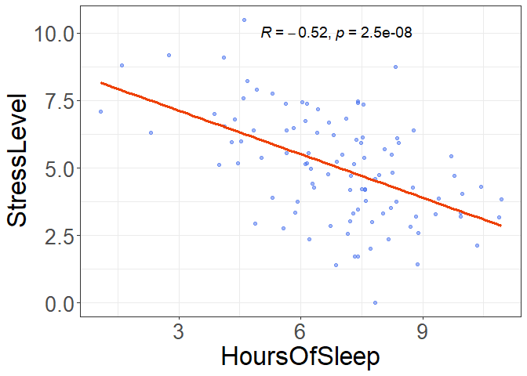

# Инструкции

Ниже приведены семь клинических (исследовательских) гипотез. В качестве задания протестируйте их, используя соответствующие статистические критерии. Решение должно содержать все элементы алгоритма проверки статистических гипотез:

• Сформулируете нулевую и альтернативную гипотезы.
• Укажите уровень значимости α.
• Определите статистический тест (критерий) для проверки гипотезы. При необходимости аргументируйте выбор одностороннего теста. 
• Укажите критическое значение статистики (используйте распределения из материалов лекции).
• Определите наблюдаемое значение статистики.
• Оцените статистическую значимость (p-value и/или доверительный интервал).
• Оцените практическую значимость.

* Решение необходимо загружать в формате Rmd (воспроизводимый код).
** Данные для анализа необходимо генерировать самостоятельно в соответствии с каждой представленной гипотезой. По возможности используйте пакет dplyr
*** Предусмотрен мягкий дедлайн (17 ноября). В этом случае вы получите комментарии с возможностью повысить оценку. Сдача работы после жёсткого дедлайна (24 ноября) предусматривает снижение оценки (10 баллов).

# GitHub
**[Классические статистические тесты](https://github.com/Eugene-van-Berd/BioStat_2024/tree/master/StatTests_task)**

# Гипотеза 1.   
Существует ассоциация между уровнем физической активности (бинарная переменная, физическая активность может быть 'высокой' и 'низкой') и частотой возникновения сердечно-сосудистых заболеваний у пациентов старше 50 лет. Попробуйте вариант с большими выборками (sample_size <- 100). Как изменится стратегия при малых выборках (sample_size <- 30) ? 

- Нулевая гипотеза: Доли пациентов с сердечно-сосудистыми заболеваниями в группах с 'высокой' и 'низкой' физической активностью равны. 
- Альтернативная гипотеза: Доли пациентов с сердечно-сосудистыми заболеваниями в группах с 'высокой' и 'низкой' физической активностью не равны. 

## Генерация данных


``` r
# Воспроизводимость результатов
set.seed(42)

# Общий размер выборки 
sample_size <- 100

# Генерация данных по физической активности (бинарная переменная) в фиксированном соотношении 1:1
activity <- rep(c("low", "high"), each = sample_size / 2)

# Генерация данных по наличию сердечно-сосудистых заболеваний (бинарная переменная)
# У активных людей меньше вероятность заболеть (0.5 vs 0.6)

cardio <- c(
  rbinom(sample_size / 2, size = 1, prob = 0.5),  
  rbinom(sample_size / 2, size = 1, prob = 0.6) 
)

data <- data.frame(activity, cardio)

table(data)  
```

```
##         cardio
## activity  0  1
##     high 18 32
##     low  19 31
```

``` r
if (min(table(data)) >= 5) {
  cat("\nСтатистический критерий для большой выборки: Z-критерий для разности долей для независимых выборок")
} else {
  cat("\nСтатистический критерий для большой выборки: Использование точного теста")
}
```


Статистический критерий для большой выборки: Z-критерий для разности долей для независимых выборок


``` r
# Воспроизводимость результатов
set.seed(42)

# Общий размер выборки 
sample_size <- 30

# Генерация данных по физической активности (бинарная переменная) в фиксированном соотношении 1:1
activity <- rep(c("low", "high"), each = sample_size / 2)

# Генерация данных по наличию сердечно-сосудистых заболеваний (бинарная переменная)
# У активных людей меньше вероятность заболеть (0.5 vs 0.6)

cardio <- c(
  rbinom(sample_size / 2, size = 1, prob = 0.5), 
  rbinom(sample_size / 2, size = 1, prob = 0.6)    
)

data <- data.frame(activity, cardio)

table(data)  
```

```
##         cardio
## activity  0  1
##     high  7  8
##     low   5 10
```

``` r
if (min(table(data)) >= 5) {
  cat("\nСтатистический критерий для малой выборки: Z-критерий для разности долей для независимых выборок")
} else {
  cat("\nСтатистический критерий для малой выборки: Использование точного теста")
}
```


Статистический критерий для малой выборки: Z-критерий для разности долей для независимых выборок

## Решение


``` r
# Уровень значимости
alpha <- 0.05
cat("Уровень значимости α =", alpha, "\n")
```

Уровень значимости α = 0.05 

``` r
# Критическое значение статистики
z_critical <- qnorm(1 - alpha / 2)
cat("Критическое значение статистики:", z_critical, "\n")
```

Критическое значение статистики: 1.959964 

``` r
# Функция для проведения z-теста для двух независимых долей
performTwoProportionZTest <- function(n1, x, n2, y) {
  
  # Расчет долей успешных исходов в выборках
  p1 <- x / n1
  p2 <- y / n2

  # Расчет объединенной доли успешных исходов
  P <- (x + y) / (n1 + n2)

  # Расчет стандартной ошибки
  SQ <- P * (1 - P) * (1/n1 + 1/n2)

  # Выполнение z-теста
  z_test_result <- (p1 - p2) / sqrt(SQ)

  return(z_test_result)
}

cat("\n")
```

``` r
#Большая выборка - 100 пациентов
n1 <- 50  # Общее количество попыток для выборки 1
x <- 50*0.5   # Количество успешных исходов для выборки 1
n2 <- 50  # Общее количество попыток для выборки 2
y <- 50*0.6   # Количество успешных исходов для выборки 2

# Определение наблюдаемого значения статистики.
z_test_result <- performTwoProportionZTest(n1, x, n2, y)
cat("Наблюдаемое значение статистики для большой выборки:", z_test_result, "\n")
```

Наблюдаемое значение статистики для большой выборки: -1.005038 

``` r
# Оценка статистической значимости
p_value <- 2 * (1 - pnorm(abs(z_test_result)))
cat("Значение p_value для большой выборки:", p_value, "\n")
```

Значение p_value для большой выборки: 0.3148786 

``` r
if (p_value < alpha) {
  cat("Нулевая гипотеза для большой выборки отвергается: есть статистически значимое различие между долями.", "\n")
} else {
  cat("Нулевая гипотеза для большой выборки не отвергается: статистически значимого различия между долями нет.", "\n")
}
```

Нулевая гипотеза для большой выборки не отвергается: статистически значимого различия между долями нет. 

``` r
cat("\n")
```

``` r
#Малая выборка - 30 пациентов
n1 <- 30  # Общее количество попыток для выборки 1
x <- 30*0.5   # Количество успешных исходов для выборки 1
n2 <- 30  # Общее количество попыток для выборки 2
y <- 30*0.6   # Количество успешных исходов для выборки 2

# Определение наблюдаемого значения статистики.
z_test_result <- performTwoProportionZTest(n1, x, n2, y)
cat("Наблюдаемое значение статистики для малой выборки:", z_test_result, "\n")
```

Наблюдаемое значение статистики для малой выборки: -0.7784989 

``` r
# Оценка статистической значимости
p_value <- 2 * (1 - pnorm(abs(z_test_result)))
cat("Значение p_value для малой выборки:", p_value, "\n")
```

Значение p_value для малой выборки: 0.4362749 

``` r
if (p_value < alpha) {
 cat("Нулевая гипотеза для малой выборки отвергается: есть статистически значимое различие между долями.", "\n")
} else {
  cat("Нулевая гипотеза для малой выборки не отвергается: статистически значимого различия между долями нет.", "\n")
}
```

Нулевая гипотеза для малой выборки не отвергается: статистически значимого различия между долями нет. 

Различия в частоте сердечно-сосудистых заболеваний между группами с высокой и низкой физической активностью не являются статистически значимыми, однако для более точной оценки влияния физической активности на заболеваемость сердечно-сосудистыми заболеваниями, следует учесть другие факторы, такие как возраст, пол и наличие сопутствующих заболеваний.

# Гипотеза 2.   
Применение нового метода лечения для пациентов с артериальной гипертензией приведет к уменьшению среднего артериального давления по сравнению с пациентами, получающими стандартное лечение.

- Нулевая гипотеза: Среднее артериальное давление одинаково в группах нового метода лечения и стандартного лечения.
- Альтернативная гипотеза: Среднее артериальное давление различается между группами нового метода лечения и стандартного лечения.
- Статистический тест для проверки гипотезы: Двухсторонний t-тест для разности средних между независимыми выборками с равными дисперсиями.

## Генерация данных 


``` r
# Воспроизводимость результатов
set.seed(42)

# Размер выборки (в каждой группе)
sample_size <- 80
# Дисперсия (допустим, что она равна в выборках)
sd <- 5

# В популяции c экспериментальным методом лечения средний уровень систолического артериального давления меньше (130 vs 135 mm) 
# Генерация данных для группы с новым методом лечения 
group1 <-  rnorm(sample_size, mean = 130, sd = sd)  # экспериментальная группа

# Генерация данных для группы со стандартным лечением
group2 <-  rnorm(sample_size, mean = 135, sd = sd)  # контрольная группа
```

## Решение


``` r
# Уровень значимости
alpha <- 0.05
cat("Уровень значимости α =", alpha, "\n")
```

Уровень значимости α = 0.05 

``` r
# Критическое значение статистики
t_critical <- qt(1 - alpha / 2, df = sample_size + sample_size - 2)
cat("Критическое значение статистики:", t_critical, "\n")
```

Критическое значение статистики: 1.975092 

``` r
# Наблюдаемое значение статистики
t_test <- t.test(group1, group2, var.equal = TRUE)
cat("Наблюдаемое значение статистики:", t_test$statistic, "\n")
```

Наблюдаемое значение статистики: -5.533764 

``` r
# Оценка статистической значимости и доверительного интервала
cat("Значение p_value:", t_test$p.value , "\n")
```

Значение p_value: 1.275504e-07 

``` r
cat("95% ДИ для разницы в средних значениях: от", t_test$conf.int[1], "до", t_test$conf.int[2], "\n")
```

95% ДИ для разницы в средних значениях: от -5.936978 до -2.813712 

``` r
if (t_test$p.value < alpha) {
  cat("Нулевая гипотеза отвергается: есть статистически значимое различие между средними.", "\n")
} else {
  cat("Нулевая гипотеза не отвергается: статистически значимого различия между средними нет.", "\n")
}
```

Нулевая гипотеза отвергается: есть статистически значимое различие между средними. 

Новый метод лечения продемонстрировал значительное снижение артериального давления на 3–6 мм рт. ст. по сравнению со стандартным лечением. Это подтверждает его практическую значимость, так как даже минимальное снижение давления может существенно снизить риски сердечно-сосудистых заболеваний.

# Гипотеза 3.   
Внедрение программы реабилитации для пациентов с хронической болью в спине приведет к улучшению их физической активности (предположим что физическую активность можно оценить по шкале 0-100)

- Нулевая гипотеза: Среднее значение физической активности до и после реабилитации не изменилось.
- Альтернативная гипотеза: Среднее значение физической активности после реабилитации отличается от значения до реабилитации.
- Статистический тест для проверки гипотезы: Двухсторонний парный t-тест для проверки гипотезы о разнице средних между зависимыми выборками.

## Генерация данных 


``` r
# Воспроизводимость результатов
set.seed(42)

# Размер выборки
sample_size <- 30
# Дисперсия (допустим, что они равны в выборках)
sd <- 5

# В популяции до реабилитации средний уровень физической активности меньше (50 vs 60) 
# Генерация данных до реабилитации
before <- rnorm(sample_size, mean = 50, sd = sd)

# Генерация данных для после реабилитации
after <- rnorm(sample_size, mean = 60, sd = sd)
```

## Решение


``` r
# Уровень значимости
alpha <- 0.05
cat("Уровень значимости α =", alpha, "\n")
```

Уровень значимости α = 0.05 

``` r
# Критическое значение статистики
t_critical <- qt(1 - alpha / 2, df = sample_size - 1)
cat("Критическое значение статистики:", t_critical, "\n")
```

Критическое значение статистики: 2.04523 

``` r
# Наблюдаемое значение статистики
t_test <- t.test(before, after, paired = TRUE)
cat("Наблюдаемое значение статистики:", t_test$statistic, "\n")
```

Наблюдаемое значение статистики: -5.527148 

``` r
# Оценка статистической значимости и доверительного интервала
cat("Значение p_value:", t_test$p.value , "\n")
```

Значение p_value: 5.868502e-06 

``` r
cat("95% ДИ для разницы в средних значениях: от", t_test$conf.int[1], "до", t_test$conf.int[2], "\n")
```

95% ДИ для разницы в средних значениях: от -12.39541 до -5.699637 

``` r
if (t_test$p.value < alpha) {
  cat("Нулевая гипотеза отвергается: есть статистически значимое различие между средними.", "\n")
} else {
  cat("Нулевая гипотеза не отвергается: статистически значимого различия между средними нет.", "\n")
}
```

Нулевая гипотеза отвергается: есть статистически значимое различие между средними. 

Улучшение уровня физической активности составило от 5.7 до 12.4 баллов. Это подтверждает, что пациенты, прошедшие программу реабилитации, в среднем улучшили свою физическую форму, что демонстрирует практическую эффективность реабилитационной программы для пациентов с хронической болью в спине.

# Гипотеза 4.   
Применение нового метода лечения для пациентов с инфарктом миокарда увеличит долю вернувшихся к нормальной физической активности 

- Нулевая гипотеза: Доля пациентов, вернувшихся к нормальной физической активности, в группе нового лечения не больше, чем в группе стандартного лечения.
- Альтернативная гипотеза: Доля пациентов, вернувшихся к нормальной физической активности, в группе нового лечения больше, чем в группе стандартного лечения.

## Генерация данных 


``` r
# Воспроизводимость результатов
set.seed(42)

# Общий размер выборки
sample_size <- 200

# В популяции экспериментального лечения вероятность нормальной физической активности больше (0.7 vs 0.65)
# Генерация данных по статусу лечение (бинарная переменная, новый метод или стандарт) в фиксированном соотношении 1:1
treatment <- rep(c("new", "default"), each = sample_size / 2)

# Генерация данных по физической активности после лечения (бинарная переменная)
activity <- c(
  rbinom(sample_size / 2, size = 1, prob = 0.7),  
  rbinom(sample_size / 2, size = 1, prob = 0.65)   
)

data <- data.frame(treatment, activity)

table(data)  
```

```
##          activity
## treatment  0  1
##   default 39 61
##   new     34 66
```

``` r
if (min(table(data)) >= 5) {
  cat("\nСтатистический критерий: Z-критерий для разности долей для независимых выборок")
} else {
  cat("\nСтатистический критерий: Использование точного теста")
}
```


Статистический критерий: Z-критерий для разности долей для независимых выборок


## Решение


``` r
# Уровень значимости
alpha <- 0.05
cat("Уровень значимости α =", alpha, "\n")
```

Уровень значимости α = 0.05 

``` r
# Критическое значение статистики
z_critical <- qnorm(1 - alpha )
cat("Критическое значение статистики:", z_critical, "\n")
```

Критическое значение статистики: 1.644854 

``` r
# Функция для проведения z-теста для двух независимых долей
performTwoProportionZTest <- function(n1, x, n2, y) {
  
  # Расчет долей успешных исходов в выборках
  p1 <- x / n1
  p2 <- y / n2

  # Расчет объединенной доли успешных исходов
  P <- (x + y) / (n1 + n2)

  # Расчет стандартной ошибки
  SQ <- P * (1 - P) * (1/n1 + 1/n2)

  # Выполнение z-теста
  z_test_result <- (p1 - p2) / sqrt(SQ)

  return(z_test_result)
}

#Выборка - 200 пациентов
n1 <- 50  # Общее количество попыток для выборки 1
x <- 50*0.7   # Количество успешных исходов для выборки 1
n2 <- 50  # Общее количество попыток для выборки 2
y <- 50*0.65   # Количество успешных исходов для выборки 2

# Определение наблюдаемого значения статистики.
z_test_result <- performTwoProportionZTest(n1, x, n2, y)
cat("Наблюдаемое значение статистики:", z_test_result, "\n")
```

Наблюдаемое значение статистики: 0.5337605 

``` r
# Оценка статистической значимости
p_value <- 1 - pnorm(abs(z_test_result))
cat("Значение p_value:", p_value, "\n")
```

Значение p_value: 0.2967536 

``` r
if (p_value < alpha) {
  cat("Нулевая гипотеза отвергается: есть статистически значимое различие между долями.", "\n")
} else {
  cat("Нулевая гипотеза не отвергается: статистически значимого различия между долями нет.", "\n")
}
```

Нулевая гипотеза не отвергается: статистически значимого различия между долями нет. 
  
Анализ показал, что новый метод лечения не приводит к улучшению в восстановлении физической активности пациентов после инфаркта миокарда в сравнении со стандартным лечением.

# Гипотеза 5. 
Применение медитации в течение 8 недель повлияет на наличие стресса (есть/нет) у лиц с высоким уровнем тревожности.

- Нулевая гипотеза: Применение медитации не влияет на наличие стресса у лиц с высоким уровнем тревожности.
- Альтернативная гипотеза: Применение медитации влияет на наличие стресса у лиц с высоким уровнем тревожности.
- Статистический тест для проверки гипотезы: Тест Мак-Немара - точный тест для разницы долей при повторном измерении.

## Генерация данных 


``` r
# Воспроизводимость результатов
set.seed(42)

# Размер выборки
sample_size <- 50

# Генерация данных до медитации (бинарная переменная) в фиксированном соотношении 1:1
before <- rbinom(sample_size, size = 1, prob = 0.4)

# Генерация данных после медитации (бинарная переменная). После медитации вероятность наличия стресса меньше (0.2 vs 0.4)
after <- rbinom(sample_size, size = 1, prob = 0.2)

# Таблица сопряженности
table_mcnemar <- table(before, after)
print(table_mcnemar)
```

```
##       after
## before  0  1
##      0 19  3
##      1 26  2
```

## Решение


``` r
# Уровень значимости
alpha <- 0.05
cat("Уровень значимости α =", alpha, "\n")
```

Уровень значимости α = 0.05 

``` r
# Критическое значение статистики
x_critical <- qchisq(1 - alpha, df = 1)
cat("Критическое значение статистики :", x_critical, "\n")
```

Критическое значение статистики : 3.841459 

``` r
# Наблюдаемое значение статистики
mcnemar <- mcnemar.test(table_mcnemar)
cat("Наблюдаемое значение статистики:", mcnemar$statistic, "\n")
```

Наблюдаемое значение статистики: 16.68966 

``` r
# Оценка статистической значимости 
cat("Значение p_value:", mcnemar$p.value , "\n")
```

Значение p_value: 4.402039e-05 

``` r
if (mcnemar$p.value < alpha) {
  cat("Нулевая гипотеза отвергается: есть статистически значимое различие в парных данных", "\n")
} else {
  cat("Нулевая гипотеза не отвергается: статистически значимого различия в парных данных нет.", "\n")
}
```

Нулевая гипотеза отвергается: есть статистически значимое различие в парных данных 

Результаты исследования подтверждают, что медитация в течение 8 недель может эффективно уменьшить уровень стресса у лиц с высоким уровнем тревожности.

# Гипотеза 6.   
Применение альтернативного метода лечения для пациентов с биполярным расстройством приведет к значимому изменению уровня симптомов депрессии по отношению к группе, прошедшей стандартное лечение (депрессию можно определить по шкале от 0 до 100, при этом исследователь должен избегать любых предположений (кроме i.i.d.)).

- Нулевая гипотеза: Применение альтернативного метода лечения не приведет к значимому изменению уровня симптомов депрессии по сравнению с стандартным лечением.
- Альтернативная гипотеза: Применение альтернативного метода лечения приведет к значимому изменению уровня симптомов депрессии по сравнению с стандартным лечением.
- Статистический тест для проверки гипотезы: Метод Уэлча для проверки гипотезы о равенстве средних в двух независимых выборках с неизвестной дисперсией.

## Генерация данных 


``` r
# Воспроизводимость результатов
set.seed(42)

# Размер выборки для каждой группы
sample_size <- 20

# В популяции c экспериментальным методом лечения среднее депрессии меньше (55 vs 68) 
# Генерация данных для экспериментальной группы 
group1 <- rnorm(sample_size, mean = 55, sd = 5)  # экспериментальная группа

# Генерация данных для группы со стандартным лечением
group2 <- rnorm(sample_size, mean = 68, sd = 7)  # контрольная группа
```

## Решение


``` r
# Уровень значимости
alpha <- 0.05
cat("Уровень значимости α =", alpha, "\n")
```

Уровень значимости α = 0.05 

``` r
# Наблюдаемое значение статистики
t_test <- t.test(group1, group2, var.equal = FALSE)
cat("Наблюдаемое значение статистики:", t_test$statistic, "\n")
```

Наблюдаемое значение статистики: -4.46087 

``` r
# Критическое значение статистики
t_critical <- qt(1 - alpha / 2, df = t_test$parameter )
cat("Критическое значение статистики:", t_critical, "\n")
```

Критическое значение статистики: 2.026248 

``` r
# Оценка статистической значимости и доверительного интервала
cat("Значение p_value:", t_test$p.value , "\n")
```

Значение p_value: 7.363838e-05 

``` r
cat("95% ДИ для разницы в средних значениях: от", t_test$conf.int[1], "до", t_test$conf.int[2], "\n")
```

95% ДИ для разницы в средних значениях: от -14.75089 до -5.536024 

``` r
if (t_test$p.value < alpha) {
  cat("Нулевая гипотеза отвергается: есть статистически значимое различие между средними.", "\n")
} else {
  cat("Нулевая гипотеза не отвергается: статистически значимого различия между средними нет.", "\n")
}
```

Нулевая гипотеза отвергается: есть статистически значимое различие между средними. 

В результате исследования установлено, что между группами с альтернативным и стандартным лечением имеется статистически значимое различие в уровне симптомов депрессии. Снижение уровня депрессии на 5.5–14.75 баллов по 100-бальной шкале можно считать клинически значимым для пациентов с биполярным расстройством.

# Гипотеза 7.   
Длительность сна (в часах) ассоциирована с уровенем стресса у студентов (шкала с нормальным распределением)

- Нулевая гипотеза: Между длительностью сна и уровнем стресса нет линейной связи, коэффициент корреляции равен нулю.
- Альтернативная гипотеза: Между длительностью сна и уровнем стресса существует линейная связь, коэффициент корреляции не равен нулю.
- Статистический тест для проверки гипотезы: Тест на корреляцию Пирсона для проверки наличия линейной зависимости между двумя количественными переменными.

## Генерация данных  


``` r
library(mvtnorm) # библиотека mvtnorm для работы с многомерным нормальным распределением

# Воспроизводимость результатов
set.seed(42)

# Размер выборки
sample_size <- 100

# Средние значения для длительности сна (HoursOfSleep) и уровня стресса (StressLevel) в популяции
means <- c(7, 5)  

# Среднеквадратическое отклонение HoursOfSleep = StressLevel = 2
# Значение ковариации
cov <- -0.5 * 2 * 2

# Матрица ковариации. В ислледуемой популяции HoursOfSleep и StressLevel ассоциированы отрицательно (r = -0.5)
cov_matrix <- matrix(c(2^2, cov, cov, 2^2), nrow = 2)

df <- rmvnorm(n = sample_size, 
              mean = means, 
              sigma = cov_matrix) %>% 
      as_tibble() %>%
      setNames(c("HoursOfSleep", "StressLevel"))  
```

## Решение 


``` r
# Уровень значимости
alpha <- 0.05
cat("Уровень значимости α =", alpha, "\n")
```

Уровень значимости α = 0.05 

``` r
# Критическое значение статистики
t_critical <- qt(1 - alpha / 2, df = sample_size - 2)
cat("Критическое значение статистики (t):", t_critical, "\n")
```

Критическое значение статистики (t): 1.984467 

``` r
# Проведение теста на корреляцию Пирсона
pearson_test <- cor.test(df$HoursOfSleep, df$StressLevel, method = "pearson")
cat("Наблюдаемое значение статистики t:", pearson_test$statistic, "\n")
```

Наблюдаемое значение статистики t: -6.062075 

``` r
# Оценка статистической значимости и доверительного интервала
cat("Значение p_value:", pearson_test$p.value , "\n")
```

Значение p_value: 2.510825e-08 

``` r
cat("95% ДИ для коэффициента корреляции: от", pearson_test$conf.int[1], "до", pearson_test$conf.int[2], "\n")
```

95% ДИ для коэффициента корреляции: от -0.6517877 до -0.363048 

``` r
if (pearson_test$p.value < alpha) {
  cat("Нулевая гипотеза отвергается: существует линейная связь между длительностью сна и уровнем стресса.", "\n")
} else {
  cat("Нулевая гипотеза не отвергается: линейной связи между длительностью сна и уровнем стресса нет.", "\n")
}
```

Нулевая гипотеза отвергается: существует линейная связь между длительностью сна и уровнем стресса. 

``` r
df %>% 
  ggplot(aes(HoursOfSleep, StressLevel))+
  geom_jitter(alpha = 0.5, colour = "royalblue2", size = 1.5)+
  geom_smooth(method = "lm", se = FALSE, colour = "orangered2", linewidth = 1.2) +
  stat_cor(method = "pearson", label.x.npc = 0.4, label.y.npc = "top", size = 5)+
  theme_custom
```

<!-- -->

Результаты исследования показывают, что между длительностью сна и уровнем стресса существует умеренная отрицательная линейная связь (коэффициент корреляции r = −0.5). Это свидетельствует о том, что увеличение длительности сна ассоциировано с уменьшением уровня стресса.


